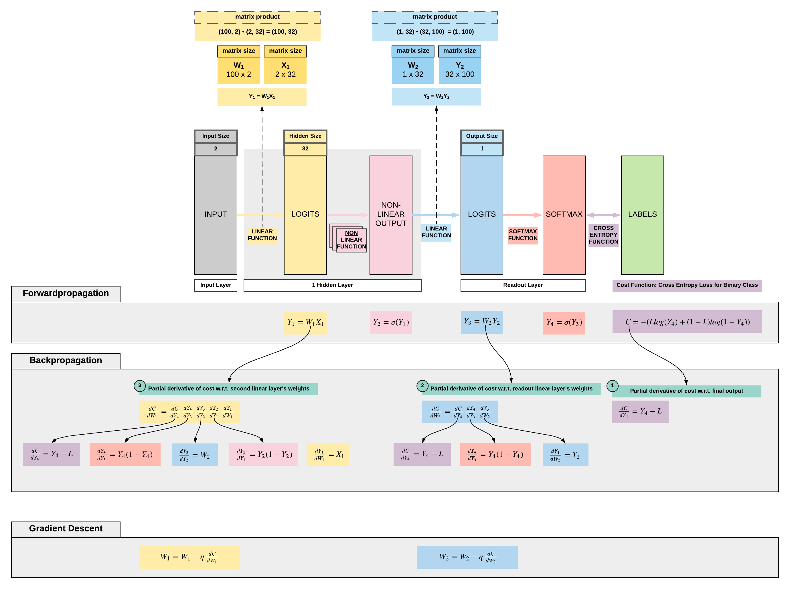

# Forwardpropagation, Backpropagation and Gradient Descent with PyTorch

!!! tip "Run Jupyter Notebook"
    You can run the code for this section in this [jupyter notebook link](https://github.com/ritchieng/deep-learning-wizard/blob/master/docs/deep_learning/boosting_models_pytorch/forwardpropagation_backpropagation_gradientdescent.ipynb).
    
## Transiting to Backpropagation
- Let's go back to our simple FNN to put things in perspective
    - Let us ignore non-linearities for now to keep it simpler, but it's just a tiny change subsequently
    - Given a linear transformation on our input (for simplicity instead of an affine transformation that includes a bias): $\hat y = \theta x$
        - $\theta$ is our parameters
        - $x$ is our input
        - $\hat y$ is our prediction
    - Then we have our MSE loss function $L = \frac{1}{2} (\hat y - y)^2$
- We need to calculate our partial derivatives of our loss w.r.t. our parameters to update our parameters: $\nabla_{\theta} = \frac{\delta L}{\delta \theta}$
    - With chain rule we have $\frac{\delta L}{\delta \theta} = \frac{\delta L}{\delta \hat y} \frac{\delta \hat y}{\delta \theta}$
        - $\frac{\delta L}{\delta \hat y} = (\hat y -  y)$
        - $\frac{\delta \hat y}{\delta \theta}$ is our partial derivatives of $y$ w.r.t. our parameters (our gradient) as we have covered previously
        

## Forward Propagation, Backward Propagation and Gradient Descent
- All right, now let's put together what we have learnt on backpropagation and apply it on a simple feedforward neural network (FNN)
- Let us assume the following simple FNN architecture and take note that we do not have bias here to keep things simple
    - FNN architecture
        1. Linear function: hidden size = 32
        2. Non-linear function: sigmoid
        3. Linear function: output size = 1
        4. Non-linear function: sigmoid
    - We will be going through a binary classification problem classifying 2 types of flowers
        - Output size: 1 (represented by 0 or 1 depending on the flower)
        - Input size: 2 (features of the flower)
        - Number of training samples: 100

 

!!! note "Load 3-class dataset"
    We want to set a seed to encourage reproducibility so you can match our loss numbers.
    
    ```python
    import torch
    import torch.nn as nn
    
    # Set manual seed
    torch.manual_seed(2)
    ```

    Here we want to load our flower classification dataset of 150 samples. There are 2 features, hence the input size would be 150x2. There is no one-hot encoding so the output would not be a size of 150x3 but a size of 150x1.
    ```python
    from sklearn import datasets
    from sklearn import preprocessing
    iris = datasets.load_iris()
    X = torch.tensor(preprocessing.normalize(iris.data[:, :2]), dtype=torch.float)
    y = torch.tensor(iris.target.reshape(-1, 1), dtype=torch.float)
    ```

    ```python
    print(X.size())
    print(y.size())
    ```

```python
torch.Size([150, 2])
torch.Size([150, 1])
```

!!! note "From 3 class dataset to 2 class dataset"
    We only want 2 classes because we want a binary classification problem. As mentioned, there is no one-hot encoding, so each class is represented by 0, 1, or 2. All we need to do is to filter out all samples with a label of 2 to have 2 classes.
    ```python
    # We only take 2 classes to make a binary classification problem
    X = X[:y[y < 2].size()[0]]
    y = y[:y[y < 2].size()[0]]
    ````

    ```python
    print(X.size())
    print(y.size())
    ```

```python
torch.Size([100, 2])
torch.Size([100, 1])
```
    

!!! note "Building our FNN model class from scratch"
    ```python
    class FNN(nn.Module):
        def __init__(self, ):
            super().__init__()
            
            # Dimensions for input, hidden and output
            self.input_dim = 2
            self.hidden_dim = 32
            self.output_dim = 1
            
            # Learning rate definition
            self.learning_rate = 0.001
            
            # Our parameters (weights)
            # w1: 2 x 32
            self.w1 = torch.randn(self.input_dim, self.hidden_dim)
            
            # w2: 32 x 1
            self.w2 = torch.randn(self.hidden_dim, self.output_dim)
        
        def sigmoid(self, s):
            return 1 / (1 + torch.exp(-s))
        
        def sigmoid_first_order_derivative(self, s):
            return s * (1 - s)
        
        # Forward propagation
        def forward(self, X):
            # First linear layer
            self.y1 = torch.matmul(X, self.w1) # 3 X 3 ".dot" does not broadcast in PyTorch
            
            # First non-linearity
            self.y2 = self.sigmoid(self.y1)
            
            # Second linear layer
            self.y3 = torch.matmul(self.y2, self.w2)
            
            # Second non-linearity
            y4 = self.sigmoid(self.y3)
            return y4
            
        # Backward propagation
        def backward(self, X, l, y4):
            # Derivative of binary cross entropy cost w.r.t. final output y4
            self.dC_dy4 = y4 - l
            
            '''
            Gradients for w2: partial derivative of cost w.r.t. w2
            dC/dw2
            '''
            self.dy4_dy3 = self.sigmoid_first_order_derivative(y4)
            self.dy3_dw2 = self.y2
            
            # Y4 delta: dC_dy4 dy4_dy3
            self.y4_delta = self.dC_dy4 * self.dy4_dy3
            
            # This is our gradients for w1: dC_dy4 dy4_dy3 dy3_dw2
            self.dC_dw2 = torch.matmul(torch.t(self.dy3_dw2), self.y4_delta)
            
            '''
            Gradients for w1: partial derivative of cost w.r.t w1
            dC/dw1
            '''
            self.dy3_dy2 = self.w2
            self.dy2_dy1 = self.sigmoid_first_order_derivative(self.y2)
            
            # Y2 delta: (dC_dy4 dy4_dy3) dy3_dy2 dy2_dy1
            self.y2_delta = torch.matmul(self.y4_delta, torch.t(self.dy3_dy2)) * self.dy2_dy1
            
            # Gradients for w1: (dC_dy4 dy4_dy3) dy3_dy2 dy2_dy1 dy1_dw1
            self.dC_dw1 = torch.matmul(torch.t(X), self.y2_delta)
            
            # Gradient descent on the weights from our 2 linear layers
            self.w1 -= self.learning_rate * self.dC_dw1
            self.w2 -= self.learning_rate * self.dC_dw2
    
        def train(self, X, l):
            # Forward propagation
            y4 = self.forward(X)
            
            # Backward propagation and gradient descent
            self.backward(X, l, y4)
    ```


!!! note "Training our FNN model"
    ```python
    # Instantiate our model class and assign it to our model object
    model = FNN()
    
    # Loss list for plotting of loss behaviour
    loss_lst = []
    
    # Number of times we want our FNN to look at all 100 samples we have, 100 implies looking through 100x
    num_epochs = 101
    
    # Let's train our model with 100 epochs
    for epoch in range(num_epochs):
        # Get our predictions
        y_hat = model(X)
        
        # Cross entropy loss, remember this can never be negative by nature of the equation
        # But it does not mean the loss can't be negative for other loss functions
        cross_entropy_loss = -(y * torch.log(y_hat) + (1 - y) * torch.log(1 - y_hat))
        
        # We have to take cross entropy loss over all our samples, 100 in this 2-class iris dataset
        mean_cross_entropy_loss = torch.mean(cross_entropy_loss).detach().item()
        
        # Print our mean cross entropy loss
        if epoch % 20 == 0:
            print('Epoch {} | Loss: {}'.format(epoch, mean_cross_entropy_loss))
        loss_lst.append(mean_cross_entropy_loss)
        
        # (1) Forward propagation: to get our predictions to pass to our cross entropy loss function
        # (2) Back propagation: get our partial derivatives w.r.t. parameters (gradients)
        # (3) Gradient Descent: update our weights with our gradients
        model.train(X, y)
    ```

```python
Epoch 0 | Loss: 0.9228229522705078
Epoch 20 | Loss: 0.6966760754585266
Epoch 40 | Loss: 0.6714916229248047
Epoch 60 | Loss: 0.6686137914657593
Epoch 80 | Loss: 0.666690468788147
Epoch 100 | Loss: 0.6648102402687073
```

Our loss is decreasing gradually, so it's learning. It has a possibility of reducing to almost 0 (overfitting) with sufficient model capacity (more layers or wider layers). We will explore overfitting and learning rate optimization subsequently.

## Summary
We've learnt...

!!! success
    * [x] The math behind forwardpropagation, backwardpropagation and gradient descent for FNN
    * [x] Implement a basic FNN from scratch with PyTorch
    
## Citation
If you have found these useful in your research, presentations, school work, projects or workshops, feel free to cite using this DOI.

[](https://zenodo.org/badge/latestdoi/139945544) 