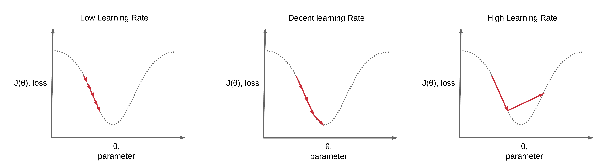
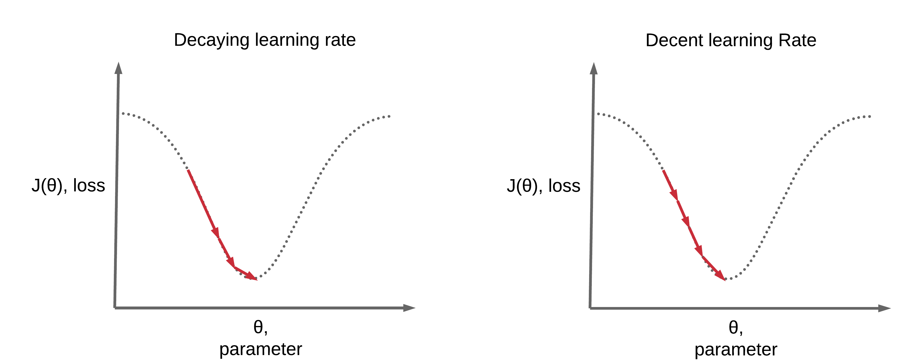

# Learning Rate Scheduling

!!! tip "Run Jupyter Notebook"
    You can run the code for this section in this [jupyter notebook link](https://github.com/ritchieng/deep-learning-wizard/blob/master/docs/deep_learning/boosting_models_pytorch/lr_scheduling.md).
    
    
## Optimization Algorithm: Mini-batch Stochastic Gradient Descent (SGD)
- We will be using mini-batch gradient descent in all our examples here when scheduling our learning rate
- Combination of batch gradient descent & stochastic gradient descent
    - $\theta = \theta - \eta \cdot  \nabla J(\theta, x^{i: i+n}, y^{i:i+n})$
- Characteristics
    - Compute the gradient of the lost function w.r.t. parameters for **n sets of training sample (n input and n label)**, $\nabla J(\theta, x^{i: i+n}, y^{i:i+n})$
    - Use this to update our parameters at every iteration
- Typically in deep learning, some variation of mini-batch gradient is used where the batch size is a hyperparameter to be determined
    
## Learning Intuition Recap
- Learning process
    - Original parameters $\rightarrow$ given input, get output $\rightarrow$ compare with labels $\rightarrow$ get loss with comparison of input/output $\rightarrow$ get gradients of loss w.r.t parameters $\rightarrow$ **update parameters so model can churn output closer to labels** $\rightarrow$ repeat
- For a detailed mathematical account of how this works and how to implement from scratch in Python and PyTorch, you can read our [forward- and back-propagation and gradient descent post](https://www.deeplearningwizard.com/deep_learning/boosting_models_pytorch/forwardpropagation_backpropagation_gradientdescent/).

## Learning Rate Pointers


- **Update parameters so model can churn output closer to labels, lower loss**
    - $\theta = \theta - \eta \cdot  \nabla J(\theta, x^{i: i+n}, y^{i:i+n})$
- If we set $\eta$ to be a **large value** $\rightarrow$ learn too much (rapid learning)
    - Unable to converge to a good local minima (unable to effectively gradually decrease your loss, overshoot the local lowest value)
- If we set $\eta$ to be a **small value** $\rightarrow$ learn too little (slow learning)
    - May take too long or unable to converge to a good local minima

## Need for Learning Rate Schedules
- Benefits
    - Converge faster
    - Higher accuracy


## Top Basic Learning Rate Schedules
1. Step-wise Decay 
2. Reduce on Loss Plateau Decay

### Step-wise Learning Rate Decay

#### Step-wise Decay: Every Epoch
- At every epoch,
    - $\eta_t = \eta_{t-1}\gamma$
    - $\gamma = 0.1$
- Optimization Algorithm 4: SGD Nesterov
    - Modification of SGD Momentum 
        - $v_t = \gamma v_{t-1} + \eta \cdot  \nabla J(\theta - \gamma v_{t-1}, x^{i: i+n}, y^{i:i+n})$
        - $\theta = \theta - v_t$
- Practical example
    - Given $\eta_t = 0.1$ and $ \gamma = 0.01$
    - Epoch 0: $\eta_t = 0.1$
    - Epoch 1: $\eta_{t+1} = 0.1 (0.1) =  0.01$
    - Epoch 2: $\eta_{t+2} = 0.1 (0.1)^2 =  0.001$
    - Epoch n: $\eta_{t+n} = 0.1 (0.1)^n$


!!! note "Code for step-wise learning rate decay at every epoch"
    ```python
    import torch
    import torch.nn as nn
    import torchvision.transforms as transforms
    import torchvision.datasets as dsets
    
    # Set seed
    torch.manual_seed(0)
    
    # Where to add a new import
    from torch.optim.lr_scheduler import StepLR
    
    '''
    STEP 1: LOADING DATASET
    '''
    
    train_dataset = dsets.MNIST(root='./data', 
                                train=True, 
                                transform=transforms.ToTensor(),
                                download=True)
    
    test_dataset = dsets.MNIST(root='./data', 
                               train=False, 
                               transform=transforms.ToTensor())
    
    '''
    STEP 2: MAKING DATASET ITERABLE
    '''
    
    batch_size = 100
    n_iters = 3000
    num_epochs = n_iters / (len(train_dataset) / batch_size)
    num_epochs = int(num_epochs)
    
    train_loader = torch.utils.data.DataLoader(dataset=train_dataset, 
                                               batch_size=batch_size, 
                                               shuffle=True)
    
    test_loader = torch.utils.data.DataLoader(dataset=test_dataset, 
                                              batch_size=batch_size, 
                                              shuffle=False)
    
    '''
    STEP 3: CREATE MODEL CLASS
    '''
    class FeedforwardNeuralNetModel(nn.Module):
        def __init__(self, input_dim, hidden_dim, output_dim):
            super(FeedforwardNeuralNetModel, self).__init__()
            # Linear function
            self.fc1 = nn.Linear(input_dim, hidden_dim) 
            # Non-linearity
            self.relu = nn.ReLU()
            # Linear function (readout)
            self.fc2 = nn.Linear(hidden_dim, output_dim)  
        
        def forward(self, x):
            # Linear function
            out = self.fc1(x)
            # Non-linearity
            out = self.relu(out)
            # Linear function (readout)
            out = self.fc2(out)
            return out
    '''
    STEP 4: INSTANTIATE MODEL CLASS
    '''
    input_dim = 28*28
    hidden_dim = 100
    output_dim = 10
    
    model = FeedforwardNeuralNetModel(input_dim, hidden_dim, output_dim)
    
    '''
    STEP 5: INSTANTIATE LOSS CLASS
    '''
    criterion = nn.CrossEntropyLoss()
    
    
    '''
    STEP 6: INSTANTIATE OPTIMIZER CLASS
    '''
    learning_rate = 0.1
    
    optimizer = torch.optim.SGD(model.parameters(), lr=learning_rate, momentum=0.9, nesterov=True)
    
    '''
    STEP 7: INSTANTIATE STEP LEARNING SCHEDULER CLASS
    '''
    # step_size: at how many multiples of epoch you decay
    # step_size = 1, after every 1 epoch, new_lr = lr*gamma 
    # step_size = 2, after every 2 epoch, new_lr = lr*gamma 
    
    # gamma = decaying factor
    scheduler = StepLR(optimizer, step_size=1, gamma=0.1)
    
    '''
    STEP 7: TRAIN THE MODEL
    '''
    iter = 0
    for epoch in range(num_epochs):
        # Decay Learning Rate
        scheduler.step()
        # Print Learning Rate
        print('Epoch:', epoch,'LR:', scheduler.get_lr())
        for i, (images, labels) in enumerate(train_loader):
            # Load images
            images = images.view(-1, 28*28).requires_grad_()
            
            # Clear gradients w.r.t. parameters
            optimizer.zero_grad()
            
            # Forward pass to get output/logits
            outputs = model(images)
            
            # Calculate Loss: softmax --> cross entropy loss
            loss = criterion(outputs, labels)
            
            # Getting gradients w.r.t. parameters
            loss.backward()
            
            # Updating parameters
            optimizer.step()
            
            iter += 1
            
            if iter % 500 == 0:
                # Calculate Accuracy         
                correct = 0
                total = 0
                # Iterate through test dataset
                for images, labels in test_loader:
                    # Load images to a Torch Variable
                    images = images.view(-1, 28*28)
                    
                    # Forward pass only to get logits/output
                    outputs = model(images)
                    
                    # Get predictions from the maximum value
                    _, predicted = torch.max(outputs.data, 1)
                    
                    # Total number of labels
                    total += labels.size(0)
                    
                    # Total correct predictions
                    correct += (predicted == labels).sum()
                
                accuracy = 100 * correct / total
                
                # Print Loss
                print('Iteration: {}. Loss: {}. Accuracy: {}'.format(iter, loss.item(), accuracy))
    ```

```python
Epoch: 0 LR: [0.1]
Iteration: 500. Loss: 0.15292978286743164. Accuracy: 96
Epoch: 1 LR: [0.010000000000000002]
Iteration: 1000. Loss: 0.1207798570394516. Accuracy: 97
Epoch: 2 LR: [0.0010000000000000002]
Iteration: 1500. Loss: 0.12287932634353638. Accuracy: 97
Epoch: 3 LR: [0.00010000000000000003]
Iteration: 2000. Loss: 0.05614742264151573. Accuracy: 97
Epoch: 4 LR: [1.0000000000000003e-05]
Iteration: 2500. Loss: 0.06775809079408646. Accuracy: 97
Iteration: 3000. Loss: 0.03737065941095352. Accuracy: 97
```

#### Step-wise Decay: Every 2 Epochs
- At every 2 epoch,
    - $\eta_t = \eta_{t-1}\gamma$
    - $\gamma = 0.1$
- Optimization Algorithm 4: SGD Nesterov
    - Modification of SGD Momentum 
        - $v_t = \gamma v_{t-1} + \eta \cdot  \nabla J(\theta - \gamma v_{t-1}, x^{i: i+n}, y^{i:i+n})$
        - $\theta = \theta - v_t$
- Practical example
    - Given $\eta_t = 0.1$ and $\gamma = 0.01$
    - Epoch 0: $\eta_t = 0.1$
    - Epoch 1: $\eta_{t+1} = 0.1$
    - Epoch 2: $\eta_{t+2} = 0.1 (0.1) =  0.01$

!!! note "Code for step-wise learning rate decay at every 2 epoch"
    ```python
    import torch
    import torch.nn as nn
    import torchvision.transforms as transforms
    import torchvision.datasets as dsets
    
    # Set seed
    torch.manual_seed(0)
    
    # Where to add a new import
    from torch.optim.lr_scheduler import StepLR
    
    '''
    STEP 1: LOADING DATASET
    '''
    
    train_dataset = dsets.MNIST(root='./data', 
                                train=True, 
                                transform=transforms.ToTensor(),
                                download=True)
    
    test_dataset = dsets.MNIST(root='./data', 
                               train=False, 
                               transform=transforms.ToTensor())
    
    '''
    STEP 2: MAKING DATASET ITERABLE
    '''
    
    batch_size = 100
    n_iters = 3000
    num_epochs = n_iters / (len(train_dataset) / batch_size)
    num_epochs = int(num_epochs)
    
    train_loader = torch.utils.data.DataLoader(dataset=train_dataset, 
                                               batch_size=batch_size, 
                                               shuffle=True)
    
    test_loader = torch.utils.data.DataLoader(dataset=test_dataset, 
                                              batch_size=batch_size, 
                                              shuffle=False)
    
    '''
    STEP 3: CREATE MODEL CLASS
    '''
    class FeedforwardNeuralNetModel(nn.Module):
        def __init__(self, input_dim, hidden_dim, output_dim):
            super(FeedforwardNeuralNetModel, self).__init__()
            # Linear function
            self.fc1 = nn.Linear(input_dim, hidden_dim) 
            # Non-linearity
            self.relu = nn.ReLU()
            # Linear function (readout)
            self.fc2 = nn.Linear(hidden_dim, output_dim)  
        
        def forward(self, x):
            # Linear function
            out = self.fc1(x)
            # Non-linearity
            out = self.relu(out)
            # Linear function (readout)
            out = self.fc2(out)
            return out
    '''
    STEP 4: INSTANTIATE MODEL CLASS
    '''
    input_dim = 28*28
    hidden_dim = 100
    output_dim = 10
    
    model = FeedforwardNeuralNetModel(input_dim, hidden_dim, output_dim)
    
    '''
    STEP 5: INSTANTIATE LOSS CLASS
    '''
    criterion = nn.CrossEntropyLoss()
    
    '''
    STEP 6: INSTANTIATE OPTIMIZER CLASS
    '''
    learning_rate = 0.1
    
    optimizer = torch.optim.SGD(model.parameters(), lr=learning_rate, momentum=0.9, nesterov=True)
    
    '''
    STEP 7: INSTANTIATE STEP LEARNING SCHEDULER CLASS
    '''
    # step_size: at how many multiples of epoch you decay
    # step_size = 1, after every 2 epoch, new_lr = lr*gamma 
    # step_size = 2, after every 2 epoch, new_lr = lr*gamma 
    
    # gamma = decaying factor
    scheduler = StepLR(optimizer, step_size=2, gamma=0.1)
    
    '''
    STEP 7: TRAIN THE MODEL
    '''
    iter = 0
    for epoch in range(num_epochs):
        # Decay Learning Rate
        scheduler.step()
        # Print Learning Rate
        print('Epoch:', epoch,'LR:', scheduler.get_lr())
        for i, (images, labels) in enumerate(train_loader):
            # Load images as Variable
            images = images.view(-1, 28*28).requires_grad_()
            
            # Clear gradients w.r.t. parameters
            optimizer.zero_grad()
            
            # Forward pass to get output/logits
            outputs = model(images)
            
            # Calculate Loss: softmax --> cross entropy loss
            loss = criterion(outputs, labels)
            
            # Getting gradients w.r.t. parameters
            loss.backward()
            
            # Updating parameters
            optimizer.step()
            
            iter += 1
            
            if iter % 500 == 0:
                # Calculate Accuracy         
                correct = 0
                total = 0
                # Iterate through test dataset
                for images, labels in test_loader:
                    # Load images to a Torch Variable
                    images = images.view(-1, 28*28).requires_grad_()
                    
                    # Forward pass only to get logits/output
                    outputs = model(images)
                    
                    # Get predictions from the maximum value
                    _, predicted = torch.max(outputs.data, 1)
                    
                    # Total number of labels
                    total += labels.size(0)
                    
                    # Total correct predictions
                    correct += (predicted == labels).sum()
                
                accuracy = 100 * correct / total
                
                # Print Loss
                print('Iteration: {}. Loss: {}. Accuracy: {}'.format(iter, loss.item(), accuracy))
    ```

```python
Epoch: 0 LR: [0.1]
Iteration: 500. Loss: 0.15292978286743164. Accuracy: 96
Epoch: 1 LR: [0.1]
Iteration: 1000. Loss: 0.11253029108047485. Accuracy: 96
Epoch: 2 LR: [0.010000000000000002]
Iteration: 1500. Loss: 0.14498558640480042. Accuracy: 97
Epoch: 3 LR: [0.010000000000000002]
Iteration: 2000. Loss: 0.03691177815198898. Accuracy: 97
Epoch: 4 LR: [0.0010000000000000002]
Iteration: 2500. Loss: 0.03511016443371773. Accuracy: 97
Iteration: 3000. Loss: 0.029424520209431648. Accuracy: 97
```

#### Step-wise Decay: Every Epoch, Larger Gamma
- At every epoch,
    - $\eta_t = \eta_{t-1}\gamma$
    - $\gamma = 0.96$
- Optimization Algorithm 4: SGD Nesterov
    - Modification of SGD Momentum 
        - $v_t = \gamma v_{t-1} + \eta \cdot  \nabla J(\theta - \gamma v_{t-1}, x^{i: i+n}, y^{i:i+n})$
        - $\theta = \theta - v_t$
- Practical example
    - Given $\eta_t = 0.1$ and $\gamma = 0.96$
    - Epoch 1: $\eta_t = 0.1$
    - Epoch 2: $\eta_{t+1} = 0.1 (0.96) =  0.096$
    - Epoch 3: $\eta_{t+2} = 0.1 (0.96)^2 =  0.092$
    - Epoch n: $\eta_{t+n} = 0.1 (0.96)^n$


!!! note "Code for step-wise learning rate decay at every epoch with larger gamma"
    ```python
    import torch
    import torch.nn as nn
    import torchvision.transforms as transforms
    import torchvision.datasets as dsets
    
    # Set seed
    torch.manual_seed(0)
    
    # Where to add a new import
    from torch.optim.lr_scheduler import StepLR
    
    '''
    STEP 1: LOADING DATASET
    '''
    
    train_dataset = dsets.MNIST(root='./data', 
                                train=True, 
                                transform=transforms.ToTensor(),
                                download=True)
    
    test_dataset = dsets.MNIST(root='./data', 
                               train=False, 
                               transform=transforms.ToTensor())
    
    '''
    STEP 2: MAKING DATASET ITERABLE
    '''
    
    batch_size = 100
    n_iters = 3000
    num_epochs = n_iters / (len(train_dataset) / batch_size)
    num_epochs = int(num_epochs)
    
    train_loader = torch.utils.data.DataLoader(dataset=train_dataset, 
                                               batch_size=batch_size, 
                                               shuffle=True)
    
    test_loader = torch.utils.data.DataLoader(dataset=test_dataset, 
                                              batch_size=batch_size, 
                                              shuffle=False)
    
    '''
    STEP 3: CREATE MODEL CLASS
    '''
    class FeedforwardNeuralNetModel(nn.Module):
        def __init__(self, input_dim, hidden_dim, output_dim):
            super(FeedforwardNeuralNetModel, self).__init__()
            # Linear function
            self.fc1 = nn.Linear(input_dim, hidden_dim) 
            # Non-linearity
            self.relu = nn.ReLU()
            # Linear function (readout)
            self.fc2 = nn.Linear(hidden_dim, output_dim)  
        
        def forward(self, x):
            # Linear function
            out = self.fc1(x)
            # Non-linearity
            out = self.relu(out)
            # Linear function (readout)
            out = self.fc2(out)
            return out
    '''
    STEP 4: INSTANTIATE MODEL CLASS
    '''
    input_dim = 28*28
    hidden_dim = 100
    output_dim = 10
    
    model = FeedforwardNeuralNetModel(input_dim, hidden_dim, output_dim)
    
    '''
    STEP 5: INSTANTIATE LOSS CLASS
    '''
    criterion = nn.CrossEntropyLoss()
    
    
    '''
    STEP 6: INSTANTIATE OPTIMIZER CLASS
    '''
    learning_rate = 0.1
    
    optimizer = torch.optim.SGD(model.parameters(), lr=learning_rate, momentum=0.9, nesterov=True)
    
    '''
    STEP 7: INSTANTIATE STEP LEARNING SCHEDULER CLASS
    '''
    # step_size: at how many multiples of epoch you decay
    # step_size = 1, after every 2 epoch, new_lr = lr*gamma 
    # step_size = 2, after every 2 epoch, new_lr = lr*gamma 
    
    # gamma = decaying factor
    scheduler = StepLR(optimizer, step_size=2, gamma=0.96)
    
    '''
    STEP 7: TRAIN THE MODEL
    '''
    iter = 0
    for epoch in range(num_epochs):
        # Decay Learning Rate
        scheduler.step()
        # Print Learning Rate
        print('Epoch:', epoch,'LR:', scheduler.get_lr())
        for i, (images, labels) in enumerate(train_loader):
            # Load images as Variable
            images = images.view(-1, 28*28).requires_grad_()
            
            # Clear gradients w.r.t. parameters
            optimizer.zero_grad()
            
            # Forward pass to get output/logits
            outputs = model(images)
            
            # Calculate Loss: softmax --> cross entropy loss
            loss = criterion(outputs, labels)
            
            # Getting gradients w.r.t. parameters
            loss.backward()
            
            # Updating parameters
            optimizer.step()
            
            iter += 1
            
            if iter % 500 == 0:
                # Calculate Accuracy         
                correct = 0
                total = 0
                # Iterate through test dataset
                for images, labels in test_loader:
                    # Load images to a Torch Variable
                    images = images.view(-1, 28*28)
                    
                    # Forward pass only to get logits/output
                    outputs = model(images)
                    
                    # Get predictions from the maximum value
                    _, predicted = torch.max(outputs.data, 1)
                    
                    # Total number of labels
                    total += labels.size(0)
                    
                    # Total correct predictions
                    correct += (predicted == labels).sum()
                
                accuracy = 100 * correct / total
                
                # Print Loss
                print('Iteration: {}. Loss: {}. Accuracy: {}'.format(iter, loss.item(), accuracy))
    ```

```python
Epoch: 0 LR: [0.1]
Iteration: 500. Loss: 0.15292978286743164. Accuracy: 96
Epoch: 1 LR: [0.1]
Iteration: 1000. Loss: 0.11253029108047485. Accuracy: 96
Epoch: 2 LR: [0.096]
Iteration: 1500. Loss: 0.11864850670099258. Accuracy: 97
Epoch: 3 LR: [0.096]
Iteration: 2000. Loss: 0.030942382290959358. Accuracy: 97
Epoch: 4 LR: [0.09216]
Iteration: 2500. Loss: 0.04521659016609192. Accuracy: 97
Iteration: 3000. Loss: 0.027839098125696182. Accuracy: 97
```

#### Pointers on Step-wise Decay
- You would want to decay your LR gradually when you're training more epochs
    - Converge too fast, to a crappy loss/accuracy, if you decay rapidly
- To decay slower
    - Larger $\gamma$
    - Larger interval of decay


### Reduce on Loss Plateau Decay

#### Reduce on Loss Plateau Decay, Patience=0, Factor=0.1
- Reduce learning rate whenever loss plateaus
    - Patience: number of epochs with no improvement after which learning rate will be reduced
        - Patience = 0
    - Factor: multiplier to decrease learning rate, $lr = lr*factor = \gamma$
        - Factor = 0.1
- Optimization Algorithm: SGD Nesterov
    - Modification of SGD Momentum 
        - $v_t = \gamma v_{t-1} + \eta \cdot  \nabla J(\theta - \gamma v_{t-1}, x^{i: i+n}, y^{i:i+n})$
        - $\theta = \theta - v_t$

!!! note "Code for reduce on loss plateau learning rate decay of factor 0.1 and 0 patience"
    ```python
    import torch
    import torch.nn as nn
    import torchvision.transforms as transforms
    import torchvision.datasets as dsets
    
    # Set seed
    torch.manual_seed(0)
    
    # Where to add a new import
    from torch.optim.lr_scheduler import ReduceLROnPlateau
    
    '''
    STEP 1: LOADING DATASET
    '''
    
    train_dataset = dsets.MNIST(root='./data', 
                                train=True, 
                                transform=transforms.ToTensor(),
                                download=True)
    
    test_dataset = dsets.MNIST(root='./data', 
                               train=False, 
                               transform=transforms.ToTensor())
    
    '''
    STEP 2: MAKING DATASET ITERABLE
    '''
    
    batch_size = 100
    n_iters = 6000
    num_epochs = n_iters / (len(train_dataset) / batch_size)
    num_epochs = int(num_epochs)
    
    train_loader = torch.utils.data.DataLoader(dataset=train_dataset, 
                                               batch_size=batch_size, 
                                               shuffle=True)
    
    test_loader = torch.utils.data.DataLoader(dataset=test_dataset, 
                                              batch_size=batch_size, 
                                              shuffle=False)
    
    '''
    STEP 3: CREATE MODEL CLASS
    '''
    class FeedforwardNeuralNetModel(nn.Module):
        def __init__(self, input_dim, hidden_dim, output_dim):
            super(FeedforwardNeuralNetModel, self).__init__()
            # Linear function
            self.fc1 = nn.Linear(input_dim, hidden_dim) 
            # Non-linearity
            self.relu = nn.ReLU()
            # Linear function (readout)
            self.fc2 = nn.Linear(hidden_dim, output_dim)  
        
        def forward(self, x):
            # Linear function
            out = self.fc1(x)
            # Non-linearity
            out = self.relu(out)
            # Linear function (readout)
            out = self.fc2(out)
            return out
    '''
    STEP 4: INSTANTIATE MODEL CLASS
    '''
    input_dim = 28*28
    hidden_dim = 100
    output_dim = 10
    
    model = FeedforwardNeuralNetModel(input_dim, hidden_dim, output_dim)
    
    '''
    STEP 5: INSTANTIATE LOSS CLASS
    '''
    criterion = nn.CrossEntropyLoss()
    
    
    '''
    STEP 6: INSTANTIATE OPTIMIZER CLASS
    '''
    learning_rate = 0.1
    
    optimizer = torch.optim.SGD(model.parameters(), lr=learning_rate, momentum=0.9, nesterov=True)
    
    '''
    STEP 7: INSTANTIATE STEP LEARNING SCHEDULER CLASS
    '''
    # lr = lr * factor 
    # mode='max': look for the maximum validation accuracy to track
    # patience: number of epochs - 1 where loss plateaus before decreasing LR
            # patience = 0, after 1 bad epoch, reduce LR
    # factor = decaying factor
    scheduler = ReduceLROnPlateau(optimizer, mode='max', factor=0.1, patience=0, verbose=True)
    
    '''
    STEP 7: TRAIN THE MODEL
    '''
    iter = 0
    for epoch in range(num_epochs):
        for i, (images, labels) in enumerate(train_loader):
            # Load images as Variable
            images = images.view(-1, 28*28).requires_grad_()
            
            # Clear gradients w.r.t. parameters
            optimizer.zero_grad()
            
            # Forward pass to get output/logits
            outputs = model(images)
            
            # Calculate Loss: softmax --> cross entropy loss
            loss = criterion(outputs, labels)
            
            # Getting gradients w.r.t. parameters
            loss.backward()
            
            # Updating parameters
            optimizer.step()
            
            iter += 1
            
            if iter % 500 == 0:
                # Calculate Accuracy         
                correct = 0
                total = 0
                # Iterate through test dataset
                for images, labels in test_loader:
                    # Load images to a Torch Variable
                    images = images.view(-1, 28*28)
                    
                    # Forward pass only to get logits/output
                    outputs = model(images)
                    
                    # Get predictions from the maximum value
                    _, predicted = torch.max(outputs.data, 1)
                    
                    # Total number of labels
                    total += labels.size(0)
                    
                    # Total correct predictions
                    # Without .item(), it is a uint8 tensor which will not work when you pass this number to the scheduler
                    correct += (predicted == labels).sum().item()
                
                accuracy = 100 * correct / total
                
                # Print Loss
                # print('Iteration: {}. Loss: {}. Accuracy: {}'.format(iter, loss.data[0], accuracy))
            
        # Decay Learning Rate, pass validation accuracy for tracking at every epoch
        print('Epoch {} completed'.format(epoch))
        print('Loss: {}. Accuracy: {}'.format(loss.item(), accuracy))
        print('-'*20)
        scheduler.step(accuracy)
    ```

```python
Epoch 0 completed
Loss: 0.17087846994400024. Accuracy: 96.26
--------------------
Epoch 1 completed
Loss: 0.11688263714313507. Accuracy: 96.96
--------------------
Epoch 2 completed
Loss: 0.035437121987342834. Accuracy: 96.78
--------------------
Epoch     2: reducing learning rate of group 0 to 1.0000e-02.
Epoch 3 completed
Loss: 0.0324370414018631. Accuracy: 97.7
--------------------
Epoch 4 completed
Loss: 0.022194599732756615. Accuracy: 98.02
--------------------
Epoch 5 completed
Loss: 0.007145566865801811. Accuracy: 98.03
--------------------
Epoch 6 completed
Loss: 0.01673538237810135. Accuracy: 98.05
--------------------
Epoch 7 completed
Loss: 0.025424446910619736. Accuracy: 98.01
--------------------
Epoch     7: reducing learning rate of group 0 to 1.0000e-03.
Epoch 8 completed
Loss: 0.014696130529046059. Accuracy: 98.05
--------------------
Epoch     8: reducing learning rate of group 0 to 1.0000e-04.
Epoch 9 completed
Loss: 0.00573748117312789. Accuracy: 98.04
--------------------
Epoch     9: reducing learning rate of group 0 to 1.0000e-05.
```


#### Reduce on Loss Plateau Decay, Patience=0, Factor=0.5
- Reduce learning rate whenever loss plateaus
    - Patience: number of epochs with no improvement after which learning rate will be reduced
        - Patience = 0
    - Factor: multiplier to decrease learning rate, $lr = lr*factor = \gamma$
        - Factor = 0.5
- Optimization Algorithm 4: SGD Nesterov
    - Modification of SGD Momentum 
        - $v_t = \gamma v_{t-1} + \eta \cdot  \nabla J(\theta - \gamma v_{t-1}, x^{i: i+n}, y^{i:i+n})$
        - $\theta = \theta - v_t$

!!! note "Code for reduce on loss plateau learning rate decay with factor 0.5 and 0 patience"
    ```python
    import torch
    import torch.nn as nn
    import torchvision.transforms as transforms
    import torchvision.datasets as dsets
    
    # Set seed
    torch.manual_seed(0)
    
    # Where to add a new import
    from torch.optim.lr_scheduler import ReduceLROnPlateau
    
    '''
    STEP 1: LOADING DATASET
    '''
    
    train_dataset = dsets.MNIST(root='./data', 
                                train=True, 
                                transform=transforms.ToTensor(),
                                download=True)
    
    test_dataset = dsets.MNIST(root='./data', 
                               train=False, 
                               transform=transforms.ToTensor())
    
    '''
    STEP 2: MAKING DATASET ITERABLE
    '''
    
    batch_size = 100
    n_iters = 6000
    num_epochs = n_iters / (len(train_dataset) / batch_size)
    num_epochs = int(num_epochs)
    
    train_loader = torch.utils.data.DataLoader(dataset=train_dataset, 
                                               batch_size=batch_size, 
                                               shuffle=True)
    
    test_loader = torch.utils.data.DataLoader(dataset=test_dataset, 
                                              batch_size=batch_size, 
                                              shuffle=False)
    
    '''
    STEP 3: CREATE MODEL CLASS
    '''
    class FeedforwardNeuralNetModel(nn.Module):
        def __init__(self, input_dim, hidden_dim, output_dim):
            super(FeedforwardNeuralNetModel, self).__init__()
            # Linear function
            self.fc1 = nn.Linear(input_dim, hidden_dim) 
            # Non-linearity
            self.relu = nn.ReLU()
            # Linear function (readout)
            self.fc2 = nn.Linear(hidden_dim, output_dim)  
        
        def forward(self, x):
            # Linear function
            out = self.fc1(x)
            # Non-linearity
            out = self.relu(out)
            # Linear function (readout)
            out = self.fc2(out)
            return out
    '''
    STEP 4: INSTANTIATE MODEL CLASS
    '''
    input_dim = 28*28
    hidden_dim = 100
    output_dim = 10
    
    model = FeedforwardNeuralNetModel(input_dim, hidden_dim, output_dim)
    
    '''
    STEP 5: INSTANTIATE LOSS CLASS
    '''
    criterion = nn.CrossEntropyLoss()
    
    
    '''
    STEP 6: INSTANTIATE OPTIMIZER CLASS
    '''
    learning_rate = 0.1
    
    optimizer = torch.optim.SGD(model.parameters(), lr=learning_rate, momentum=0.9, nesterov=True)
    
    '''
    STEP 7: INSTANTIATE STEP LEARNING SCHEDULER CLASS
    '''
    # lr = lr * factor 
    # mode='max': look for the maximum validation accuracy to track
    # patience: number of epochs - 1 where loss plateaus before decreasing LR
            # patience = 0, after 1 bad epoch, reduce LR
    # factor = decaying factor
    scheduler = ReduceLROnPlateau(optimizer, mode='max', factor=0.5, patience=0, verbose=True)
    
    '''
    STEP 7: TRAIN THE MODEL
    '''
    iter = 0
    for epoch in range(num_epochs):
        for i, (images, labels) in enumerate(train_loader):
            # Load images as Variable
            images = images.view(-1, 28*28).requires_grad_()
            
            # Clear gradients w.r.t. parameters
            optimizer.zero_grad()
            
            # Forward pass to get output/logits
            outputs = model(images)
            
            # Calculate Loss: softmax --> cross entropy loss
            loss = criterion(outputs, labels)
            
            # Getting gradients w.r.t. parameters
            loss.backward()
            
            # Updating parameters
            optimizer.step()
            
            iter += 1
            
            if iter % 500 == 0:
                # Calculate Accuracy         
                correct = 0
                total = 0
                # Iterate through test dataset
                for images, labels in test_loader:
                    # Load images to a Torch Variable
                    images = images.view(-1, 28*28)
                    
                    # Forward pass only to get logits/output
                    outputs = model(images)
                    
                    # Get predictions from the maximum value
                    _, predicted = torch.max(outputs.data, 1)
                    
                    # Total number of labels
                    total += labels.size(0)
                    
                    # Total correct predictions
                     # Without .item(), it is a uint8 tensor which will not work when you pass this number to the scheduler
                    correct += (predicted == labels).sum().item()
                
                accuracy = 100 * correct / total
                
                # Print Loss
                # print('Iteration: {}. Loss: {}. Accuracy: {}'.format(iter, loss.data[0], accuracy))
            
        # Decay Learning Rate, pass validation accuracy for tracking at every epoch
        print('Epoch {} completed'.format(epoch))
        print('Loss: {}. Accuracy: {}'.format(loss.item(), accuracy))
        print('-'*20)
        scheduler.step(accuracy)
    ```
```python
Epoch 0 completed
Loss: 0.17087846994400024. Accuracy: 96.26
--------------------
Epoch 1 completed
Loss: 0.11688263714313507. Accuracy: 96.96
--------------------
Epoch 2 completed
Loss: 0.035437121987342834. Accuracy: 96.78
--------------------
Epoch     2: reducing learning rate of group 0 to 5.0000e-02.
Epoch 3 completed
Loss: 0.04893001914024353. Accuracy: 97.62
--------------------
Epoch 4 completed
Loss: 0.020584167912602425. Accuracy: 97.86
--------------------
Epoch 5 completed
Loss: 0.006022400688380003. Accuracy: 97.95
--------------------
Epoch 6 completed
Loss: 0.028374142944812775. Accuracy: 97.87
--------------------
Epoch     6: reducing learning rate of group 0 to 2.5000e-02.
Epoch 7 completed
Loss: 0.013204765506088734. Accuracy: 98.0
--------------------
Epoch 8 completed
Loss: 0.010137186385691166. Accuracy: 97.95
--------------------
Epoch     8: reducing learning rate of group 0 to 1.2500e-02.
Epoch 9 completed
Loss: 0.0035198689438402653. Accuracy: 98.01
--------------------
```

## Pointers on Reduce on Loss Pleateau Decay
- In these examples, we used patience=1 because we are running few epochs
    - You should look at a larger patience such as 5 if for example you ran 500 epochs. 
- You should experiment with 2 properties 
    - Patience
    - Decay factor 

## Summary
We've learnt...

!!! success
    * [x] Learning Rate Intuition
        * [x] Update parameters so model can churn output closer to labels
        * [x] Gradual parameter updates
    * [x] Learning Rate Pointers
        * [x] If we set $\eta$ to be a **large value** $\rightarrow$ learn too much (rapid learning)
        * [x] If we set $\eta$ to be a **small value** $\rightarrow$ learn too little (slow learning)
    * [x] Learning Rate Schedules
        * [x] Step-wise Decay
        * [x] Reduce on Loss Plateau Decay
    * [x] Step-wise Decay
        * [x] Every 1 epoch
        * [x] Every 2 epoch
        * [x] Every 1 epoch, larger gamma
    * [x] Step-wise Decay Pointers
        * [x] Decay LR gradually
            * [x] Larger $\gamma$
            * [x] Larger interval of decay (increase epoch)
    * [x] Reduce on Loss Plateau Decay
        * [x] Patience=0, Factor=1
        * [x] Patience=0, Factor=0.5
    * [x] Pointers on Reduce on Loss Plateau Decay
        * [x] Larger patience with more epochs
        * [x] 2 hyperparameters to experiment
            * [x] Patience
            * [x] Decay factor
    
## Citation
If you have found these useful in your research, presentations, school work, projects or workshops, feel free to cite using this DOI.

[](https://zenodo.org/badge/latestdoi/139945544) 
