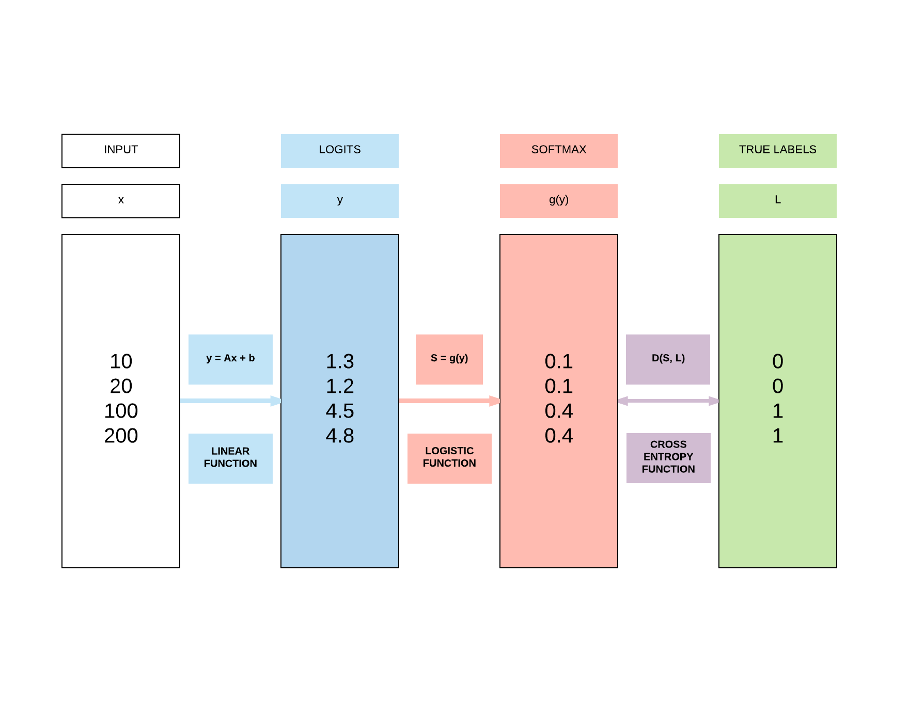
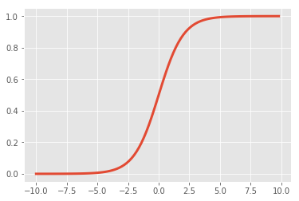
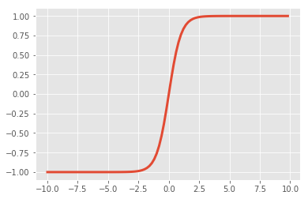
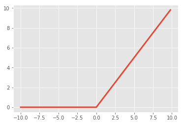

# Weight Initializations & Activation Functions

!!! tip "Run Jupyter Notebook"
    You can run the code for this section in this [jupyter notebook link](https://github.com/ritchieng/deep-learning-wizard/blob/master/docs/deep_learning/boosting_models_pytorch/weight_initialization_activation_functions.ipynb).
    
## Recap of Logistic Regression


## Recap of Feedforward Neural Network Activation Function


#### Sigmoid (Logistic)
- $\sigma(x) = \frac{1}{1 + e^{-x}}$
- Input number $\rightarrow$ [0, 1]
    - Large negative number $\rightarrow$ 0
    - Large positive number $\rightarrow$ 1
- Cons: 
    1. Activation saturates at 0 or 1 with **gradients $\approx$ 0**
        - No signal to update weights $\rightarrow$ **cannot learn**
        - Solution: Have to carefully initialize weights to prevent this

```python
import matplotlib.pyplot as plt
%matplotlib inline
import numpy as np

def sigmoid(x):
    a = []
    for item in x:
        a.append(1/(1+np.exp(-item)))
    return a

x = np.arange(-10., 10., 0.2)
sig = sigmoid(x)

plt.style.use('ggplot')
plt.plot(x,sig, linewidth=3.0)
```




#### Tanh
- $\tanh(x) = 2 \sigma(2x) -1$
    - A scaled sigmoid function
- Input number $\rightarrow$ [-1, 1]
- Cons: 
    1. Activation saturates at 0 or 1 with **gradients $\approx$ 0**
        - No signal to update weights $\rightarrow$ **cannot learn**
        - **Solution**: Have to carefully initialize weights to prevent this

```python
x = np.arange(-10., 10., 0.2)
tanh = np.dot(2, sigmoid(np.dot(2, x))) - 1

plt.plot(x,tanh, linewidth=3.0)
```




#### ReLUs
- $f(x) = \max(0, x)$
- Pros:
    1. Accelerates convergence $\rightarrow$ **train faster**
    2. **Less computationally expensive operation** compared to Sigmoid/Tanh exponentials
- Cons:
    1. Many ReLU units "die" $\rightarrow$ **gradients = 0** forever
        - **Solution**: careful learning rate and weight initialization choice


```python
x = np.arange(-10., 10., 0.2)
relu = np.maximum(x, 0)

plt.plot(x,relu, linewidth=3.0)
```




## Why do we need weight initializations or new activation functions?
- **To prevent vanishing/exploding gradients**

### Case 1: Sigmoid/Tanh
- **Problem**
    - If variance of input too large: gradients = 0 (vanishing gradients)
    - If variance of input too small: linear $\rightarrow$ gradients = constant value
- **Solutions**
    - Want a constant variance of input to achieve non-linearity $\rightarrow$ unique gradients for unique updates
        - Xavier Initialization (good constant variance for Sigmoid/Tanh)
        - ReLU or Leaky ReLU

### Case 2: ReLU
- **Solution to Case 1**
    - Regardless of variance of input: gradients = 0 or 1 
- **Problem**
    - But those with 0: no updates ("dead ReLU units") 
    - Has unlimited output size with input > 0 (explodes gradients subsequently)
- **Solutions**
    - He Initialization (good constant variance)
    - Leaky ReLU

### Case 3: Leaky ReLU
- **Solution to Case 2**
    - Solves the 0 signal issue when input < 0 

- **Problem**
    - Has unlimited output size with input > 0 (explodes)
- **Solution**
    - He Initialization (good constant variance)

## Summary of weight initialization solutions to activations
- Tanh/Sigmoid vanishing gradients can be solved with Xavier initialization
    - Good range of constant variance
- ReLU/Leaky ReLU exploding gradients can be solved with He initialization
    - Good range of constant variance

## Types of weight intializations

#### Zero Initialization: set all weights to 0 
- Every neuron in the network computes the same output $\rightarrow$ computes the same gradient $\rightarrow$ same parameter updates 

#### Normal Initialization: set all weights to random small numbers
- Every neuron in the network computes different output $\rightarrow$ computes different gradient $\rightarrow$ different parameter updates 
- "Symmetry breaking" 
- Problem: variance that grows with the number of inputs

#### Lecun Initialization: normalize variance
- Solves growing variance with the number of inputs $\rightarrow$ constant variance 
- Look at a simple feedforward neural network


##### Equations for Lecun Initialization
- $Y = AX + B$
- $y = a_1x_1 + a_2x_2 + \cdot + a_n x_n + b$
- $Var(y) = Var(a_1x_1 + a_2x_2 + \cdot + a_n x_n + b)$
- $Var(a_i x_i) = E(x_i)^2 Var(a_i) + E(a_i)^2Var(x_i) + Var(a_i)Var(x_i)$
    - General term, you might be more familiar with the following
        - $Var(XY) = E(X)^2 Var(Y) + E(Y)^2Var(X) + Var(X)Var(Y)$
    - $E(x_i)$: expectation/mean of $x_i$
    - $E(a_i)$: expectation/mean of $a_i$
- Assuming inputs/weights drawn i.i.d. with Gaussian distribution of mean=0
    - $E(x_i) = E(a_i) = 0$
    - $Var(a_i x_i) = Var(a_i)Var(x_i)$
- $Var(y) = Var(a_1)Var(x_1) + \cdot + Var(a_n)Var(x_n)$
    - Since the bias, b, is a constant, $Var(b) = 0$
- Since i.i.d.
    - $Var(y) = n \times Var(a_i)Var(x_i)$
- Since we want constant variance where $Var(y) = Var(x_i)$
    - $1 = nVar(a_i)$
    - $Var(a_i) = \frac{1}{n}$
- This is essentially [Lecun initialization, from his paper titled "Efficient Backpropagation"](http://yann.lecun.com/exdb/publis/pdf/lecun-98b.pdf)
    - We draw our weights i.i.d. with mean=0 and variance = $\frac{1}{n}$
    - Where $n$ is the number of **input units** in the weight tensor

#### Improvements to Lecun Intialization
- They are essentially slight modifications to Lecun'98 initialization
- Xavier Intialization
    - Works better for layers with Sigmoid activations 
    - $var(a_i) = \frac{1}{n_{in} + n_{out}}$
        - Where $n_{in}$ and $n_{out}$ are the number of input and output units in the weight tensor respectively
- Kaiming Initialization
    - Works better for layers with ReLU or LeakyReLU activations 
    - $var(a_i) = \frac{2}{n_{in}}$
 

#### Summary of  weight initializations
- Normal Distribution
- Lecun Normal Distribution
- Xavier (Glorot) Normal Distribution 
- Kaiming (He) Normal Distribution

## Weight Initializations with PyTorch

### Normal Initialization: Tanh Activation


```python
import torch
import torch.nn as nn
import torchvision.transforms as transforms
import torchvision.datasets as dsets
from torch.autograd import Variable

# Set seed
torch.manual_seed(0)

# Scheduler import
from torch.optim.lr_scheduler import StepLR

'''
STEP 1: LOADING DATASET
'''

train_dataset = dsets.MNIST(root='./data', 
                            train=True, 
                            transform=transforms.ToTensor(),
                            download=True)

test_dataset = dsets.MNIST(root='./data', 
                           train=False, 
                           transform=transforms.ToTensor())

'''
STEP 2: MAKING DATASET ITERABLE
'''

batch_size = 100
n_iters = 3000
num_epochs = n_iters / (len(train_dataset) / batch_size)
num_epochs = int(num_epochs)

train_loader = torch.utils.data.DataLoader(dataset=train_dataset, 
                                           batch_size=batch_size, 
                                           shuffle=True)

test_loader = torch.utils.data.DataLoader(dataset=test_dataset, 
                                          batch_size=batch_size, 
                                          shuffle=False)

'''
STEP 3: CREATE MODEL CLASS
'''
class FeedforwardNeuralNetModel(nn.Module):
    def __init__(self, input_dim, hidden_dim, output_dim):
        super(FeedforwardNeuralNetModel, self).__init__()
        # Linear function
        self.fc1 = nn.Linear(input_dim, hidden_dim) 
        # Linear weight, W,  Y = WX + B
        nn.init.normal_(self.fc1.weight, mean=0, std=1)
        # Non-linearity
        self.tanh = nn.Tanh()
        # Linear function (readout)
        self.fc2 = nn.Linear(hidden_dim, output_dim)  
        nn.init.normal_(self.fc2.weight, mean=0, std=1)
    
    def forward(self, x):
        # Linear function
        out = self.fc1(x)
        # Non-linearity
        out = self.tanh(out)
        # Linear function (readout)
        out = self.fc2(out)
        return out

'''
STEP 4: INSTANTIATE MODEL CLASS
'''
input_dim = 28*28
hidden_dim = 100
output_dim = 10

model = FeedforwardNeuralNetModel(input_dim, hidden_dim, output_dim)

'''
STEP 5: INSTANTIATE LOSS CLASS
'''
criterion = nn.CrossEntropyLoss()

'''
STEP 6: INSTANTIATE OPTIMIZER CLASS
'''
learning_rate = 0.1

optimizer = torch.optim.SGD(model.parameters(), lr=learning_rate, momentum=0.9, nesterov=True)

'''
STEP 7: INSTANTIATE STEP LEARNING SCHEDULER CLASS
'''
# step_size: at how many multiples of epoch you decay
# step_size = 1, after every 2 epoch, new_lr = lr*gamma 
# step_size = 2, after every 2 epoch, new_lr = lr*gamma 

# gamma = decaying factor
scheduler = StepLR(optimizer, step_size=1, gamma=0.96)

'''
STEP 8: TRAIN THE MODEL
'''
iter = 0
for epoch in range(num_epochs):
    # Decay Learning Rate
    scheduler.step()
    # Print Learning Rate
    print('Epoch:', epoch,'LR:', scheduler.get_lr())
    for i, (images, labels) in enumerate(train_loader):
        # Load images as tensors with gradient accumulation abilities
        images = images.view(-1, 28*28).requires_grad_()
        
        # Clear gradients w.r.t. parameters
        optimizer.zero_grad()
        
        # Forward pass to get output/logits
        outputs = model(images)
        
        # Calculate Loss: softmax --> cross entropy loss
        loss = criterion(outputs, labels)
        
        # Getting gradients w.r.t. parameters
        loss.backward()
        
        # Updating parameters
        optimizer.step()
        
        iter += 1
        
        if iter % 500 == 0:
            # Calculate Accuracy         
            correct = 0
            total = 0
            # Iterate through test dataset
            for images, labels in test_loader:
                # Load images to a Torch Variable
                images = images.view(-1, 28*28)
                
                # Forward pass only to get logits/output
                outputs = model(images)
                
                # Get predictions from the maximum value
                _, predicted = torch.max(outputs.data, 1)
                
                # Total number of labels
                total += labels.size(0)
                
               # Total correct predictions
                correct += (predicted.type(torch.FloatTensor).cpu() == labels.type(torch.FloatTensor)).sum()

            accuracy = 100. * correct.item() / total
            
            # Print Loss
            print('Iteration: {}. Loss: {}. Accuracy: {}'.format(iter, loss.item(), accuracy))
```

    Epoch: 0 LR: [0.1]
    Iteration: 500. Loss: 0.5192779302597046. Accuracy: 87.9
    Epoch: 1 LR: [0.096]
    Iteration: 1000. Loss: 0.4060308337211609. Accuracy: 90.15
    Epoch: 2 LR: [0.09216]
    Iteration: 1500. Loss: 0.2880493104457855. Accuracy: 90.71
    Epoch: 3 LR: [0.08847359999999999]
    Iteration: 2000. Loss: 0.23173095285892487. Accuracy: 91.99
    Epoch: 4 LR: [0.084934656]
    Iteration: 2500. Loss: 0.23814399540424347. Accuracy: 92.32
    Iteration: 3000. Loss: 0.19513173401355743. Accuracy: 92.55


### Lecun Initialization: Tanh Activation
- By default, PyTorch uses Lecun initialization, so nothing new has to be done here compared to using Normal, Xavier or Kaiming initialization.


```python
import torch
import torch.nn as nn
import torchvision.transforms as transforms
import torchvision.datasets as dsets
from torch.autograd import Variable

# Set seed
torch.manual_seed(0)

# Scheduler import
from torch.optim.lr_scheduler import StepLR

'''
STEP 1: LOADING DATASET
'''

train_dataset = dsets.MNIST(root='./data', 
                            train=True, 
                            transform=transforms.ToTensor(),
                            download=True)

test_dataset = dsets.MNIST(root='./data', 
                           train=False, 
                           transform=transforms.ToTensor())

'''
STEP 2: MAKING DATASET ITERABLE
'''

batch_size = 100
n_iters = 3000
num_epochs = n_iters / (len(train_dataset) / batch_size)
num_epochs = int(num_epochs)

train_loader = torch.utils.data.DataLoader(dataset=train_dataset, 
                                           batch_size=batch_size, 
                                           shuffle=True)

test_loader = torch.utils.data.DataLoader(dataset=test_dataset, 
                                          batch_size=batch_size, 
                                          shuffle=False)

'''
STEP 3: CREATE MODEL CLASS
'''
class FeedforwardNeuralNetModel(nn.Module):
    def __init__(self, input_dim, hidden_dim, output_dim):
        super(FeedforwardNeuralNetModel, self).__init__()
        # Linear function
        self.fc1 = nn.Linear(input_dim, hidden_dim) 
        # Non-linearity
        self.tanh = nn.Tanh()
        # Linear function (readout)
        self.fc2 = nn.Linear(hidden_dim, output_dim)  
    
    def forward(self, x):
        # Linear function
        out = self.fc1(x)
        # Non-linearity
        out = self.tanh(out)
        # Linear function (readout)
        out = self.fc2(out)
        return out

'''
STEP 4: INSTANTIATE MODEL CLASS
'''
input_dim = 28*28
hidden_dim = 100
output_dim = 10

model = FeedforwardNeuralNetModel(input_dim, hidden_dim, output_dim)

'''
STEP 5: INSTANTIATE LOSS CLASS
'''
criterion = nn.CrossEntropyLoss()

'''
STEP 6: INSTANTIATE OPTIMIZER CLASS
'''
learning_rate = 0.1

optimizer = torch.optim.SGD(model.parameters(), lr=learning_rate, momentum=0.9, nesterov=True)

'''
STEP 7: INSTANTIATE STEP LEARNING SCHEDULER CLASS
'''
# step_size: at how many multiples of epoch you decay
# step_size = 1, after every 2 epoch, new_lr = lr*gamma 
# step_size = 2, after every 2 epoch, new_lr = lr*gamma 

# gamma = decaying factor
scheduler = StepLR(optimizer, step_size=1, gamma=0.96)

'''
STEP 8: TRAIN THE MODEL
'''
iter = 0
for epoch in range(num_epochs):
    # Decay Learning Rate
    scheduler.step()
    # Print Learning Rate
    print('Epoch:', epoch,'LR:', scheduler.get_lr())
    for i, (images, labels) in enumerate(train_loader):
        # Load images as tensors with gradient accumulation abilities
        images = images.view(-1, 28*28).requires_grad_()
        
        # Clear gradients w.r.t. parameters
        optimizer.zero_grad()
        
        # Forward pass to get output/logits
        outputs = model(images)
        
        # Calculate Loss: softmax --> cross entropy loss
        loss = criterion(outputs, labels)
        
        # Getting gradients w.r.t. parameters
        loss.backward()
        
        # Updating parameters
        optimizer.step()
        
        iter += 1
        
        if iter % 500 == 0:
            # Calculate Accuracy         
            correct = 0
            total = 0
            # Iterate through test dataset
            for images, labels in test_loader:
                # Load images to a Torch Variable
                images = images.view(-1, 28*28)
                
                # Forward pass only to get logits/output
                outputs = model(images)
                
                # Get predictions from the maximum value
                _, predicted = torch.max(outputs.data, 1)
                
                # Total number of labels
                total += labels.size(0)
                
                # Total correct predictions
                correct += (predicted.type(torch.FloatTensor).cpu() == labels.type(torch.FloatTensor)).sum()

            accuracy = 100. * correct.item() / total
            
            # Print Loss
            print('Iteration: {}. Loss: {}. Accuracy: {}'.format(iter, loss.item(), accuracy))
```

    Epoch: 0 LR: [0.1]
    Iteration: 500. Loss: 0.20123475790023804. Accuracy: 95.63
    Epoch: 1 LR: [0.096]
    Iteration: 1000. Loss: 0.10885068774223328. Accuracy: 96.48
    Epoch: 2 LR: [0.09216]
    Iteration: 1500. Loss: 0.1296212077140808. Accuracy: 97.22
    Epoch: 3 LR: [0.08847359999999999]
    Iteration: 2000. Loss: 0.05178885534405708. Accuracy: 97.36
    Epoch: 4 LR: [0.084934656]
    Iteration: 2500. Loss: 0.02619408629834652. Accuracy: 97.61
    Iteration: 3000. Loss: 0.02096685953438282. Accuracy: 97.7


### Xavier Initialization: Tanh Activation


```python
import torch
import torch.nn as nn
import torchvision.transforms as transforms
import torchvision.datasets as dsets
from torch.autograd import Variable

# Set seed
torch.manual_seed(0)

# Scheduler import
from torch.optim.lr_scheduler import StepLR

'''
STEP 1: LOADING DATASET
'''

train_dataset = dsets.MNIST(root='./data', 
                            train=True, 
                            transform=transforms.ToTensor(),
                            download=True)

test_dataset = dsets.MNIST(root='./data', 
                           train=False, 
                           transform=transforms.ToTensor())

'''
STEP 2: MAKING DATASET ITERABLE
'''

batch_size = 100
n_iters = 3000
num_epochs = n_iters / (len(train_dataset) / batch_size)
num_epochs = int(num_epochs)

train_loader = torch.utils.data.DataLoader(dataset=train_dataset, 
                                           batch_size=batch_size, 
                                           shuffle=True)

test_loader = torch.utils.data.DataLoader(dataset=test_dataset, 
                                          batch_size=batch_size, 
                                          shuffle=False)

'''
STEP 3: CREATE MODEL CLASS
'''
class FeedforwardNeuralNetModel(nn.Module):
    def __init__(self, input_dim, hidden_dim, output_dim):
        super(FeedforwardNeuralNetModel, self).__init__()
        # Linear function
        self.fc1 = nn.Linear(input_dim, hidden_dim) 
        # Linear weight, W,  Y = WX + B
        nn.init.xavier_normal_(self.fc1.weight)
        # Non-linearity
        self.tanh = nn.Tanh()
        # Linear function (readout)
        self.fc2 = nn.Linear(hidden_dim, output_dim)  
        nn.init.xavier_normal_(self.fc2.weight)
    
    def forward(self, x):
        # Linear function
        out = self.fc1(x)
        # Non-linearity
        out = self.tanh(out)
        # Linear function (readout)
        out = self.fc2(out)
        return out
'''
STEP 4: INSTANTIATE MODEL CLASS
'''
input_dim = 28*28
hidden_dim = 100
output_dim = 10

model = FeedforwardNeuralNetModel(input_dim, hidden_dim, output_dim)

'''
STEP 5: INSTANTIATE LOSS CLASS
'''
criterion = nn.CrossEntropyLoss()


'''
STEP 6: INSTANTIATE OPTIMIZER CLASS
'''
learning_rate = 0.1

optimizer = torch.optim.SGD(model.parameters(), lr=learning_rate, momentum=0.9, nesterov=True)

'''
STEP 7: INSTANTIATE STEP LEARNING SCHEDULER CLASS
'''
# step_size: at how many multiples of epoch you decay
# step_size = 1, after every 2 epoch, new_lr = lr*gamma 
# step_size = 2, after every 2 epoch, new_lr = lr*gamma 

# gamma = decaying factor
scheduler = StepLR(optimizer, step_size=1, gamma=0.96)

'''
STEP 8: TRAIN THE MODEL
'''
iter = 0
for epoch in range(num_epochs):
    # Decay Learning Rate
    scheduler.step()
    # Print Learning Rate
    print('Epoch:', epoch,'LR:', scheduler.get_lr())
    for i, (images, labels) in enumerate(train_loader):
        # Load images as tensors with gradient accumulation abilities
        images = images.view(-1, 28*28).requires_grad_()
        
        # Clear gradients w.r.t. parameters
        optimizer.zero_grad()
        
        # Forward pass to get output/logits
        outputs = model(images)
        
        # Calculate Loss: softmax --> cross entropy loss
        loss = criterion(outputs, labels)
        
        # Getting gradients w.r.t. parameters
        loss.backward()
        
        # Updating parameters
        optimizer.step()
        
        iter += 1
        
        if iter % 500 == 0:
            # Calculate Accuracy         
            correct = 0
            total = 0
            # Iterate through test dataset
            for images, labels in test_loader:
                # Load images to a Torch Variable
                images = images.view(-1, 28*28)
                
                # Forward pass only to get logits/output
                outputs = model(images)
                
                # Get predictions from the maximum value
                _, predicted = torch.max(outputs.data, 1)
                
                # Total number of labels
                total += labels.size(0)
                
                # Total correct predictions
                correct += (predicted.type(torch.FloatTensor).cpu() == labels.type(torch.FloatTensor)).sum()

            accuracy = 100. * correct.item() / total
            
            # Print Loss
            print('Iteration: {}. Loss: {}. Accuracy: {}'.format(iter, loss.item(), accuracy))
```

    Epoch: 0 LR: [0.1]
    Iteration: 500. Loss: 0.14800140261650085. Accuracy: 95.43
    Epoch: 1 LR: [0.096]
    Iteration: 1000. Loss: 0.17138008773326874. Accuracy: 96.58
    Epoch: 2 LR: [0.09216]
    Iteration: 1500. Loss: 0.07987994700670242. Accuracy: 96.95
    Epoch: 3 LR: [0.08847359999999999]
    Iteration: 2000. Loss: 0.07756654918193817. Accuracy: 97.23
    Epoch: 4 LR: [0.084934656]
    Iteration: 2500. Loss: 0.05563584715127945. Accuracy: 97.6
    Iteration: 3000. Loss: 0.07122127711772919. Accuracy: 97.49


### Xavier Initialization: ReLU Activation


```python
import torch
import torch.nn as nn
import torchvision.transforms as transforms
import torchvision.datasets as dsets
from torch.autograd import Variable

# Set seed
torch.manual_seed(0)

# Scheduler import
from torch.optim.lr_scheduler import StepLR

'''
STEP 1: LOADING DATASET
'''

train_dataset = dsets.MNIST(root='./data', 
                            train=True, 
                            transform=transforms.ToTensor(),
                            download=True)

test_dataset = dsets.MNIST(root='./data', 
                           train=False, 
                           transform=transforms.ToTensor())

'''
STEP 2: MAKING DATASET ITERABLE
'''

batch_size = 100
n_iters = 3000
num_epochs = n_iters / (len(train_dataset) / batch_size)
num_epochs = int(num_epochs)

train_loader = torch.utils.data.DataLoader(dataset=train_dataset, 
                                           batch_size=batch_size, 
                                           shuffle=True)

test_loader = torch.utils.data.DataLoader(dataset=test_dataset, 
                                          batch_size=batch_size, 
                                          shuffle=False)

'''
STEP 3: CREATE MODEL CLASS
'''
class FeedforwardNeuralNetModel(nn.Module):
    def __init__(self, input_dim, hidden_dim, output_dim):
        super(FeedforwardNeuralNetModel, self).__init__()
        # Linear function
        self.fc1 = nn.Linear(input_dim, hidden_dim) 
        # Linear weight, W,  Y = WX + B
        nn.init.xavier_normal_(self.fc1.weight)
        # Non-linearity
        self.relu = nn.ReLU()
        # Linear function (readout)
        self.fc2 = nn.Linear(hidden_dim, output_dim)  
        nn.init.xavier_normal_(self.fc2.weight)
    
    def forward(self, x):
        # Linear function
        out = self.fc1(x)
        # Non-linearity
        out = self.relu(out)
        # Linear function (readout)
        out = self.fc2(out)
        return out
'''
STEP 4: INSTANTIATE MODEL CLASS
'''
input_dim = 28*28
hidden_dim = 100
output_dim = 10

model = FeedforwardNeuralNetModel(input_dim, hidden_dim, output_dim)

'''
STEP 5: INSTANTIATE LOSS CLASS
'''
criterion = nn.CrossEntropyLoss()


'''
STEP 6: INSTANTIATE OPTIMIZER CLASS
'''
learning_rate = 0.1

optimizer = torch.optim.SGD(model.parameters(), lr=learning_rate, momentum=0.9, nesterov=True)

'''
STEP 7: INSTANTIATE STEP LEARNING SCHEDULER CLASS
'''
# step_size: at how many multiples of epoch you decay
# step_size = 1, after every 2 epoch, new_lr = lr*gamma 
# step_size = 2, after every 2 epoch, new_lr = lr*gamma 

# gamma = decaying factor
scheduler = StepLR(optimizer, step_size=1, gamma=0.96)

'''
STEP 8: TRAIN THE MODEL
'''
iter = 0
for epoch in range(num_epochs):
    # Decay Learning Rate
    scheduler.step()
    # Print Learning Rate
    print('Epoch:', epoch,'LR:', scheduler.get_lr())
    for i, (images, labels) in enumerate(train_loader):
        # Load images as tensors with gradient accumulation abilities
        images = images.view(-1, 28*28).requires_grad_()
        
        # Clear gradients w.r.t. parameters
        optimizer.zero_grad()
        
        # Forward pass to get output/logits
        outputs = model(images)
        
        # Calculate Loss: softmax --> cross entropy loss
        loss = criterion(outputs, labels)
        
        # Getting gradients w.r.t. parameters
        loss.backward()
        
        # Updating parameters
        optimizer.step()
        
        iter += 1
        
        if iter % 500 == 0:
            # Calculate Accuracy         
            correct = 0
            total = 0
            # Iterate through test dataset
            for images, labels in test_loader:
                # Load images to a Torch Variable
                images = images.view(-1, 28*28)
                
                # Forward pass only to get logits/output
                outputs = model(images)
                
                # Get predictions from the maximum value
                _, predicted = torch.max(outputs.data, 1)
                
                # Total number of labels
                total += labels.size(0)
                
                # Total correct predictions
                correct += (predicted.type(torch.FloatTensor).cpu() == labels.type(torch.FloatTensor)).sum()

            accuracy = 100. * correct.item() / total
            
            # Print Loss
            print('Iteration: {}. Loss: {}. Accuracy: {}'.format(iter, loss.item(), accuracy))
```

    Epoch: 0 LR: [0.1]
    Iteration: 500. Loss: 0.1245984435081482. Accuracy: 95.82
    Epoch: 1 LR: [0.096]
    Iteration: 1000. Loss: 0.14348150789737701. Accuracy: 96.72
    Epoch: 2 LR: [0.09216]
    Iteration: 1500. Loss: 0.10421314090490341. Accuracy: 97.3
    Epoch: 3 LR: [0.08847359999999999]
    Iteration: 2000. Loss: 0.04693891853094101. Accuracy: 97.29
    Epoch: 4 LR: [0.084934656]
    Iteration: 2500. Loss: 0.06869587302207947. Accuracy: 97.61
    Iteration: 3000. Loss: 0.056865859776735306. Accuracy: 97.48


### He Initialization: ReLU Activation


```python
import torch
import torch.nn as nn
import torchvision.transforms as transforms
import torchvision.datasets as dsets
from torch.autograd import Variable

# Set seed
torch.manual_seed(0)

# Scheduler import
from torch.optim.lr_scheduler import StepLR

'''
STEP 1: LOADING DATASET
'''

train_dataset = dsets.MNIST(root='./data', 
                            train=True, 
                            transform=transforms.ToTensor(),
                            download=True)

test_dataset = dsets.MNIST(root='./data', 
                           train=False, 
                           transform=transforms.ToTensor())

'''
STEP 2: MAKING DATASET ITERABLE
'''

batch_size = 100
n_iters = 3000
num_epochs = n_iters / (len(train_dataset) / batch_size)
num_epochs = int(num_epochs)

train_loader = torch.utils.data.DataLoader(dataset=train_dataset, 
                                           batch_size=batch_size, 
                                           shuffle=True)

test_loader = torch.utils.data.DataLoader(dataset=test_dataset, 
                                          batch_size=batch_size, 
                                          shuffle=False)

'''
STEP 3: CREATE MODEL CLASS
'''
class FeedforwardNeuralNetModel(nn.Module):
    def __init__(self, input_dim, hidden_dim, output_dim):
        super(FeedforwardNeuralNetModel, self).__init__()
        # Linear function
        self.fc1 = nn.Linear(input_dim, hidden_dim) 
        # Linear weight, W,  Y = WX + B
        nn.init.kaiming_normal_(self.fc1.weight)
        # Non-linearity
        self.relu = nn.ReLU()
        # Linear function (readout)
        self.fc2 = nn.Linear(hidden_dim, output_dim)  
        nn.init.kaiming_normal_(self.fc2.weight)
    
    def forward(self, x):
        # Linear function
        out = self.fc1(x)
        # Non-linearity
        out = self.relu(out)
        # Linear function (readout)
        out = self.fc2(out)
        return out
'''
STEP 4: INSTANTIATE MODEL CLASS
'''
input_dim = 28*28
hidden_dim = 100
output_dim = 10

model = FeedforwardNeuralNetModel(input_dim, hidden_dim, output_dim)

'''
STEP 5: INSTANTIATE LOSS CLASS
'''
criterion = nn.CrossEntropyLoss()


'''
STEP 6: INSTANTIATE OPTIMIZER CLASS
'''
learning_rate = 0.1

optimizer = torch.optim.SGD(model.parameters(), lr=learning_rate, momentum=0.9, nesterov=True)

'''
STEP 7: INSTANTIATE STEP LEARNING SCHEDULER CLASS
'''
# step_size: at how many multiples of epoch you decay
# step_size = 1, after every 2 epoch, new_lr = lr*gamma 
# step_size = 2, after every 2 epoch, new_lr = lr*gamma 

# gamma = decaying factor
scheduler = StepLR(optimizer, step_size=1, gamma=0.96)

'''
STEP 8: TRAIN THE MODEL
'''
iter = 0
for epoch in range(num_epochs):
    # Decay Learning Rate
    scheduler.step()
    # Print Learning Rate
    print('Epoch:', epoch,'LR:', scheduler.get_lr())
    for i, (images, labels) in enumerate(train_loader):
        # Load images as tensors with gradient accumulation abilities
        images = images.view(-1, 28*28).requires_grad_()
        
        # Clear gradients w.r.t. parameters
        optimizer.zero_grad()
        
        # Forward pass to get output/logits
        outputs = model(images)
        
        # Calculate Loss: softmax --> cross entropy loss
        loss = criterion(outputs, labels)
        
        # Getting gradients w.r.t. parameters
        loss.backward()
        
        # Updating parameters
        optimizer.step()
        
        iter += 1
        
        if iter % 500 == 0:
            # Calculate Accuracy         
            correct = 0
            total = 0
            # Iterate through test dataset
            for images, labels in test_loader:
                # Load images to a Torch Variable
                images = images.view(-1, 28*28)
                
                # Forward pass only to get logits/output
                outputs = model(images)
                
                # Get predictions from the maximum value
                _, predicted = torch.max(outputs.data, 1)
                
                # Total number of labels
                total += labels.size(0)
                
                # Total correct predictions
                correct += (predicted.type(torch.FloatTensor).cpu() == labels.type(torch.FloatTensor)).sum()

            accuracy = 100. * correct.item() / total
            
            # Print Loss
            print('Iteration: {}. Loss: {}. Accuracy: {}'.format(iter, loss.item(), accuracy))
```

    Epoch: 0 LR: [0.1]
    Iteration: 500. Loss: 0.11658752709627151. Accuracy: 95.7
    Epoch: 1 LR: [0.096]
    Iteration: 1000. Loss: 0.15525035560131073. Accuracy: 96.65
    Epoch: 2 LR: [0.09216]
    Iteration: 1500. Loss: 0.09970294684171677. Accuracy: 97.07
    Epoch: 3 LR: [0.08847359999999999]
    Iteration: 2000. Loss: 0.04063304886221886. Accuracy: 97.23
    Epoch: 4 LR: [0.084934656]
    Iteration: 2500. Loss: 0.0719323456287384. Accuracy: 97.7
    Iteration: 3000. Loss: 0.04470040276646614. Accuracy: 97.39


## Initialization Performance

| Initialization: Activation        | Test Accuracy           | 
| :-------------: |:-------------:| 
| Normal: Tanh| 92.55 | 
| Lecun: Tanh| 97.7 | 
| Xavier: Tanh    | 97.49     |
| Xavier: ReLU | 97.48    |  
| He: ReLU | 97.39     | 

!!! note "Interpreting the Validation Accuracy Table"
    Take note that these numbers would fluctuate slightly when you change seeds. 
    
    However, the key point here is that all the other intializations are clearly much better than a basic normal distribution.
    
    Whether He, Xavier, or Lecun  intialization is better or any other initializations depends on the overall model's architecture (RNN/LSTM/CNN/FNN etc.), activation functions (ReLU, Sigmoid, Tanh etc.) and more.
    
    For example, more advanced initializations we will cover subsequently is orthogonal initialization that works better for RNN/LSTM. But due to the math involved in that, we will be covering such advanced initializations in a separate section.

## Summary
We've learnt...

!!! success
    * [x]  Recap of LG
    * [x]  Recap of FNN
    * [x]  Recap of Activation Functions
        * [x]  Sigmoid (Logistic)
        * [x]  Tanh
        * [x]  ReLU
    * [x]  Need for Weight Initializations
        * [x]  Sigmoid/Tanh: vanishing gradients
            * [x]  Constant Variance initialization with Lecun or Xavier 
        * [x]  ReLU: exploding gradients with dead units
            * [x]  He Initialization
        * [x]  Leaky ReLU: exploding gradients only
            * [x]  He Initialization
    * [x]  Types of weight initialisations
        * [x]  Zero
        * [x]  Normal: growing weight variance
        * [x]  Lecun: constant variance
        * [x]  Xavier: constant variance for Sigmoid/Tanh
        * [x]  Kaiming He: constant variance for ReLU activations
    * [x]  PyTorch implementation

## Citation
If you have found these useful in your research, presentations, school work, projects or workshops, feel free to cite using this DOI.

[](https://zenodo.org/badge/latestdoi/139945544) 
