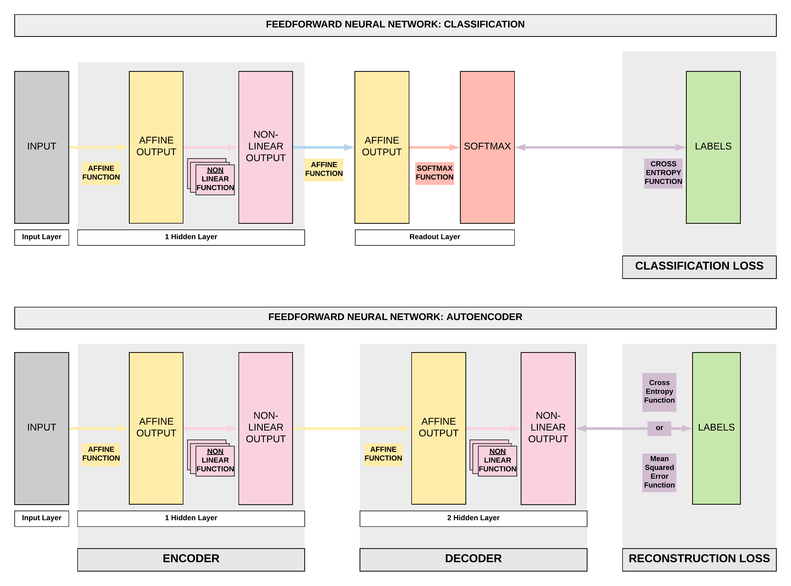

# Autoencoders with PyTorch

!!! tip "Run Jupyter Notebook"
    You can run the code for this section in this [jupyter notebook link](https://github.com/ritchieng/deep-learning-wizard/blob/master/docs/deep_learning/practical_pytorch/pytorch_autoencoder.ipynb).
    
## About Autoencoders

### Feedforward Neural Network (FNN) to Autoencoders (AEs)
- Autoencoder is a form of **unsupervised learning**.
    - This is a big deviation from what we have been doing: classification and regression which are under supervised learning.
    - There are no labels required, inputs are used as labels.
    	- This is a bit mind-boggling for some, but there're many conrete use cases as you'll soon realize.
    	- Just a quick preview of use cases we will be covering:
    		- Denoising overcomplete AEs: recreate images without the random noises originally injected.
    		- Undercomplete AEs for anomaly detection: use AEs for credit card fraud detection via anomaly detection.
    		- Variational AEs for creating synthetic faces: with a convolutional VAEs, we can make fake faces.
- An autoencoder's purpose is to learn an approximation of the identity function (mapping $x$ to $\hat x$).
    - Essentially we are trying to learn a function that can take our input $x$ and recreate it $\hat x$.
        - Technically we can do an exact recreation of our in-sample input if we use a very wide and deep neural network.

### Undercomplete and Overcomplete Autoencoders
- When we highlighted some use cases, did you notice how we mentioned undercomplete and autocomplete AEs?
- The only difference between the two is in the encoding output's size.
	- In the diagram above, this refers to the encoding output's size after our first affine function (yellow box) and non-linear function (pink box).
- **Undercomplete AEs: smaller**
	- This is when our encoding output's dimension is **smaller** than our input's dimension.
		- Essentially we reduced the dimension of our data (dimensionality reduction) with an undercomplete AE
- **Overcomplete AEs: larger**
	- This is when our encoding output's dimension is **larger** than our input's dimension
		- Essentially we increased the dimension of our data with an overcomplete AE
        
### Fully-connected and Convolutional Autoencoders
- Another important point is that, in our diagram we've used the example of our Feedforward Neural Networks (FNN) where we use fully-connected layers. 
	- This is called Fully-connected AE.
- However, we can easily swap those fully-connected layers with convolutional layers.
	- This is called Convolutional AE.

## Autoencoders Series
- We'll be covering a series of autoencoders in this order
	- Fully-connected Overcomplete Autoencoder (AEs): Denoising Images
	- Fully-connected Undercomplete Autoencoder (AEs): Credit Card Fraud Detection
	- Convolutional Overcomplete Variational Autoencoder (VAEs): Generate Fake Human Faces
	- Convolutional Overcomplete Adversarial Autoencoder (AAEs): Generate Fake Human Faces
	- Generative Adversarial Networks (GANs): Generate Better Fake Human Faces
