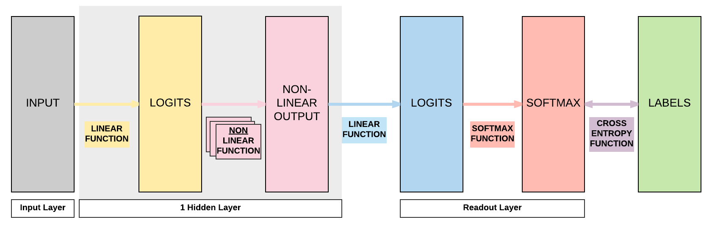
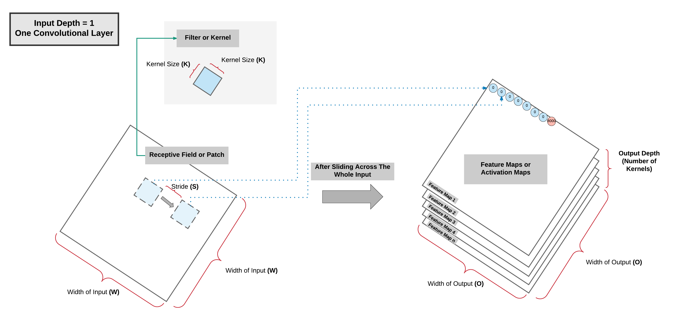
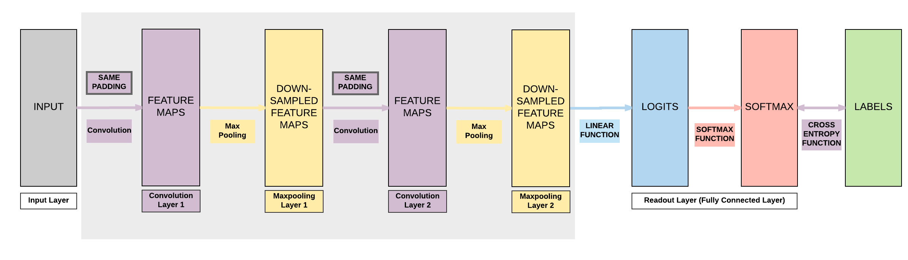
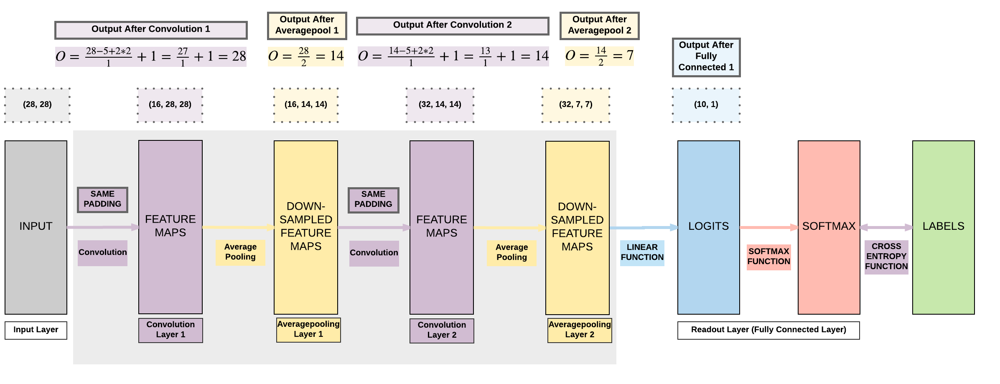

# Convolutional Neural Network with PyTorch

!!! tip "Run Jupyter Notebook"
    You can run the code for this section in this [jupyter notebook link](https://github.com/ritchieng/deep-learning-wizard/blob/master/docs/deep_learning/practical_pytorch/pytorch_convolutional_neuralnetwork.ipynb).
    
## About Convolutional Neural Network

### Transition From Feedforward Neural Network

#### Hidden Layer Feedforward Neural Network

!!! info "Recap of FNN"
    So let's do a recap of what we covered in the Feedforward Neural Network (FNN) section using a simple FNN with 1 hidden layer (a pair of affine function and non-linear function)
    
    1. [Yellow box] Pass input into an affine function $\boldsymbol{y} = A\boldsymbol{x} + \boldsymbol{b}$
    2. [Pink box] Pass logits to non-linear function, for example sigmoid, tanh (hyperbolic tangent), ReLU, or LeakyReLU
    3. [Blue box] Pass output of non-linear function to another affine function
    4. [Red box] Pass output of final affine function to softmax function to get our probability distribution over K classes
    5. [Purple box] Finally we can get our loss by using our cross entropy function 


#### Basic Convolutional Neural Network (CNN)
- A basic CNN just requires 2 additional layers!
    - **Convolution** and **pooling** layers **before our feedforward neural network**

!!! info "Fully Connected (FC) Layer"
    A layer with an **affine function & non-linear function** is called a **Fully Connected (FC) layer**


### One Convolutional Layer: High Level View


 


### One Convolutional Layer: High Level View Summary



- As the **kernel is sliding/convolving** across the image $\rightarrow$ 2 operations done **per patch**
    1. Element-wise multiplication
    2. Summation
- More **kernels** $=$ more **feature map channels**
    - Can capture **more information** about the input
    

### Multiple Convolutional Layers: High Level View


### Pooling Layer: High Level View
- 2 Common Types
    - Max Pooling
    - Average Pooling


### Multiple Pooling Layers: High Level View


### Padding


### Padding Summary
- **Valid** Padding (No Padding)
    - Output size < Input Size
- **Same** Padding (Zero Padding)
    - Output size = Input Size

### Dimension Calculations
- $O = \frac {W - K + 2P}{S} + 1$
    - $O$: output height/length
    - $W$: input height/length
    - $K$: filter size (kernel size)
    - $P$: padding
        - $P = \frac{K - 1}{2}$
    - $S$: stride


#### Example 1: Output Dimension Calculation for Valid Padding


- $W = 4$
- $K = 3$
- $P = 0$
- $S = 1$
- $O = \frac {4 - 3 + 2*0}{1} + 1 = \frac {1}{1} + 1 = 1 + 1 = 2$


#### Example 2: Output Dimension Calculation for Same Padding


- $W = 5$
- $K = 3$
- $P = \frac{3 - 1}{2} = \frac{2}{2} = 1$
- $S = 1$
- $O = \frac {5 - 3 + 2*1}{1} + 1 = \frac {4}{1} + 1 = 5$


## Building a Convolutional Neural Network with PyTorch

### Model A: 
- 2 Convolutional Layers
    - Same Padding (same output size)
- 2 Max Pooling Layers
- 1 Fully Connected Layer



#### Steps
- Step 1: Load Dataset
- Step 2: Make Dataset Iterable
- Step 3: Create Model Class
- Step 4: Instantiate Model Class
- Step 5: Instantiate Loss Class
- Step 6: Instantiate Optimizer Class
- Step 7: Train Model

#### Step 1: Loading MNIST Train Dataset
**Images from 1 to 9**


!!! note "MNIST Dataset and Size of Training Dataset (Excluding Labels)"
    ```python
    import torch
    import torch.nn as nn
    import torchvision.transforms as transforms
    import torchvision.datasets as dsets
    ```
    
    
    ```python
    train_dataset = dsets.MNIST(root='./data', 
                                train=True, 
                                transform=transforms.ToTensor(),
                                download=True)
    
    test_dataset = dsets.MNIST(root='./data', 
                               train=False, 
                               transform=transforms.ToTensor())
    ```
    
    
    ```python
    print(train_dataset.train_data.size())
    ```

```bash
torch.Size([60000, 28, 28])
```

!!! note "Size of our training dataset labels"
    ```python
    print(train_dataset.train_labels.size())
    ```

```bash
torch.Size([60000])
```

!!! note "Size of our testing dataset (excluding labels)"
```python
print(test_dataset.test_data.size())
```

```bash
torch.Size([10000, 28, 28])
```
   
!!! note "Size of our testing dataset labels"
    ```python
    print(test_dataset.test_labels.size())
    ```

```bash
torch.Size([10000])
```
   

#### Step 2: Make Dataset Iterable


!!! note "Load Dataset into Dataloader"
    ```python
    batch_size = 100
    n_iters = 3000
    num_epochs = n_iters / (len(train_dataset) / batch_size)
    num_epochs = int(num_epochs)
    
    train_loader = torch.utils.data.DataLoader(dataset=train_dataset, 
                                               batch_size=batch_size, 
                                               shuffle=True)
    
    test_loader = torch.utils.data.DataLoader(dataset=test_dataset, 
                                              batch_size=batch_size, 
                                              shuffle=False)
    ```

#### Step 3: Create Model Class


##### Output Formula for Convolution
- $O = \frac {W - K + 2P}{S} + 1$
    - $O$: output height/length
    - $W$: input height/length
    - $K$: **filter size (kernel size) = 5**
    - $P$: **same padding (non-zero)**
        - $P = \frac{K - 1}{2}  = \frac{5 - 1}{2} = 2$
    - $S$: **stride = 1**
    
##### Output Formula for Pooling
- $O = \frac {W - K}{S} + 1$
    - W: input height/width
    - K: **filter size = 2**
    - S: **stride size = filter size**, PyTorch defaults the stride to kernel filter size
        - If using PyTorch default stride, this will result in the formula $O = \frac {W}{K}$
        - By default, in our tutorials, we do this for simplicity.
     


!!! note "Define our simple 2 convolutional layer CNN"
    ```python
    class CNNModel(nn.Module):
        def __init__(self):
            super(CNNModel, self).__init__()
            
            # Convolution 1
            self.cnn1 = nn.Conv2d(in_channels=1, out_channels=16, kernel_size=5, stride=1, padding=2)
            self.relu1 = nn.ReLU()
            
            # Max pool 1
            self.maxpool1 = nn.MaxPool2d(kernel_size=2)
         
            # Convolution 2
            self.cnn2 = nn.Conv2d(in_channels=16, out_channels=32, kernel_size=5, stride=1, padding=2)
            self.relu2 = nn.ReLU()
            
            # Max pool 2
            self.maxpool2 = nn.MaxPool2d(kernel_size=2)
            
            # Fully connected 1 (readout)
            self.fc1 = nn.Linear(32 * 7 * 7, 10) 
        
        def forward(self, x):
            # Convolution 1
            out = self.cnn1(x)
            out = self.relu1(out)
            
            # Max pool 1
            out = self.maxpool1(out)
            
            # Convolution 2 
            out = self.cnn2(out)
            out = self.relu2(out)
            
            # Max pool 2 
            out = self.maxpool2(out)
            
            # Resize
            # Original size: (100, 32, 7, 7)
            # out.size(0): 100
            # New out size: (100, 32*7*7)
            out = out.view(out.size(0), -1)
    
            # Linear function (readout)
            out = self.fc1(out)
            
            return out
    ```

#### Step 4: Instantiate Model Class

!!! note "Our model"
    ```python
    model = CNNModel()
    ```

#### Step 5: Instantiate Loss Class
- Convolutional Neural Network: **Cross Entropy Loss**
    - _Feedforward Neural Network_: **Cross Entropy Loss**
    - _Logistic Regression_: **Cross Entropy Loss**
    - _Linear Regression_: **MSE**
    
!!! note "Our cross entropy loss"
    ```python
    criterion = nn.CrossEntropyLoss()
    ```

#### Step 6: Instantiate Optimizer Class
- Simplified equation
    - $\theta = \theta - \eta \cdot \nabla_\theta$
        - $\theta$: parameters
        - $\eta$: learning rate (how fast we want to learn)
        - $\nabla_\theta$: parameters' gradients
- Even simplier equation
    - `parameters = parameters - learning_rate * parameters_gradients`
    - **At every iteration, we update our model's parameters**


!!! note "Optimizer"
    ```python
    learning_rate = 0.01
    
    optimizer = torch.optim.SGD(model.parameters(), lr=learning_rate)  
    ```

##### Parameters In-Depth


!!! note "Print model's parameter"
    ```python
    print(model.parameters())
    
    print(len(list(model.parameters())))
    
    # Convolution 1: 16 Kernels
    print(list(model.parameters())[0].size())
    
    # Convolution 1 Bias: 16 Kernels
    print(list(model.parameters())[1].size())
    
    # Convolution 2: 32 Kernels with depth = 16
    print(list(model.parameters())[2].size())
    
    # Convolution 2 Bias: 32 Kernels with depth = 16
    print(list(model.parameters())[3].size())
    
    # Fully Connected Layer 1
    print(list(model.parameters())[4].size())
    
    # Fully Connected Layer Bias
    print(list(model.parameters())[5].size())
    ```

```bash
<generator object Module.parameters at 0x7f9864363c50>
6
torch.Size([16, 1, 5, 5])
torch.Size([16])
torch.Size([32, 16, 5, 5])
torch.Size([32])
torch.Size([10, 1568])
torch.Size([10])
```
    

#### Step 7: Train Model
- Process 
    1. **Convert inputs to tensors with gradient accumulation abilities**
        - CNN Input: (1, 28, 28) 
        - Feedforward NN Input: (1, 28*28)
    2. Clear gradient buffets
    3. Get output given inputs 
    4. Get loss
    5. Get gradients w.r.t. parameters
    6. Update parameters using gradients
        - `parameters = parameters - learning_rate * parameters_gradients`
    7. REPEAT


!!! note "Model training"
    ```python
    iter = 0
    for epoch in range(num_epochs):
        for i, (images, labels) in enumerate(train_loader):
            # Load images
            images = images.requires_grad_()
            
            # Clear gradients w.r.t. parameters
            optimizer.zero_grad()
            
            # Forward pass to get output/logits
            outputs = model(images)
            
            # Calculate Loss: softmax --> cross entropy loss
            loss = criterion(outputs, labels)
            
            # Getting gradients w.r.t. parameters
            loss.backward()
            
            # Updating parameters
            optimizer.step()
            
            iter += 1
            
            if iter % 500 == 0:
                # Calculate Accuracy         
                correct = 0
                total = 0
                # Iterate through test dataset
                for images, labels in test_loader:
                    # Load images
                    images = images.requires_grad_()
                    
                    # Forward pass only to get logits/output
                    outputs = model(images)
                    
                    # Get predictions from the maximum value
                    _, predicted = torch.max(outputs.data, 1)
                    
                    # Total number of labels
                    total += labels.size(0)
                    
                    # Total correct predictions
                    correct += (predicted == labels).sum()
                
                accuracy = 100 * correct / total
                
                # Print Loss
                print('Iteration: {}. Loss: {}. Accuracy: {}'.format(iter, loss.item(), accuracy))
    ```

```
Iteration: 500. Loss: 0.43324267864227295. Accuracy: 90
Iteration: 1000. Loss: 0.2511480152606964. Accuracy: 92
Iteration: 1500. Loss: 0.13431282341480255. Accuracy: 94
Iteration: 2000. Loss: 0.11173319816589355. Accuracy: 95
Iteration: 2500. Loss: 0.06409914791584015. Accuracy: 96
Iteration: 3000. Loss: 0.14377528429031372. Accuracy: 96
```
    
### Model B: 
- 2 Convolutional Layers
    - Same Padding (same output size)
- 2 **Average Pooling** Layers
- 1 Fully Connected Layer




#### Steps
- Step 1: Load Dataset
- Step 2: Make Dataset Iterable
- Step 3: Create Model Class
- Step 4: Instantiate Model Class
- Step 5: Instantiate Loss Class
- Step 6: Instantiate Optimizer Class
- Step 7: Train Model

!!! note "2 Conv + 2 Average Pool + 1 FC (Zero Padding, Same Padding)"
    ```python
    import torch
    import torch.nn as nn
    import torchvision.transforms as transforms
    import torchvision.datasets as dsets
    
    '''
    STEP 1: LOADING DATASET
    '''
    
    train_dataset = dsets.MNIST(root='./data', 
                                train=True, 
                                transform=transforms.ToTensor(),
                                download=True)
    
    test_dataset = dsets.MNIST(root='./data', 
                               train=False, 
                               transform=transforms.ToTensor())
    
    '''
    STEP 2: MAKING DATASET ITERABLE
    '''
    
    batch_size = 100
    n_iters = 3000
    num_epochs = n_iters / (len(train_dataset) / batch_size)
    num_epochs = int(num_epochs)
    
    train_loader = torch.utils.data.DataLoader(dataset=train_dataset, 
                                               batch_size=batch_size, 
                                               shuffle=True)
    
    test_loader = torch.utils.data.DataLoader(dataset=test_dataset, 
                                              batch_size=batch_size, 
                                              shuffle=False)
    
    '''
    STEP 3: CREATE MODEL CLASS
    '''
    class CNNModel(nn.Module):
        def __init__(self):
            super(CNNModel, self).__init__()
            
            # Convolution 1
            self.cnn1 = nn.Conv2d(in_channels=1, out_channels=16, kernel_size=5, stride=1, padding=2)
            self.relu1 = nn.ReLU()
            
            # Average pool 1
            self.avgpool1 = nn.AvgPool2d(kernel_size=2)
         
            # Convolution 2
            self.cnn2 = nn.Conv2d(in_channels=16, out_channels=32, kernel_size=5, stride=1, padding=2)
            self.relu2 = nn.ReLU()
            
            # Average pool 2
            self.avgpool2 = nn.AvgPool2d(kernel_size=2)
            
            # Fully connected 1 (readout)
            self.fc1 = nn.Linear(32 * 7 * 7, 10) 
        
        def forward(self, x):
            # Convolution 1
            out = self.cnn1(x)
            out = self.relu1(out)
            
            # Average pool 1
            out = self.avgpool1(out)
            
            # Convolution 2 
            out = self.cnn2(out)
            out = self.relu2(out)
            
            # Max pool 2 
            out = self.avgpool2(out)
            
            # Resize
            # Original size: (100, 32, 7, 7)
            # out.size(0): 100
            # New out size: (100, 32*7*7)
            out = out.view(out.size(0), -1)
    
            # Linear function (readout)
            out = self.fc1(out)
            
            return out
    
    '''
    STEP 4: INSTANTIATE MODEL CLASS
    '''
    
    model = CNNModel()
    
    '''
    STEP 5: INSTANTIATE LOSS CLASS
    '''
    criterion = nn.CrossEntropyLoss()
    
    
    '''
    STEP 6: INSTANTIATE OPTIMIZER CLASS
    '''
    learning_rate = 0.01
    
    optimizer = torch.optim.SGD(model.parameters(), lr=learning_rate)
    
    '''
    STEP 7: TRAIN THE MODEL
    '''
    iter = 0
    for epoch in range(num_epochs):
        for i, (images, labels) in enumerate(train_loader):
            # Load images as tensors with gradient accumulation abilities
            images = images.requires_grad_()
    
            # Clear gradients w.r.t. parameters
            optimizer.zero_grad()
            
            # Forward pass to get output/logits
            outputs = model(images)
            
            # Calculate Loss: softmax --> cross entropy loss
            loss = criterion(outputs, labels)
            
            # Getting gradients w.r.t. parameters
            loss.backward()
            
            # Updating parameters
            optimizer.step()
            
            iter += 1
            
            if iter % 500 == 0:
                # Calculate Accuracy         
                correct = 0
                total = 0
                # Iterate through test dataset
                for images, labels in test_loader:
                    # Load images to tensors with gradient accumulation abilities
                    images = images.requires_grad_()
                    
                    # Forward pass only to get logits/output
                    outputs = model(images)
                    
                    # Get predictions from the maximum value
                    _, predicted = torch.max(outputs.data, 1)
                    
                    # Total number of labels
                    total += labels.size(0)
                    
                    # Total correct predictions
                    correct += (predicted == labels).sum()
                
                accuracy = 100 * correct / total
                
                # Print Loss
                print('Iteration: {}. Loss: {}. Accuracy: {}'.format(iter, loss.item(), accuracy))
    ```

```bash
Iteration: 500. Loss: 0.6850348711013794. Accuracy: 85
Iteration: 1000. Loss: 0.36549052596092224. Accuracy: 88
Iteration: 1500. Loss: 0.31540098786354065. Accuracy: 89
Iteration: 2000. Loss: 0.3522164225578308. Accuracy: 90
Iteration: 2500. Loss: 0.2680729925632477. Accuracy: 91
Iteration: 3000. Loss: 0.26440390944480896. Accuracy: 92
```

!!! note "Comparison of accuracies"
    It seems like average pooling test accuracy is less than the max pooling accuracy! Does this mean average pooling is better? This is not definitive and depends on a lot of factors including the model's architecture, seed (that affects random weight initialization) and more.

### Model C: 
- 2 Convolutional Layers
    - **Valid Padding** (smaller output size)
- 2 **Max Pooling** Layers
- 1 Fully Connected Layer


#### Steps
- Step 1: Load Dataset
- Step 2: Make Dataset Iterable
- Step 3: Create Model Class
- Step 4: Instantiate Model Class
- Step 5: Instantiate Loss Class
- Step 6: Instantiate Optimizer Class
- Step 7: Train Model

!!! note "2 Conv + 2 Max Pool + 1 FC (Valid Padding, No Padding)" 
    ```python
    import torch
    import torch.nn as nn
    import torchvision.transforms as transforms
    import torchvision.datasets as dsets
    
    '''
    STEP 1: LOADING DATASET
    '''
    
    train_dataset = dsets.MNIST(root='./data', 
                                train=True, 
                                transform=transforms.ToTensor(),
                                download=True)
    
    test_dataset = dsets.MNIST(root='./data', 
                               train=False, 
                               transform=transforms.ToTensor())
    
    '''
    STEP 2: MAKING DATASET ITERABLE
    '''
    
    batch_size = 100
    n_iters = 3000
    num_epochs = n_iters / (len(train_dataset) / batch_size)
    num_epochs = int(num_epochs)
    
    train_loader = torch.utils.data.DataLoader(dataset=train_dataset, 
                                               batch_size=batch_size, 
                                               shuffle=True)
    
    test_loader = torch.utils.data.DataLoader(dataset=test_dataset, 
                                              batch_size=batch_size, 
                                              shuffle=False)
    
    '''
    STEP 3: CREATE MODEL CLASS
    '''
    class CNNModel(nn.Module):
        def __init__(self):
            super(CNNModel, self).__init__()
            
            # Convolution 1
            self.cnn1 = nn.Conv2d(in_channels=1, out_channels=16, kernel_size=5, stride=1, padding=0)
            self.relu1 = nn.ReLU()
            
            # Max pool 1
            self.maxpool1 = nn.MaxPool2d(kernel_size=2)
         
            # Convolution 2
            self.cnn2 = nn.Conv2d(in_channels=16, out_channels=32, kernel_size=5, stride=1, padding=0)
            self.relu2 = nn.ReLU()
            
            # Max pool 2
            self.maxpool2 = nn.MaxPool2d(kernel_size=2)
            
            # Fully connected 1 (readout)
            self.fc1 = nn.Linear(32 * 4 * 4, 10) 
        
        def forward(self, x):
            # Convolution 1
            out = self.cnn1(x)
            out = self.relu1(out)
            
            # Max pool 1
            out = self.maxpool1(out)
            
            # Convolution 2 
            out = self.cnn2(out)
            out = self.relu2(out)
            
            # Max pool 2 
            out = self.maxpool2(out)
            
            # Resize
            # Original size: (100, 32, 7, 7)
            # out.size(0): 100
            # New out size: (100, 32*7*7)
            out = out.view(out.size(0), -1)
    
            # Linear function (readout)
            out = self.fc1(out)
            
            return out
    
    '''
    STEP 4: INSTANTIATE MODEL CLASS
    '''
    
    model = CNNModel()
    
    '''
    STEP 5: INSTANTIATE LOSS CLASS
    '''
    criterion = nn.CrossEntropyLoss()
    
    
    '''
    STEP 6: INSTANTIATE OPTIMIZER CLASS
    '''
    learning_rate = 0.01
    
    optimizer = torch.optim.SGD(model.parameters(), lr=learning_rate)
    
    '''
    STEP 7: TRAIN THE MODEL
    '''
    iter = 0
    for epoch in range(num_epochs):
        for i, (images, labels) in enumerate(train_loader):
            # Load images as tensors with gradient accumulation abilities
            images = images.requires_grad_()
            
            # Clear gradients w.r.t. parameters
            optimizer.zero_grad()
            
            # Forward pass to get output/logits
            outputs = model(images)
            
            # Calculate Loss: softmax --> cross entropy loss
            loss = criterion(outputs, labels)
            
            # Getting gradients w.r.t. parameters
            loss.backward()
            
            # Updating parameters
            optimizer.step()
            
            iter += 1
            
            if iter % 500 == 0:
                # Calculate Accuracy         
                correct = 0
                total = 0
                # Iterate through test dataset
                for images, labels in test_loader:
                    # Load images to tensors with gradient accumulation abilities
                    images = images.requires_grad_()
                    
                    # Forward pass only to get logits/output
                    outputs = model(images)
                    
                    # Get predictions from the maximum value
                    _, predicted = torch.max(outputs.data, 1)
                    
                    # Total number of labels
                    total += labels.size(0)
                    
                    # Total correct predictions
                    correct += (predicted == labels).sum()
                
                accuracy = 100 * correct / total
                
                # Print Loss
                print('Iteration: {}. Loss: {}. Accuracy: {}'.format(iter, loss.item(), accuracy))
    ```

```bash
Iteration: 500. Loss: 0.5153220295906067. Accuracy: 88
Iteration: 1000. Loss: 0.28784745931625366. Accuracy: 92
Iteration: 1500. Loss: 0.4086027443408966. Accuracy: 94
Iteration: 2000. Loss: 0.09390712529420853. Accuracy: 95
Iteration: 2500. Loss: 0.07138358801603317. Accuracy: 95
Iteration: 3000. Loss: 0.05396252125501633. Accuracy: 96
```
  
### Summary of Results

| Model A | Model B | Model C | 
|------|------|------|
|   Max Pooling  | Average Pooling | Max Pooling |
| Same Padding | Same Padding | Valid Padding | 
| 97.04% | 93.59% | 96.5% | 


| All Models |
|------|
| INPUT $\rightarrow$ CONV $\rightarrow$ POOL $\rightarrow$ CONV $\rightarrow$ POOL $\rightarrow$ FC | 
| Convolution Kernel Size = 5 x 5 |
| Convolution Kernel Stride = 1 |
| Pooling Kernel Size = 2 x 2 |


### General Deep Learning Notes on CNN and FNN
- 3 ways to expand a convolutional neural network
    - More convolutional layers 
    - Less aggressive downsampling
        - Smaller kernel size for pooling (gradually downsampling)
    - More fully connected layers 
- Cons
    - Need a larger dataset
        - Curse of dimensionality
    - Does not necessarily mean higher accuracy

## 3. Building a Convolutional Neural Network with PyTorch (GPU)
### Model A


GPU: 2 things must be on GPU
- `model`
- `tensors`

### Steps
- Step 1: Load Dataset
- Step 2: Make Dataset Iterable
- Step 3: Create Model Class
- **Step 4: Instantiate Model Class**
- Step 5: Instantiate Loss Class
- Step 6: Instantiate Optimizer Class
- **Step 7: Train Model**


!!! note "2 Conv + 2 Max Pooling + 1 FC (Same Padding, Zero Padding)"
    ```python
    import torch
    import torch.nn as nn
    import torchvision.transforms as transforms
    import torchvision.datasets as dsets 
    
    '''
    STEP 1: LOADING DATASET
    '''
    
    train_dataset = dsets.MNIST(root='./data', 
                                train=True, 
                                transform=transforms.ToTensor(),
                                download=True)
    
    test_dataset = dsets.MNIST(root='./data', 
                               train=False, 
                               transform=transforms.ToTensor())
    
    '''
    STEP 2: MAKING DATASET ITERABLE
    '''
    
    batch_size = 100
    n_iters = 3000
    num_epochs = n_iters / (len(train_dataset) / batch_size)
    num_epochs = int(num_epochs)
    
    train_loader = torch.utils.data.DataLoader(dataset=train_dataset, 
                                               batch_size=batch_size, 
                                               shuffle=True)
    
    test_loader = torch.utils.data.DataLoader(dataset=test_dataset, 
                                              batch_size=batch_size, 
                                              shuffle=False)
    
    '''
    STEP 3: CREATE MODEL CLASS
    '''
    class CNNModel(nn.Module):
        def __init__(self):
            super(CNNModel, self).__init__()
            
            # Convolution 1
            self.cnn1 = nn.Conv2d(in_channels=1, out_channels=16, kernel_size=5, stride=1, padding=0)
            self.relu1 = nn.ReLU()
            
            # Max pool 1
            self.maxpool1 = nn.MaxPool2d(kernel_size=2)
         
            # Convolution 2
            self.cnn2 = nn.Conv2d(in_channels=16, out_channels=32, kernel_size=5, stride=1, padding=0)
            self.relu2 = nn.ReLU()
            
            # Max pool 2
            self.maxpool2 = nn.MaxPool2d(kernel_size=2)
            
            # Fully connected 1 (readout)
            self.fc1 = nn.Linear(32 * 4 * 4, 10) 
        
        def forward(self, x):
            # Convolution 1
            out = self.cnn1(x)
            out = self.relu1(out)
            
            # Max pool 1
            out = self.maxpool1(out)
            
            # Convolution 2 
            out = self.cnn2(out)
            out = self.relu2(out)
            
            # Max pool 2 
            out = self.maxpool2(out)
            
            # Resize
            # Original size: (100, 32, 7, 7)
            # out.size(0): 100
            # New out size: (100, 32*7*7)
            out = out.view(out.size(0), -1)
    
            # Linear function (readout)
            out = self.fc1(out)
            
            return out
    
    '''
    STEP 4: INSTANTIATE MODEL CLASS
    '''
    
    model = CNNModel()
    
    #######################
    #  USE GPU FOR MODEL  #
    #######################
    
    device = torch.device("cuda:0" if torch.cuda.is_available() else "cpu")
    model.to(device)
    
    '''
    STEP 5: INSTANTIATE LOSS CLASS
    '''
    criterion = nn.CrossEntropyLoss()
    
    
    '''
    STEP 6: INSTANTIATE OPTIMIZER CLASS
    '''
    learning_rate = 0.01
    
    optimizer = torch.optim.SGD(model.parameters(), lr=learning_rate)
    
    '''
    STEP 7: TRAIN THE MODEL
    '''
    iter = 0
    for epoch in range(num_epochs):
        for i, (images, labels) in enumerate(train_loader):
            
            #######################
            #  USE GPU FOR MODEL  #
            #######################
            images = images.requires_grad_().to(device)
            labels = labels.to(device)
            
            # Clear gradients w.r.t. parameters
            optimizer.zero_grad()
            
            # Forward pass to get output/logits
            outputs = model(images)
            
            # Calculate Loss: softmax --> cross entropy loss
            loss = criterion(outputs, labels)
            
            # Getting gradients w.r.t. parameters
            loss.backward()
            
            # Updating parameters
            optimizer.step()
            
            iter += 1
            
            if iter % 500 == 0:
                # Calculate Accuracy         
                correct = 0
                total = 0
                # Iterate through test dataset
                for images, labels in test_loader:
                    #######################
                    #  USE GPU FOR MODEL  #
                    #######################
                    images = images.requires_grad_().to(device)
                    labels = labels.to(device)
                    
                    # Forward pass only to get logits/output
                    outputs = model(images)
                    
                    # Get predictions from the maximum value
                    _, predicted = torch.max(outputs.data, 1)
                    
                    # Total number of labels
                    total += labels.size(0)
                    
                    #######################
                    #  USE GPU FOR MODEL  #
                    #######################
                    # Total correct predictions
                    if torch.cuda.is_available():
                        correct += (predicted.cpu() == labels.cpu()).sum()
                    else:
                        correct += (predicted == labels).sum()
                
                accuracy = 100 * correct / total
                
                # Print Loss
                print('Iteration: {}. Loss: {}. Accuracy: {}'.format(iter, loss.item(), accuracy))
    ```

```bash
Iteration: 500. Loss: 0.36831170320510864. Accuracy: 88
Iteration: 1000. Loss: 0.31790846586227417. Accuracy: 92
Iteration: 1500. Loss: 0.1510857343673706. Accuracy: 94
Iteration: 2000. Loss: 0.08368007838726044. Accuracy: 95
Iteration: 2500. Loss: 0.13419771194458008. Accuracy: 96
Iteration: 3000. Loss: 0.16750787198543549. Accuracy: 96
```


!!! tip "More Efficient Convolutions via Toeplitz Matrices"
    This is beyond the scope of this particular lesson. But now that we understand how convolutions work, it is critical to know that it is quite an inefficient operation if we use for-loops to perform our 2D convolutions (5 x 5 convolution kernel size for example) on our 2D images (28 x 28 MNIST image for example).
    
    A more efficient implementation is in converting our convolution kernel into a doubly block circulant/Toeplitz matrix (special case Toeplitz matrix) and our image (input) into a vector. Then, we will do just one matrix operation using our doulby block Toeplitz matrix and our input vector.
    
    There will be a whole lesson dedicated to this operation released down the road. 
    
## Summary
We've learnt to...

!!! success
    * [x] Transition from **Feedforward Neural Network**
        * [x] Addition of **Convolutional** & **Pooling** Layers before Linear Layers
    * [x] One **Convolutional** Layer Basics
    * [x] One **Pooling** Layer Basics
        * [x] Max pooling
        * [x] Average pooling
    * [x] **Padding**
    * [x] **Output Dimension** Calculations and Examples
        * [x]  $O = \frac {W - K + 2P}{S} + 1$
    * [x] Convolutional Neural Networks
        * [x] **Model A**: 2 Conv + 2 Max pool + 1 FC
            * [x] Same Padding
        * [x] **Model B**: 2 Conv + 2 Average pool + 1 FC
            * [x] Same Padding
        * [x] **Model C**: 2 Conv + 2 Max pool + 1 FC
            * [x] Valid Padding
    * [x] Model Variation in **Code**
        * [x] Modifying only step 3
    * [x] Ways to Expand Model’s **Capacity**
        * [x] More convolutions
        * [x] Gradual pooling
        * [x] More fully connected layers
    * [x] **GPU** Code
        * [x] 2 things on GPU
            * [x] **model**
            * [x] **tensors with gradient accumulation abilities**
        * [x] Modifying only **Step 4 & Step 7**
    * [x] **7 Step** Model Building Recap
        * [x] Step 1: Load Dataset
        * [x] Step 2: Make Dataset Iterable
        * [x] Step 3: Create Model Class
        * [x] Step 4: Instantiate Model Class
        * [x] Step 5: Instantiate Loss Class
        * [x] Step 6: Instantiate Optimizer Class
        * [x] Step 7: Train Model

## Citation
If you have found these useful in your research, presentations, school work, projects or workshops, feel free to cite using this DOI.

[](https://zenodo.org/badge/latestdoi/139945544)