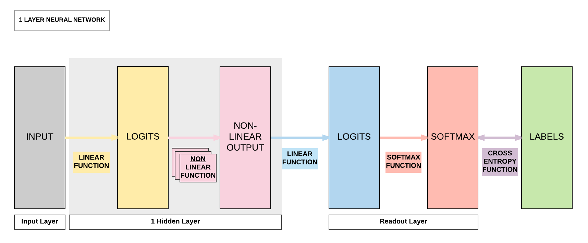
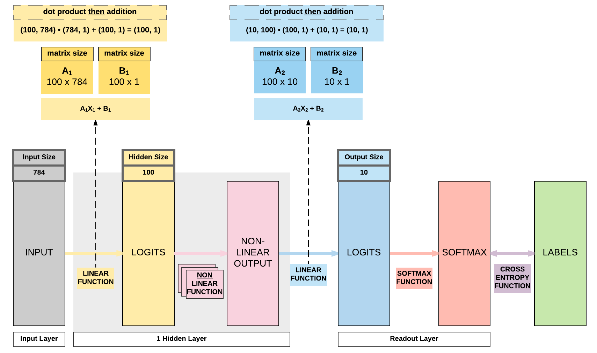

# Feedforward Neural Network with PyTorch

!!! tip "Run Jupyter Notebook"
    You can run the code for this section in this [jupyter notebook link](https://github.com/ritchieng/deep-learning-wizard/blob/master/docs/deep_learning/practical_pytorch/pytorch_feedforward_neuralnetwork.ipynb).
    
## About Feedforward Neural Network

### Logistic Regression Transition to Neural Networks

#### Logistic Regression Review


!!! note "Define logistic regression model"
    Import our relevant torch modules.
    ```python
    import torch
    import torch.nn as nn
    ```
    
    Define our model class.
    ```python
    class LogisticRegressionModel(nn.Module):
        def __init__(self, input_dim, output_dim):
            super(LogisticRegressionModel, self).__init__()
            self.linear = nn.Linear(input_dim, output_dim)
        
        def forward(self, x):
            out = self.linear(x)
            return out
    ```
    
    
    Instantiate the logistic regression model.
    ```python
    input_dim = 28*28
    output_dim = 10
    
    model = LogisticRegressionModel(input_dim, output_dim)
    ```
    
    When we inspect the model, we would have an input size of 784 (derived from 28 x 28) and output size of 10 (which is the number of classes we are classifying from 0 to 9).
    ```python
    print(model)
    ```

```python
LogisticRegressionModel(
  (linear): Linear(in_features=784, out_features=10, bias=True)
)
```

#### Logistic Regression Problems
- Can represent **linear** functions well
    - $y = 2x + 3$
    - $y = x_1 + x_2$
    - $y = x_1 + 3x_2 + 4x_3$
- Cannot represent **non-linear** functions
    - $y = 4x_1 + 2x_2^2 +3x_3^3$
    - $y = x_1x_2$
       
### Introducing a Non-linear Function


### Non-linear Function In-Depth
- Function: takes a number & perform mathematical operation
- Common Types of Non-linearity
    - ReLUs (Rectified Linear Units)      
    - Sigmoid
    - Tanh

#### Sigmoid (Logistic)
- $\sigma(x) = \frac{1}{1 + e^{-x}}$
- Input number $\rightarrow$ [0, 1]
    - Large negative number $\rightarrow$ 0
    - Large positive number $\rightarrow$ 1
- Cons: 
    1. Activation saturates at 0 or 1 with **gradients $\approx$ 0**
        - No signal to update weights $\rightarrow$ **cannot learn**
        - Solution: Have to carefully initialize weights to prevent this
    2. Outputs not centered around 0 
        - If output always positive $\rightarrow$ gradients always positive or negative $\rightarrow$ **bad for gradient updates** 

#### Tanh
- $\tanh(x) = 2 \sigma(2x) -1$
    - A scaled sigmoid function
- Input number $\rightarrow$ [-1, 1]
- Cons: 
    1. Activation saturates at 0 or 1 with **gradients $\approx$ 0**
        - No signal to update weights $\rightarrow$ **cannot learn**
        - **Solution**: Have to carefully initialize weights to prevent this

 
#### ReLUs
- $f(x) = \max(0, x)$
- Pros:
    1. Accelerates convergence $\rightarrow$ **train faster**
    2. **Less computationally expensive operation** compared to Sigmoid/Tanh exponentials
- Cons:
    1. Many ReLU units "die" $\rightarrow$ **gradients = 0** forever
        - **Solution**: careful learning rate choice
      
      
## Building a Feedforward Neural Network with PyTorch

### Model A: 1 Hidden Layer Feedforward Neural Network (Sigmoid Activation)


### Steps
- Step 1: Load Dataset
- Step 2: Make Dataset Iterable
- Step 3: Create Model Class
- Step 4: Instantiate Model Class
- Step 5: Instantiate Loss Class
- Step 6: Instantiate Optimizer Class
- Step 7: Train Model

### Step 1: Loading MNIST Train Dataset

!!! note "Images from 1 to 9"
    Similar to what we did in logistic regression, we will be using the same MNIST dataset where we load our training and testing datasets.
    
    ```python
    import torch
    import torch.nn as nn
    import torchvision.transforms as transforms
    import torchvision.datasets as dsets
    ```
    
    
    ```python
    train_dataset = dsets.MNIST(root='./data', 
                                train=True, 
                                transform=transforms.ToTensor(),
                                download=True)
    
    test_dataset = dsets.MNIST(root='./data', 
                               train=False, 
                               transform=transforms.ToTensor())
    ```

### Step 2: Make Dataset Iterable


!!! note "Batch sizes and iterations"
    Because we have 60000 training samples (images), we need to split them up to small groups (batches) and pass these batches of samples to our feedforward neural network subsesquently.
    
    There are a few reasons why we split them into batches. Passing your whole dataset as a single batch would:
    
    (1) require a lot of RAM/VRAM on your CPU/GPU and this might result in Out-of-Memory (OOM) errors. 
    
    (2) cause unstable training if you just use all the errors accumulated in 60,000 images to update the model rather than gradually update the model. In layman terms, imagine you accumulated errors for a student taking an exam with 60,000 questions and punish the student all at the same time. It is much harder for the student to learn compared to letting the student learn it made mistakes and did well in smaller batches of questions like mini-tests!
    
    If we have 60,000 images and we want a batch size of 100, then we would have 600 iterations where each iteration involves passing 600 images to the model and getting their respective predictions. 
    
    ```python
    60000 / 100
    ```

```python
600.0
```


!!! note "Epochs"
    An epoch means that you have successfully passed the whole training set, 60,000 images, to the model. Continuing our example above, an epoch consists of 600 iterations.
    
    If we want to go through the whole dataset 5 times (5 epochs) for the model to learn, then we need 3000 iterations (600 x 5). 

    
    ```python
    600 * 5
    ```


```python
3000.0
```


!!! note "Bringing batch size, iterations and epochs together"
    As we have gone through above, we want to have 5 epochs, where each epoch would have 600 iterations and each iteration has a batch size of 100.
    
    Because we want 5 epochs, we need a total of 3000 iterations.
    
    ```python
    batch_size = 100
    n_iters = 3000
    num_epochs = n_iters / (len(train_dataset) / batch_size)
    num_epochs = int(num_epochs)
    
    train_loader = torch.utils.data.DataLoader(dataset=train_dataset, 
                                               batch_size=batch_size, 
                                               shuffle=True)
    
    test_loader = torch.utils.data.DataLoader(dataset=test_dataset, 
                                              batch_size=batch_size, 
                                              shuffle=False)
    ```

### Step 3: Create Model Class

!!! note "Creating our feedforward neural network"
    Compared to logistic regression with only a single linear layer, we know for an FNN we need an additional linear layer and non-linear layer. 
    
    This translates to just 4 more lines of code! 
    
    ```python
    class FeedforwardNeuralNetModel(nn.Module):
        def __init__(self, input_dim, hidden_dim, output_dim):
            super(FeedforwardNeuralNetModel, self).__init__()
            # Linear function
            self.fc1 = nn.Linear(input_dim, hidden_dim) 
            
            # Non-linearity
            self.sigmoid = nn.Sigmoid()
            
            # Linear function (readout)
            self.fc2 = nn.Linear(hidden_dim, output_dim)  
        
        def forward(self, x):
            # Linear function  # LINEAR
            out = self.fc1(x)
            
            # Non-linearity  # NON-LINEAR
            out = self.sigmoid(out)
            
            # Linear function (readout)  # LINEAR
            out = self.fc2(out)
            return out
    ```

### Step 4: Instantiate Model Class
- **Input** dimension: **784** 
    - Size of image
    - $28 \times 28 = 784$
- **Output** dimension: **10**
    - 0, 1, 2, 3, 4, 5, 6, 7, 8, 9
- **Hidden** dimension: **100**
    - Can be any number
    - Similar term
        - Number of neurons
        - Number of non-linear activation functions


!!! note "Instantiating our model class"
    Our input size is determined by the size of the image (numbers ranging from 0 to 9) which has a width of 28 pixels and a height of 28 pixels. Hence the size of our input is 784 (28 x 28).
    
    Our output size is what we are trying to predict. When we pass an image to our model, it will try to predict if it's 0, 1, 2, 3, 4, 5, 6, 7, 8, or 9. That is a total of 10 classes, hence we have an output size of 10.
    
    Now the tricky part is in determining our hidden layer size, that is the size of our first linear layer prior to the non-linear layer. This can be any number, a larger number implies a bigger model with more parameters. Intuitively we think a bigger model equates to a better model, but a bigger model requires more training samples to learn and converge to a good model (also called curse of dimensionality). Hence, it is wise to pick the model size for the problem at hand. Because it is a simple problem of recognizing digits, we typically would not need a big model to achieve state-of-the-art results.
    
    On the flipside, too small of a hidden size would mean there would be insufficient model capacity to predict competently. In layman terms, too small of a capacity implies a smaller brain capacity so no matter how many training samples you give it, it has a maximum capacity in terms of its predictive power. 
    
    ```python
    input_dim = 28*28
    hidden_dim = 100
    output_dim = 10
    
    model = FeedforwardNeuralNetModel(input_dim, hidden_dim, output_dim)
    ```

### Step 5: Instantiate Loss Class
- Feedforward Neural Network: **Cross Entropy Loss**
    - _Logistic Regression_: **Cross Entropy Loss**
    - _Linear Regression_: **MSE**
   

!!! note "Loss class"
    This is exactly the same as what we did in logistic regression. Because we are going through a classification problem, cross entropy function is required to compute the loss between our softmax outputs and our binary labels.
    
    ```python
    criterion = nn.CrossEntropyLoss()
    ```

### Step 6: Instantiate Optimizer Class
- Simplified equation
    - $\theta = \theta - \eta \cdot \nabla_\theta$
        - $\theta$: parameters (our tensors with gradient accumulation capabilities)
        - $\eta$: learning rate (how fast we want to learn)
        - $\nabla_\theta$: parameters' gradients
- Even simplier equation
    - `parameters = parameters - learning_rate * parameters_gradients`
    - **At every iteration, we update our model's parameters**


!!! note "Optimizer class"
    Learning rate determines how fast the algorithm learns. Too small and the algorithm learns too slowly, too large and the algorithm learns too fast resulting in instabilities.
    
    Intuitively, we would think a larger learning rate would be better because we learn faster. But that's not true. Imagine we pass 10 images to a human to learn how to recognize whether the image is a hot dog or not, and it got half right and half wrong. 
    
    A well defined learning rate (neither too small or large) is equivalent to rewarding the human with a sweet for getting the first half right, and punishing the other half the human got wrong with a smack on the palm. 
    
    A large learning rate would be equivalent to feeding a thousand sweets to the human and smacking a thousand times on the human's palm. This would lead in a very unstable learning environment. Similarly, we will observe that the algorithm's convergence path will be extremely unstable if you use a large learning rate without reducing it subsequently. 
    
    We are using an optimization algorithm called Stochastic Gradient Descent (SGD) which is essentially what we covered above on calculating the parameters' gradients multiplied by the learning rate then using it to update our parameters gradually. There's an in-depth analysis of various optimization algorithms on top of SGD in another section.
    
    ```python
    learning_rate = 0.1
    
    optimizer = torch.optim.SGD(model.parameters(), lr=learning_rate)  
    ```

#### Parameters In-Depth


!!! note "Linear layers' parameters"
    In a simple linear layer it's $Y = AX + B$, and our parameters are $A$ and bias $B$. 
    
    Hence, each linear layer would have 2 groups of parameters  $A$ and $B$. It is critical to take note that our non-linear layers have no parameters to update. They are merely mathematical functions performed on $Y$, the output of our linear layers.
    
    This would return a Python generator object, so you need to call list on the generator object to access anything meaningful.
    ```python
    print(model.parameters())
    ```
    
    Here we call list on the generator object and getting the length of the list. This would return 4 because we've 2 linear layers, and each layer has 2 groups of parameters $A$ and $b$.
    
    ```python
    print(len(list(model.parameters())))
    ```
    
    Our first linear layer parameters, $A_1$, would be of size 100 x 784. This is because we've an input size of 784 (28 x 28) and a hidden size of 100.
    ```python
    # FC 1 Parameters 
    print(list(model.parameters())[0].size())
    ```
    
    Our first linear layer bias parameters, $B_1$, would be of size 100 which is our hidden size.
    ```python
    # FC 1 Bias Parameters
    print(list(model.parameters())[1].size())
    ```
    
    Our second linear layer is our readout layer, where the parameters $A_2$ would be of size 10 x 100. This is because our output size is 10 and hidden size is 100.
    
    ```python
    # FC 2 Parameters
    print(list(model.parameters())[2].size())
    ```
    
    Likewise our readout layer's bias $B_1$ would just be 10, the size of our output.
    
    ```python
    # FC 2 Bias Parameters
    print(list(model.parameters())[3].size())
    ```
    
    The diagram below shows the interaction amongst our input $X$ and our linear layers' parameters $A_1$, $B_1$, $A_2$, and $B_2$ to reach to the final size of 10 x 1.
    
    If you're still unfamiliar with matrix product, go ahead and review the previous quick lesson where we covered it in [logistic regression](https://www.deeplearningwizard.com/deep_learning/practical_pytorch/pytorch_logistic_regression/#step-6-instantiate-optimizer-class).
    

```python
<generator object Module.parameters at 0x7f1d530fa678>
4
torch.Size([100, 784])
torch.Size([100])
torch.Size([10, 100])
torch.Size([10])
```



### Step 7: Train Model
- Process 
    1. Convert inputs to tensors with gradient accumulation capabilities
    2. Clear gradient buffers
    3. Get output given inputs 
    4. Get loss
    5. Get gradients w.r.t. parameters
    6. Update parameters using gradients
        - `parameters = parameters - learning_rate * parameters_gradients`
    7. REPEAT

!!! note "7-step training process"
    ```python
    iter = 0
    for epoch in range(num_epochs):
        for i, (images, labels) in enumerate(train_loader):
            # Load images with gradient accumulation capabilities
            images = images.view(-1, 28*28).requires_grad_()
            
            # Clear gradients w.r.t. parameters
            optimizer.zero_grad()
            
            # Forward pass to get output/logits
            outputs = model(images)
            
            # Calculate Loss: softmax --> cross entropy loss
            loss = criterion(outputs, labels)
            
            # Getting gradients w.r.t. parameters
            loss.backward()
            
            # Updating parameters
            optimizer.step()
            
            iter += 1
            
            if iter % 500 == 0:
                # Calculate Accuracy         
                correct = 0
                total = 0
                # Iterate through test dataset
                for images, labels in test_loader:
                    # Load images with gradient accumulation capabilities
                    images = images.view(-1, 28*28).requires_grad_()
                    
                    # Forward pass only to get logits/output
                    outputs = model(images)
                    
                    # Get predictions from the maximum value
                    _, predicted = torch.max(outputs.data, 1)
                    
                    # Total number of labels
                    total += labels.size(0)
                    
                    # Total correct predictions
                    correct += (predicted == labels).sum()
                
                accuracy = 100 * correct / total
                
                # Print Loss
                print('Iteration: {}. Loss: {}. Accuracy: {}'.format(iter, loss.item(), accuracy))
    ```

```python
Iteration: 500. Loss: 0.6457265615463257. Accuracy: 85
Iteration: 1000. Loss: 0.39627206325531006. Accuracy: 89
Iteration: 1500. Loss: 0.2831554412841797. Accuracy: 90
Iteration: 2000. Loss: 0.4409525394439697. Accuracy: 91
Iteration: 2500. Loss: 0.2397005707025528. Accuracy: 91
Iteration: 3000. Loss: 0.3160165846347809. Accuracy: 91

```


### Model B: 1 Hidden Layer Feedforward Neural Network (Tanh Activation)


### Steps
- Step 1: Load Dataset
- Step 2: Make Dataset Iterable
- **Step 3: Create Model Class**
- Step 4: Instantiate Model Class
- Step 5: Instantiate Loss Class
- Step 6: Instantiate Optimizer Class
- Step 7: Train Model


!!! note "1-layer FNN with Tanh Activation"
    The only difference here compared to previously is that we are using Tanh activation instead of Sigmoid activation. This affects step 3.
    ```python
    import torch
    import torch.nn as nn
    import torchvision.transforms as transforms
    import torchvision.datasets as dsets
    
    '''
    STEP 1: LOADING DATASET
    '''
    
    train_dataset = dsets.MNIST(root='./data', 
                                train=True, 
                                transform=transforms.ToTensor(),
                                download=True)
    
    test_dataset = dsets.MNIST(root='./data', 
                               train=False, 
                               transform=transforms.ToTensor())
    
    '''
    STEP 2: MAKING DATASET ITERABLE
    '''
    
    batch_size = 100
    n_iters = 3000
    num_epochs = n_iters / (len(train_dataset) / batch_size)
    num_epochs = int(num_epochs)
    
    train_loader = torch.utils.data.DataLoader(dataset=train_dataset, 
                                               batch_size=batch_size, 
                                               shuffle=True)
    
    test_loader = torch.utils.data.DataLoader(dataset=test_dataset, 
                                              batch_size=batch_size, 
                                              shuffle=False)
    
    '''
    STEP 3: CREATE MODEL CLASS
    '''
    class FeedforwardNeuralNetModel(nn.Module):
        def __init__(self, input_dim, hidden_dim, output_dim):
            super(FeedforwardNeuralNetModel, self).__init__()
            # Linear function
            self.fc1 = nn.Linear(input_dim, hidden_dim) 
            # Non-linearity
            self.tanh = nn.Tanh()
            # Linear function (readout)
            self.fc2 = nn.Linear(hidden_dim, output_dim)  
        
        def forward(self, x):
            # Linear function
            out = self.fc1(x)
            # Non-linearity
            out = self.tanh(out)
            # Linear function (readout)
            out = self.fc2(out)
            return out
    '''
    STEP 4: INSTANTIATE MODEL CLASS
    '''
    input_dim = 28*28
    hidden_dim = 100
    output_dim = 10
    
    model = FeedforwardNeuralNetModel(input_dim, hidden_dim, output_dim)
    
    '''
    STEP 5: INSTANTIATE LOSS CLASS
    '''
    criterion = nn.CrossEntropyLoss()
    
    '''
    STEP 6: INSTANTIATE OPTIMIZER CLASS
    '''
    learning_rate = 0.1
    
    optimizer = torch.optim.SGD(model.parameters(), lr=learning_rate)
    
    '''
    STEP 7: TRAIN THE MODEL
    '''
    iter = 0
    for epoch in range(num_epochs):
        for i, (images, labels) in enumerate(train_loader):
            # Load images with gradient accumulation capabilities
            images = images.view(-1, 28*28).requires_grad_()
            
            # Clear gradients w.r.t. parameters
            optimizer.zero_grad()
            
            # Forward pass to get output/logits
            outputs = model(images)
            
            # Calculate Loss: softmax --> cross entropy loss
            loss = criterion(outputs, labels)
            
            # Getting gradients w.r.t. parameters
            loss.backward()
            
            # Updating parameters
            optimizer.step()
            
            iter += 1
            
            if iter % 500 == 0:
                # Calculate Accuracy         
                correct = 0
                total = 0
                # Iterate through test dataset
                for images, labels in test_loader:
                    # Load images with gradient accumulation capabilities
                    images = images.view(-1, 28*28).requires_grad_()
                    
                    # Forward pass only to get logits/output
                    outputs = model(images)
                    
                    # Get predictions from the maximum value
                    _, predicted = torch.max(outputs.data, 1)
                    
                    # Total number of labels
                    total += labels.size(0)
                    
                    # Total correct predictions
                    correct += (predicted == labels).sum()
                
                accuracy = 100 * correct / total
                
                # Print Loss
                print('Iteration: {}. Loss: {}. Accuracy: {}'.format(iter, loss.item(), accuracy))
    ```

```python
Iteration: 500. Loss: 0.4128190577030182. Accuracy: 91
Iteration: 1000. Loss: 0.14497484266757965. Accuracy: 92
Iteration: 1500. Loss: 0.272532194852829. Accuracy: 93
Iteration: 2000. Loss: 0.2758277952671051. Accuracy: 94
Iteration: 2500. Loss: 0.1603182554244995. Accuracy: 94
Iteration: 3000. Loss: 0.08848697692155838. Accuracy: 95
```

### Model C: 1 Hidden Layer Feedforward Neural Network (ReLU Activation)


### Steps
- Step 1: Load Dataset
- Step 2: Make Dataset Iterable
- **Step 3: Create Model Class**
- Step 4: Instantiate Model Class
- Step 5: Instantiate Loss Class
- Step 6: Instantiate Optimizer Class
- Step 7: Train Model

!!! note "1-layer FNN with ReLU Activation"
    The only difference again is in using ReLU activation and it affects step 3.
    ```python
    import torch
    import torch.nn as nn
    import torchvision.transforms as transforms
    import torchvision.datasets as dsets
    
    '''
    STEP 1: LOADING DATASET
    '''
    
    train_dataset = dsets.MNIST(root='./data', 
                                train=True, 
                                transform=transforms.ToTensor(),
                                download=True)
    
    test_dataset = dsets.MNIST(root='./data', 
                               train=False, 
                               transform=transforms.ToTensor())
    
    '''
    STEP 2: MAKING DATASET ITERABLE
    '''
    
    batch_size = 100
    n_iters = 3000
    num_epochs = n_iters / (len(train_dataset) / batch_size)
    num_epochs = int(num_epochs)
    
    train_loader = torch.utils.data.DataLoader(dataset=train_dataset, 
                                               batch_size=batch_size, 
                                               shuffle=True)
    
    test_loader = torch.utils.data.DataLoader(dataset=test_dataset, 
                                              batch_size=batch_size, 
                                              shuffle=False)
    
    '''
    STEP 3: CREATE MODEL CLASS
    '''
    class FeedforwardNeuralNetModel(nn.Module):
        def __init__(self, input_dim, hidden_dim, output_dim):
            super(FeedforwardNeuralNetModel, self).__init__()
            # Linear function
            self.fc1 = nn.Linear(input_dim, hidden_dim) 
            # Non-linearity
            self.relu = nn.ReLU()
            # Linear function (readout)
            self.fc2 = nn.Linear(hidden_dim, output_dim)  
        
        def forward(self, x):
            # Linear function
            out = self.fc1(x)
            # Non-linearity
            out = self.relu(out)
            # Linear function (readout)
            out = self.fc2(out)
            return out
    '''
    STEP 4: INSTANTIATE MODEL CLASS
    '''
    input_dim = 28*28
    hidden_dim = 100
    output_dim = 10
    
    model = FeedforwardNeuralNetModel(input_dim, hidden_dim, output_dim)
    
    '''
    STEP 5: INSTANTIATE LOSS CLASS
    '''
    criterion = nn.CrossEntropyLoss()
    
    
    '''
    STEP 6: INSTANTIATE OPTIMIZER CLASS
    '''
    learning_rate = 0.1
    
    optimizer = torch.optim.SGD(model.parameters(), lr=learning_rate)
    
    '''
    STEP 7: TRAIN THE MODEL
    '''
    iter = 0
    for epoch in range(num_epochs):
        for i, (images, labels) in enumerate(train_loader):
            # Load images with gradient accumulation capabilities
            images = images.view(-1, 28*28).requires_grad_()
            
            # Clear gradients w.r.t. parameters
            optimizer.zero_grad()
            
            # Forward pass to get output/logits
            outputs = model(images)
            
            # Calculate Loss: softmax --> cross entropy loss
            loss = criterion(outputs, labels)
            
            # Getting gradients w.r.t. parameters
            loss.backward()
            
            # Updating parameters
            optimizer.step()
            
            iter += 1
            
            if iter % 500 == 0:
                # Calculate Accuracy         
                correct = 0
                total = 0
                # Iterate through test dataset
                for images, labels in test_loader:
                    # Load images with gradient accumulation capabilities
                    images = images.view(-1, 28*28).requires_grad_()
                    
                    # Forward pass only to get logits/output
                    outputs = model(images)
                    
                    # Get predictions from the maximum value
                    _, predicted = torch.max(outputs.data, 1)
                    
                    # Total number of labels
                    total += labels.size(0)
                    
                    # Total correct predictions
                    correct += (predicted == labels).sum()
                
                accuracy = 100 * correct / total
                
                # Print Loss
                print('Iteration: {}. Loss: {}. Accuracy: {}'.format(iter, loss.item(), accuracy))
    ```

```python
Iteration: 500. Loss: 0.3179700970649719. Accuracy: 91
Iteration: 1000. Loss: 0.17288273572921753. Accuracy: 93
Iteration: 1500. Loss: 0.16829034686088562. Accuracy: 94
Iteration: 2000. Loss: 0.25494423508644104. Accuracy: 94
Iteration: 2500. Loss: 0.16818439960479736. Accuracy: 95
Iteration: 3000. Loss: 0.11110792309045792. Accuracy: 95
```


### Model D: 2 Hidden Layer Feedforward Neural Network (ReLU Activation)


### Steps
- Step 1: Load Dataset
- Step 2: Make Dataset Iterable
- **Step 3: Create Model Class**
- Step 4: Instantiate Model Class
- Step 5: Instantiate Loss Class
- Step 6: Instantiate Optimizer Class
- Step 7: Train Model


!!! note "2-layer FNN with ReLU Activation"
    This is a bigger difference that increases your model's capacity by adding another linear layer and non-linear layer which affects step 3.
    ```python
    import torch
    import torch.nn as nn
    import torchvision.transforms as transforms
    import torchvision.datasets as dsets
    
    '''
    STEP 1: LOADING DATASET
    '''
    
    train_dataset = dsets.MNIST(root='./data', 
                                train=True, 
                                transform=transforms.ToTensor(),
                                download=True)
    
    test_dataset = dsets.MNIST(root='./data', 
                               train=False, 
                               transform=transforms.ToTensor())
    
    '''
    STEP 2: MAKING DATASET ITERABLE
    '''
    
    batch_size = 100
    n_iters = 3000
    num_epochs = n_iters / (len(train_dataset) / batch_size)
    num_epochs = int(num_epochs)
    
    train_loader = torch.utils.data.DataLoader(dataset=train_dataset, 
                                               batch_size=batch_size, 
                                               shuffle=True)
    
    test_loader = torch.utils.data.DataLoader(dataset=test_dataset, 
                                              batch_size=batch_size, 
                                              shuffle=False)
    
    '''
    STEP 3: CREATE MODEL CLASS
    '''
    class FeedforwardNeuralNetModel(nn.Module):
        def __init__(self, input_dim, hidden_dim, output_dim):
            super(FeedforwardNeuralNetModel, self).__init__()
            # Linear function 1: 784 --> 100
            self.fc1 = nn.Linear(input_dim, hidden_dim) 
            # Non-linearity 1
            self.relu1 = nn.ReLU()
            
            # Linear function 2: 100 --> 100
            self.fc2 = nn.Linear(hidden_dim, hidden_dim)
            # Non-linearity 2
            self.relu2 = nn.ReLU()
            
            # Linear function 3 (readout): 100 --> 10
            self.fc3 = nn.Linear(hidden_dim, output_dim)  
        
        def forward(self, x):
            # Linear function 1
            out = self.fc1(x)
            # Non-linearity 1
            out = self.relu1(out)
            
            # Linear function 2
            out = self.fc2(out)
            # Non-linearity 2
            out = self.relu2(out)
            
            # Linear function 3 (readout)
            out = self.fc3(out)
            return out
    '''
    STEP 4: INSTANTIATE MODEL CLASS
    '''
    input_dim = 28*28
    hidden_dim = 100
    output_dim = 10
    
    model = FeedforwardNeuralNetModel(input_dim, hidden_dim, output_dim)
    
    '''
    STEP 5: INSTANTIATE LOSS CLASS
    '''
    criterion = nn.CrossEntropyLoss()
    
    
    '''
    STEP 6: INSTANTIATE OPTIMIZER CLASS
    '''
    learning_rate = 0.1
    
    optimizer = torch.optim.SGD(model.parameters(), lr=learning_rate)
    
    '''
    STEP 7: TRAIN THE MODEL
    '''
    iter = 0
    for epoch in range(num_epochs):
        for i, (images, labels) in enumerate(train_loader):
            # Load images with gradient accumulation capabilities
            images = images.view(-1, 28*28).requires_grad_()
            labels = labels
            
            # Clear gradients w.r.t. parameters
            optimizer.zero_grad()
            
            # Forward pass to get output/logits
            outputs = model(images)
            
            # Calculate Loss: softmax --> cross entropy loss
            loss = criterion(outputs, labels)
            
            # Getting gradients w.r.t. parameters
            loss.backward()
            
            # Updating parameters
            optimizer.step()
            
            iter += 1
            
            if iter % 500 == 0:
                # Calculate Accuracy         
                correct = 0
                total = 0
                # Iterate through test dataset
                for images, labels in test_loader:
                    # Load images with gradient accumulation capabilities
                    images = images.view(-1, 28*28).requires_grad_()
                    
                    # Forward pass only to get logits/output
                    outputs = model(images)
                    
                    # Get predictions from the maximum value
                    _, predicted = torch.max(outputs.data, 1)
                    
                    # Total number of labels
                    total += labels.size(0)
                    
                    # Total correct predictions
                    correct += (predicted == labels).sum()
                
                accuracy = 100 * correct / total
                
                # Print Loss
                print('Iteration: {}. Loss: {}. Accuracy: {}'.format(iter, loss.item(), accuracy))
    ```

```python
Iteration: 500. Loss: 0.2995373010635376. Accuracy: 91
Iteration: 1000. Loss: 0.3924565613269806. Accuracy: 93
Iteration: 1500. Loss: 0.1283276081085205. Accuracy: 94
Iteration: 2000. Loss: 0.10905527323484421. Accuracy: 95
Iteration: 2500. Loss: 0.11943754553794861. Accuracy: 96
Iteration: 3000. Loss: 0.15632082521915436. Accuracy: 96
```

### Model E: 3 Hidden Layer Feedforward Neural Network (ReLU Activation)


### Steps
- Step 1: Load Dataset
- Step 2: Make Dataset Iterable
- **Step 3: Create Model Class**
- Step 4: Instantiate Model Class
- Step 5: Instantiate Loss Class
- Step 6: Instantiate Optimizer Class
- Step 7: Train Model

!!! note "3-layer FNN with ReLU Activation"
    Let's add one more layer! Bigger model capacity. But will it be better? Remember what we talked about on curse of dimensionality?

    ```python
    import torch
    import torch.nn as nn
    import torchvision.transforms as transforms
    import torchvision.datasets as dsets
    
    '''
    STEP 1: LOADING DATASET
    '''
    
    train_dataset = dsets.MNIST(root='./data', 
                                train=True, 
                                transform=transforms.ToTensor(),
                                download=True)
    
    test_dataset = dsets.MNIST(root='./data', 
                               train=False, 
                               transform=transforms.ToTensor())
    
    '''
    STEP 2: MAKING DATASET ITERABLE
    '''
    
    batch_size = 100
    n_iters = 3000
    num_epochs = n_iters / (len(train_dataset) / batch_size)
    num_epochs = int(num_epochs)
    
    train_loader = torch.utils.data.DataLoader(dataset=train_dataset, 
                                               batch_size=batch_size, 
                                               shuffle=True)
    
    test_loader = torch.utils.data.DataLoader(dataset=test_dataset, 
                                              batch_size=batch_size, 
                                              shuffle=False)
    
    '''
    STEP 3: CREATE MODEL CLASS
    '''
    class FeedforwardNeuralNetModel(nn.Module):
        def __init__(self, input_dim, hidden_dim, output_dim):
            super(FeedforwardNeuralNetModel, self).__init__()
            # Linear function 1: 784 --> 100
            self.fc1 = nn.Linear(input_dim, hidden_dim) 
            # Non-linearity 1
            self.relu1 = nn.ReLU()
            
            # Linear function 2: 100 --> 100
            self.fc2 = nn.Linear(hidden_dim, hidden_dim)
            # Non-linearity 2
            self.relu2 = nn.ReLU()
            
            # Linear function 3: 100 --> 100
            self.fc3 = nn.Linear(hidden_dim, hidden_dim)
            # Non-linearity 3
            self.relu3 = nn.ReLU()
            
            # Linear function 4 (readout): 100 --> 10
            self.fc4 = nn.Linear(hidden_dim, output_dim)  
        
        def forward(self, x):
            # Linear function 1
            out = self.fc1(x)
            # Non-linearity 1
            out = self.relu1(out)
            
            # Linear function 2
            out = self.fc2(out)
            # Non-linearity 2
            out = self.relu2(out)
            
            # Linear function 2
            out = self.fc3(out)
            # Non-linearity 2
            out = self.relu3(out)
            
            # Linear function 4 (readout)
            out = self.fc4(out)
            return out
    '''
    STEP 4: INSTANTIATE MODEL CLASS
    '''
    input_dim = 28*28
    hidden_dim = 100
    output_dim = 10
    
    model = FeedforwardNeuralNetModel(input_dim, hidden_dim, output_dim)
    
    '''
    STEP 5: INSTANTIATE LOSS CLASS
    '''
    criterion = nn.CrossEntropyLoss()
    
    
    '''
    STEP 6: INSTANTIATE OPTIMIZER CLASS
    '''
    learning_rate = 0.1
    
    optimizer = torch.optim.SGD(model.parameters(), lr=learning_rate)
    
    '''
    STEP 7: TRAIN THE MODEL
    '''
    iter = 0
    for epoch in range(num_epochs):
        for i, (images, labels) in enumerate(train_loader):
            # Load images with gradient accumulation capabilities
            images = images.view(-1, 28*28).requires_grad_()
            
            # Clear gradients w.r.t. parameters
            optimizer.zero_grad()
            
            # Forward pass to get output/logits
            outputs = model(images)
            
            # Calculate Loss: softmax --> cross entropy loss
            loss = criterion(outputs, labels)
            
            # Getting gradients w.r.t. parameters
            loss.backward()
            
            # Updating parameters
            optimizer.step()
            
            iter += 1
            
            if iter % 500 == 0:
                # Calculate Accuracy         
                correct = 0
                total = 0
                # Iterate through test dataset
                for images, labels in test_loader:
                    # Load images with gradient accumulation capabilities
                    images = images.view(-1, 28*28).requires_grad_()
                    
                    # Forward pass only to get logits/output
                    outputs = model(images)
                    
                    # Get predictions from the maximum value
                    _, predicted = torch.max(outputs.data, 1)
                    
                    # Total number of labels
                    total += labels.size(0)
                    
                    # Total correct predictions
                    correct += (predicted == labels).sum()
                
                accuracy = 100 * correct / total
                
                # Print Loss
                print('Iteration: {}. Loss: {}. Accuracy: {}'.format(iter, loss.item(), accuracy))
    ```

```python
Iteration: 500. Loss: 0.33234935998916626. Accuracy: 89
Iteration: 1000. Loss: 0.3098006248474121. Accuracy: 94
Iteration: 1500. Loss: 0.12461677193641663. Accuracy: 95
Iteration: 2000. Loss: 0.14346086978912354. Accuracy: 96
Iteration: 2500. Loss: 0.03763459622859955. Accuracy: 96
Iteration: 3000. Loss: 0.1397182047367096. Accuracy: 97
```

### General Comments on FNNs
- 2 ways to expand a neural network
    - More non-linear activation units (neurons)
    - More hidden layers 
- Cons
    - Need a larger dataset
        - Curse of dimensionality
    - Does not necessarily mean higher accuracy

## 3. Building a Feedforward Neural Network with PyTorch (GPU)


GPU: 2 things must be on GPU
- `model`
- `tensors`

### Steps
- Step 1: Load Dataset
- Step 2: Make Dataset Iterable
- Step 3: Create Model Class
- **Step 4: Instantiate Model Class**
- Step 5: Instantiate Loss Class
- Step 6: Instantiate Optimizer Class
- **Step 7: Train Model**

!!! note "3-layer FNN with ReLU Activation on GPU"
    Only step 4 and 7 of the CPU code will be affected and it's a simple change.
    
    ```python
    import torch
    import torch.nn as nn
    import torchvision.transforms as transforms
    import torchvision.datasets as dsets
    
    '''
    STEP 1: LOADING DATASET
    '''
    
    train_dataset = dsets.MNIST(root='./data', 
                                train=True, 
                                transform=transforms.ToTensor(),
                                download=True)
    
    test_dataset = dsets.MNIST(root='./data', 
                               train=False, 
                               transform=transforms.ToTensor())
    
    '''
    STEP 2: MAKING DATASET ITERABLE
    '''
    
    batch_size = 100
    n_iters = 3000
    num_epochs = n_iters / (len(train_dataset) / batch_size)
    num_epochs = int(num_epochs)
    
    train_loader = torch.utils.data.DataLoader(dataset=train_dataset, 
                                               batch_size=batch_size, 
                                               shuffle=True)
    
    test_loader = torch.utils.data.DataLoader(dataset=test_dataset, 
                                              batch_size=batch_size, 
                                              shuffle=False)
    
    '''
    STEP 3: CREATE MODEL CLASS
    '''
    class FeedforwardNeuralNetModel(nn.Module):
        def __init__(self, input_dim, hidden_dim, output_dim):
            super(FeedforwardNeuralNetModel, self).__init__()
            # Linear function 1: 784 --> 100
            self.fc1 = nn.Linear(input_dim, hidden_dim) 
            # Non-linearity 1
            self.relu1 = nn.ReLU()
            
            # Linear function 2: 100 --> 100
            self.fc2 = nn.Linear(hidden_dim, hidden_dim)
            # Non-linearity 2
            self.relu2 = nn.ReLU()
            
            # Linear function 3: 100 --> 100
            self.fc3 = nn.Linear(hidden_dim, hidden_dim)
            # Non-linearity 3
            self.relu3 = nn.ReLU()
            
            # Linear function 4 (readout): 100 --> 10
            self.fc4 = nn.Linear(hidden_dim, output_dim)  
        
        def forward(self, x):
            # Linear function 1
            out = self.fc1(x)
            # Non-linearity 1
            out = self.relu1(out)
            
            # Linear function 2
            out = self.fc2(out)
            # Non-linearity 2
            out = self.relu2(out)
            
            # Linear function 2
            out = self.fc3(out)
            # Non-linearity 2
            out = self.relu3(out)
            
            # Linear function 4 (readout)
            out = self.fc4(out)
            return out
    '''
    STEP 4: INSTANTIATE MODEL CLASS
    '''
    input_dim = 28*28
    hidden_dim = 100
    output_dim = 10
    
    model = FeedforwardNeuralNetModel(input_dim, hidden_dim, output_dim)
    
    #######################
    #  USE GPU FOR MODEL  #
    #######################
    
    device = torch.device("cuda:0" if torch.cuda.is_available() else "cpu")
    model.to(device)
    
    '''
    STEP 5: INSTANTIATE LOSS CLASS
    '''
    criterion = nn.CrossEntropyLoss()
    
    
    '''
    STEP 6: INSTANTIATE OPTIMIZER CLASS
    '''
    learning_rate = 0.1
    
    optimizer = torch.optim.SGD(model.parameters(), lr=learning_rate)
    
    '''
    STEP 7: TRAIN THE MODEL
    '''
    iter = 0
    for epoch in range(num_epochs):
        for i, (images, labels) in enumerate(train_loader):
            
            #######################
            #  USE GPU FOR MODEL  #
            #######################
            images = images.view(-1, 28*28).requires_grad_().to(device)
            labels = labels.to(device)
            
            # Clear gradients w.r.t. parameters
            optimizer.zero_grad()
            
            # Forward pass to get output/logits
            outputs = model(images)
            
            # Calculate Loss: softmax --> cross entropy loss
            loss = criterion(outputs, labels)
            
            # Getting gradients w.r.t. parameters
            loss.backward()
            
            # Updating parameters
            optimizer.step()
            
            iter += 1
            
            if iter % 500 == 0:
                # Calculate Accuracy         
                correct = 0
                total = 0
                # Iterate through test dataset
                for images, labels in test_loader:
                    #######################
                    #  USE GPU FOR MODEL  #
                    #######################
                    images = images.view(-1, 28*28).requires_grad_().to(device)
                    
                    # Forward pass only to get logits/output
                    outputs = model(images)
                    
                    # Get predictions from the maximum value
                    _, predicted = torch.max(outputs.data, 1)
                    
                    # Total number of labels
                    total += labels.size(0)
                    
                    #######################
                    #  USE GPU FOR MODEL  #
                    #######################
                    # Total correct predictions
                    if torch.cuda.is_available():
                        correct += (predicted.cpu() == labels.cpu()).sum()
                    else:
                        correct += (predicted == labels).sum()
                
                accuracy = 100 * correct / total
                
                # Print Loss
                print('Iteration: {}. Loss: {}. Accuracy: {}'.format(iter, loss.item(), accuracy))
    ```

```python
Iteration: 500. Loss: 0.3877025246620178. Accuracy: 90
Iteration: 1000. Loss: 0.1337055265903473. Accuracy: 93
Iteration: 1500. Loss: 0.2038637101650238. Accuracy: 95
Iteration: 2000. Loss: 0.17892278730869293. Accuracy: 95
Iteration: 2500. Loss: 0.14455552399158478. Accuracy: 96
Iteration: 3000. Loss: 0.024540524929761887. Accuracy: 96
```

!!! tip "Alternative Term of Neural Network"
    The alternative term is **Universal Function Approximator**. This is because ultimately we are trying to find a function that maps our input, $X$, to our output, $y$. 
    
## Summary
We've learnt to...

!!! success
    * [x] **Logistic Regression Problems** for Non-Linear Functions Representation
        * [x] Cannot represent **non-linear** functions
            * [x] $ y = 4x_1 + 2x_2^2 +3x_3^3 $
            * [x] $ y = x_1x_2$
    * [x] Introduced **Non-Linearity** to Logistic Regression to form a Neural Network
    * [x] **Types** of Non-Linearity
        * [x] Sigmoid
        * [x] Tanh
        * [x] ReLU
    * [x] Feedforward Neural Network **Models**
        * [x] Model A: 1 hidden layer (**sigmoid** activation)
        * [x] Model B: 1 hidden layer (**tanh** activation)
        * [x] Model C: 1 hidden layer (**ReLU** activation)
        * [x] Model D: **2 hidden** layers (ReLU activation)
        * [x] Model E: **3 hidden** layers (ReLU activation)
    * [x] Models Variation in **Code**
        * [x] Modifying only step 3
    * [x] Ways to Expand Model’s **Capacity**
        * [x] More non-linear activation units (**neurons**)
        * [x] More hidden **layers**
    * [x] **Cons** of Expanding Capacity
        * [x] Need more **data**
        * [x] Does not necessarily mean higher **accuracy**
    * [x] **GPU** Code
        * [x] 2 things on GPU
            * [x] **model**
            * [x] **tensors with gradient accumulation capabilities**
        * [x] Modifying only **Step 4 & Step 7**
    * [x] **7 Step** Model Building Recap
        * [x] Step 1: Load Dataset
        * [x] Step 2: Make Dataset Iterable
        * [x] Step 3: Create Model Class
        * [x] Step 4: Instantiate Model Class
        * [x] Step 5: Instantiate Loss Class
        * [x] Step 6: Instantiate Optimizer Class
        * [x] Step 7: Train Model
    
## Citation
If you have found these useful in your research, presentations, school work, projects or workshops, feel free to cite using this DOI.

[](https://zenodo.org/badge/latestdoi/139945544)
