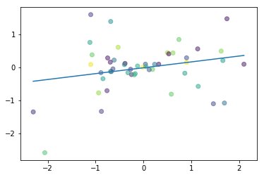
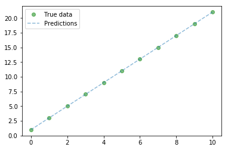

# Linear Regression with PyTorch

!!! tip "Run Jupyter Notebook"
    You can run the code for this section in this [jupyter notebook link](https://github.com/ritchieng/deep-learning-wizard/blob/master/docs/deep_learning/practical_pytorch/pytorch_linear_regression.ipynb).
    
## About Linear Regression

### Simple Linear Regression Basics
- Allows us to understand **relationship** between two **continuous variables**
- Example
    - x: independent variable
        - weight
    - y: dependent variable
        - height
- $y = \alpha x + \beta$

### Example of simple linear regression


!!! note "Create plot for simple linear regression"
    Take note that this code is not important at all. It simply creates random data points and does a simple best-fit line to best approximate the underlying function if one even exists.
    
    ```python
    import numpy as np
    import matplotlib.pyplot as plt
    %matplotlib inline
    
    # Creates 50 random x and y numbers
    np.random.seed(1)
    n = 50
    x = np.random.randn(n)
    y = x * np.random.randn(n)
    
    # Makes the dots colorful
    colors = np.random.rand(n)
    
    # Plots best-fit line via polyfit
    plt.plot(np.unique(x), np.poly1d(np.polyfit(x, y, 1))(np.unique(x)))
    
    # Plots the random x and y data points we created
    # Interestingly, alpha makes it more aesthetically pleasing
    plt.scatter(x, y, c=colors, alpha=0.5)
    plt.show()
    ```
    
    


### Aim of Linear Regression
- Minimize the distance between the points and the line ($y = \alpha x + \beta$)
- Adjusting
    - Coefficient: $\alpha$
    - Bias/intercept: $\beta$

## Building a Linear Regression Model with PyTorch

### Example
- Coefficient: $\alpha = 2$
- Bias/intercept: $\beta = 1$
- Equation: $y = 2x + 1$

### Building a Toy Dataset

!!! note "Create a list of values from 0 to 11"
    
    ```python
    x_values = [i for i in range(11)]
    ```
    
    
    ```python
    x_values
    ```

```python
[0, 1, 2, 3, 4, 5, 6, 7, 8, 9, 10]
```

!!! note "Convert list of numbers to numpy array"
    ```python
    # Convert to numpy
    x_train = np.array(x_values, dtype=np.float32)
    x_train.shape
    ```

```python
(11,)
```

!!! note "Convert to 2-dimensional array"
    If you don't this you will get an error stating you need 2D. Simply just reshape accordingly if you ever face such errors down the road.
    ```python
    # IMPORTANT: 2D required
    x_train = x_train.reshape(-1, 1)
    x_train.shape
    ```

```python
(11, 1)
```


    
!!! note "Create list of y values"
    We want y values for every x value we have above. 
    
    $y = 2x + 1$
   
    ```python
    y_values = [2*i + 1 for i in x_values]
    ```
    
    ```python
    y_values
    ```

```python

[1, 3, 5, 7, 9, 11, 13, 15, 17, 19, 21]
```

!!! note "Alternative to create list of y values"
    If you're weak in list iterators, this might be an easier alternative.
    ```python
    # In case you're weak in list iterators...
    y_values = []
    for i in x_values:
        result = 2*i + 1
        y_values.append(result) 
    ```

    ```python
    y_values
    ```

```python
[1, 3, 5, 7, 9, 11, 13, 15, 17, 19, 21]

```

!!! note "Convert to numpy array"
    You will slowly get a hang on how when you deal with PyTorch tensors, you just keep on making sure your raw data is in numpy form to make sure everything's good.

    ```python
    y_train = np.array(y_values, dtype=np.float32)
    y_train.shape
    ```
    
```python
(11,)
```

    
!!! note "Reshape y numpy array to 2-dimension"    
    ```python
    # IMPORTANT: 2D required
    y_train = y_train.reshape(-1, 1)
    y_train.shape
    ```

```python
(11, 1)
```

### Building Model

!!! note "Critical Imports"
    ```python
    import torch
    import torch.nn as nn
    ```

!!! note "Create Model"
    1. Linear model
        - True Equation: $y = 2x + 1$
    2. Forward
        - Example
            - Input $x = 1$
            - Output $\hat y = ?$

    ```python
    # Create class
    class LinearRegressionModel(nn.Module):
        def __init__(self, input_dim, output_dim):
            super(LinearRegressionModel, self).__init__()
            self.linear = nn.Linear(input_dim, output_dim)  
        
        def forward(self, x):
            out = self.linear(x)
            return out
    ```

!!! note "Instantiate Model Class"
    - input: [0, 1, 2, 3, 4, 5, 6, 7, 8, 9, 10]
    - desired output: [1, 3, 5, 7, 9, 11, 13, 15, 17, 19, 21]
    
    ```python
    input_dim = 1
    output_dim = 1
    
    model = LinearRegressionModel(input_dim, output_dim)
    ```

!!! note "Instantiate Loss Class"
    - MSE Loss: Mean Squared Error
    - $MSE = \frac{1}{n} \sum_{i=1}^n(\hat y_i - y_i)^2$
        - $\hat y$: prediction
        - $y$: true value


    ```python
    criterion = nn.MSELoss()
    ```

!!! note "Instantiate Optimizer Class"
    - Simplified equation
        - $\theta = \theta - \eta \cdot \nabla_\theta$
            - $\theta$: parameters (our variables)
            - $\eta$: learning rate (how fast we want to learn)
            - $\nabla_\theta$: parameters' gradients
    - Even simplier equation
        - `parameters = parameters - learning_rate * parameters_gradients`
            - parameters: $\alpha$ and $\beta$ in $y = \alpha x + \beta$
            - desired parameters: $\alpha = 2$ and $\beta = 1$ in $y = 2x + 1$ 

    ```python
    learning_rate = 0.01
    
    optimizer = torch.optim.SGD(model.parameters(), lr=learning_rate)
    ```

!!! note "Train Model"
    - 1 epoch: going through the whole x_train data once
        - 100 epochs: 
            - 100x mapping `x_train = [0, 1, 2, 3, 4, 5, 6, 7, 8, 9, 10]`
            
    - Process 
        1. Convert inputs/labels to tensors with gradients
        2. Clear gradient buffets
        3. Get output given inputs 
        4. Get loss
        5. Get gradients w.r.t. parameters
        6. Update parameters using gradients
            - `parameters = parameters - learning_rate * parameters_gradients`
        7. REPEAT
    
    
    ```python
    epochs = 100
    ```
    
    
    ```python
    for epoch in range(epochs):
        epoch += 1
        # Convert numpy array to torch Variable
        inputs = torch.from_numpy(x_train).requires_grad_()
        labels = torch.from_numpy(y_train)
    
        # Clear gradients w.r.t. parameters
        optimizer.zero_grad() 
        
        # Forward to get output
        outputs = model(inputs)
        
        # Calculate Loss
        loss = criterion(outputs, labels)
        
        # Getting gradients w.r.t. parameters
        loss.backward()
        
        # Updating parameters
        optimizer.step()
        
        print('epoch {}, loss {}'.format(epoch, loss.item()))
    ```

```python
epoch 1, loss 140.58143615722656
epoch 2, loss 11.467253684997559
epoch 3, loss 0.9358152747154236
epoch 4, loss 0.07679400593042374
epoch 5, loss 0.0067212567664682865
epoch 6, loss 0.0010006226366385818
epoch 7, loss 0.0005289533291943371
epoch 8, loss 0.0004854927829001099
epoch 9, loss 0.00047700389404781163
epoch 10, loss 0.0004714332753792405
epoch 11, loss 0.00046614606981165707
epoch 12, loss 0.0004609318566508591
epoch 13, loss 0.0004557870561257005
epoch 14, loss 0.00045069155748933554
epoch 15, loss 0.00044567222357727587
epoch 16, loss 0.00044068993884138763
epoch 17, loss 0.00043576463940553367
epoch 18, loss 0.00043090470717288554
epoch 19, loss 0.00042609183583408594
epoch 20, loss 0.0004213254142086953
epoch 21, loss 0.0004166301223449409
epoch 22, loss 0.0004119801160413772
epoch 23, loss 0.00040738462121225893
epoch 24, loss 0.0004028224211651832
epoch 25, loss 0.0003983367350883782
epoch 26, loss 0.0003938761365134269
epoch 27, loss 0.000389480876037851
epoch 28, loss 0.00038514015614055097
epoch 29, loss 0.000380824290914461
epoch 30, loss 0.00037657516077160835
epoch 31, loss 0.000372376263840124
epoch 32, loss 0.0003682126116473228
epoch 33, loss 0.0003640959912445396
epoch 34, loss 0.00036003670538775623
epoch 35, loss 0.00035601368290372193
epoch 36, loss 0.00035203873994760215
epoch 37, loss 0.00034810820943675935
epoch 38, loss 0.000344215368386358
epoch 39, loss 0.0003403784066904336
epoch 40, loss 0.00033658024040050805
epoch 41, loss 0.0003328165039420128
epoch 42, loss 0.0003291067841928452
epoch 43, loss 0.0003254293987993151
epoch 44, loss 0.0003217888588551432
epoch 45, loss 0.0003182037326041609
epoch 46, loss 0.0003146533854305744
epoch 47, loss 0.00031113551813177764
epoch 48, loss 0.0003076607536058873
epoch 49, loss 0.00030422292184084654
epoch 50, loss 0.00030083119054324925
epoch 51, loss 0.00029746422660537064
epoch 52, loss 0.0002941471466328949
epoch 53, loss 0.00029085995629429817
epoch 54, loss 0.0002876132493838668
epoch 55, loss 0.00028440452297218144
epoch 56, loss 0.00028122696676291525
epoch 57, loss 0.00027808290906250477
epoch 58, loss 0.00027497278642840683
epoch 59, loss 0.00027190230321139097
epoch 60, loss 0.00026887087733484805
epoch 61, loss 0.0002658693410921842
epoch 62, loss 0.0002629039518069476
epoch 63, loss 0.00025996880140155554
epoch 64, loss 0.0002570618235040456
epoch 65, loss 0.00025419273879379034
epoch 66, loss 0.00025135406758636236
epoch 67, loss 0.0002485490695107728
epoch 68, loss 0.0002457649679854512
epoch 69, loss 0.0002430236927466467
epoch 70, loss 0.00024031475186347961
epoch 71, loss 0.00023762597993481904
epoch 72, loss 0.00023497406800743192
epoch 73, loss 0.0002323519001947716
epoch 74, loss 0.00022976362379267812
epoch 75, loss 0.0002271933335578069
epoch 76, loss 0.00022465786605607718
epoch 77, loss 0.00022214400814846158
epoch 78, loss 0.00021966728672850877
epoch 79, loss 0.0002172116219298914
epoch 80, loss 0.00021478648704942316
epoch 81, loss 0.00021239375928416848
epoch 82, loss 0.0002100227284245193
epoch 83, loss 0.00020767028036061674
epoch 84, loss 0.00020534756185952574
epoch 85, loss 0.00020305956422816962
epoch 86, loss 0.0002007894654525444
epoch 87, loss 0.00019854879064951092
epoch 88, loss 0.00019633043848443776
epoch 89, loss 0.00019413618429098278
epoch 90, loss 0.00019197272195015103
epoch 91, loss 0.0001898303598864004
epoch 92, loss 0.00018771187751553953
epoch 93, loss 0.00018561164324637502
epoch 94, loss 0.00018354636267758906
epoch 95, loss 0.00018149390234611928
epoch 96, loss 0.0001794644631445408
epoch 97, loss 0.00017746571393217891
epoch 98, loss 0.00017548113828524947
epoch 99, loss 0.00017352371651213616
epoch 100, loss 0.00017157981346827
```
   

!!! note "Looking at predicted values"
    ```python
    # Purely inference
    predicted = model(torch.from_numpy(x_train).requires_grad_()).data.numpy()
    predicted
    ```

```python
array([[ 0.9756333],
       [ 2.9791424],
       [ 4.982651 ],
       [ 6.9861603],
       [ 8.98967  ],
       [10.993179 ],
       [12.996688 ],
       [15.000196 ],
       [17.003706 ],
       [19.007215 ],
       [21.010725 ]], dtype=float32)
```

!!! note "Looking at training values"
    These are the true values, you can see how it's able to predict similar values.

    ```python
    # y = 2x + 1 
    y_train
    ```


```python
array([[ 1.],
       [ 3.],
       [ 5.],
       [ 7.],
       [ 9.],
       [11.],
       [13.],
       [15.],
       [17.],
       [19.],
       [21.]], dtype=float32)

```


!!! note "Plot of predicted and actual values"
    
    ```python
    # Clear figure
    plt.clf()
    
    # Get predictions
    predicted = model(torch.from_numpy(x_train).requires_grad_()).data.numpy()
    
    # Plot true data
    plt.plot(x_train, y_train, 'go', label='True data', alpha=0.5)
    
    # Plot predictions
    plt.plot(x_train, predicted, '--', label='Predictions', alpha=0.5)
    
    # Legend and plot
    plt.legend(loc='best')
    plt.show()
    ```


    


!!! note "Save Model"
    ```python
    save_model = False
    if save_model is True:
        # Saves only parameters
        # alpha & beta
        torch.save(model.state_dict(), 'awesome_model.pkl')
    ```

!!! note "Load Model"
    ```python
    load_model = False
    if load_model is True:
        model.load_state_dict(torch.load('awesome_model.pkl'))
    ```

## Building a Linear Regression Model with PyTorch (GPU)


!!! note "CPU Summary"


    ```python
    import torch
    import torch.nn as nn
    
    '''
    STEP 1: CREATE MODEL CLASS
    '''
    class LinearRegressionModel(nn.Module):
        def __init__(self, input_dim, output_dim):
            super(LinearRegressionModel, self).__init__()
            self.linear = nn.Linear(input_dim, output_dim)  
        
        def forward(self, x):
            out = self.linear(x)
            return out
    
    '''
    STEP 2: INSTANTIATE MODEL CLASS
    '''
    input_dim = 1
    output_dim = 1
    
    model = LinearRegressionModel(input_dim, output_dim)
    
    '''
    STEP 3: INSTANTIATE LOSS CLASS
    '''
    
    criterion = nn.MSELoss()
    
    '''
    STEP 4: INSTANTIATE OPTIMIZER CLASS
    '''
    
    learning_rate = 0.01
    
    optimizer = torch.optim.SGD(model.parameters(), lr=learning_rate)
    
    '''
    STEP 5: TRAIN THE MODEL
    '''
    epochs = 100
    for epoch in range(epochs):
        epoch += 1
        # Convert numpy array to torch Variable
        inputs = torch.from_numpy(x_train).requires_grad_()
        labels = torch.from_numpy(y_train)
    
        # Clear gradients w.r.t. parameters
        optimizer.zero_grad() 
        
        # Forward to get output
        outputs = model(inputs)
        
        # Calculate Loss
        loss = criterion(outputs, labels)
        
        # Getting gradients w.r.t. parameters
        loss.backward()
        
        # Updating parameters
        optimizer.step()
    ```

!!! note "GPU Summary"
    - Just remember always 2 things must be on GPU
        - `model`
        - `tensors`


    ```python
    import torch
    import torch.nn as nn
    import numpy as np
    
    '''
    STEP 1: CREATE MODEL CLASS
    '''
    class LinearRegressionModel(nn.Module):
        def __init__(self, input_dim, output_dim):
            super(LinearRegressionModel, self).__init__()
            self.linear = nn.Linear(input_dim, output_dim)  
        
        def forward(self, x):
            out = self.linear(x)
            return out
    
    '''
    STEP 2: INSTANTIATE MODEL CLASS
    '''
    input_dim = 1
    output_dim = 1
    
    model = LinearRegressionModel(input_dim, output_dim)
    
    
    #######################
    #  USE GPU FOR MODEL  #
    #######################
    
    device = torch.device("cuda:0" if torch.cuda.is_available() else "cpu")
    model.to(device)
    
    '''
    STEP 3: INSTANTIATE LOSS CLASS
    '''
    
    criterion = nn.MSELoss()
    
    '''
    STEP 4: INSTANTIATE OPTIMIZER CLASS
    '''
    
    learning_rate = 0.01
    
    optimizer = torch.optim.SGD(model.parameters(), lr=learning_rate)
    
    '''
    STEP 5: TRAIN THE MODEL
    '''
    epochs = 100
    for epoch in range(epochs):
        epoch += 1
        # Convert numpy array to torch Variable
        
        #######################
        #  USE GPU FOR MODEL  #
        #######################
        inputs = torch.from_numpy(x_train).to(device)
        labels = torch.from_numpy(y_train).to(device)
        
        # Clear gradients w.r.t. parameters
        optimizer.zero_grad() 
        
        # Forward to get output
        outputs = model(inputs)
        
        # Calculate Loss
        loss = criterion(outputs, labels)
        
        # Getting gradients w.r.t. parameters
        loss.backward()
        
        # Updating parameters
        optimizer.step()
        
        # Logging
        print('epoch {}, loss {}'.format(epoch, loss.item()))
    ```

```python
epoch 1, loss 336.0314025878906
epoch 2, loss 27.67657470703125
epoch 3, loss 2.5220539569854736
epoch 4, loss 0.46732547879219055
epoch 5, loss 0.2968060076236725
epoch 6, loss 0.2800087630748749
epoch 7, loss 0.27578213810920715
epoch 8, loss 0.2726128399372101
epoch 9, loss 0.269561231136322
epoch 10, loss 0.2665504515171051
epoch 11, loss 0.2635740041732788
epoch 12, loss 0.26063060760498047
epoch 13, loss 0.2577202618122101
epoch 14, loss 0.2548423111438751
epoch 15, loss 0.25199657678604126
epoch 16, loss 0.24918246269226074
epoch 17, loss 0.24639996886253357
epoch 18, loss 0.24364829063415527
epoch 19, loss 0.24092751741409302
epoch 20, loss 0.2382371574640274
epoch 21, loss 0.23557686805725098
epoch 22, loss 0.2329462170600891
epoch 23, loss 0.2303449958562851
epoch 24, loss 0.22777271270751953
epoch 25, loss 0.2252292037010193
epoch 26, loss 0.22271405160427094
epoch 27, loss 0.22022713720798492
epoch 28, loss 0.21776780486106873
epoch 29, loss 0.21533599495887756
epoch 30, loss 0.21293145418167114
epoch 31, loss 0.21055366098880768
epoch 32, loss 0.20820240676403046
epoch 33, loss 0.2058774083852768
epoch 34, loss 0.20357847213745117
epoch 35, loss 0.20130516588687897
epoch 36, loss 0.1990572065114975
epoch 37, loss 0.19683438539505005
epoch 38, loss 0.19463638961315155
epoch 39, loss 0.19246290624141693
epoch 40, loss 0.1903136670589447
epoch 41, loss 0.1881885528564453
epoch 42, loss 0.18608702719211578
epoch 43, loss 0.18400898575782776
epoch 44, loss 0.18195408582687378
epoch 45, loss 0.17992223799228668
epoch 46, loss 0.17791320383548737
epoch 47, loss 0.17592646181583405
epoch 48, loss 0.17396186292171478
epoch 49, loss 0.17201924324035645
epoch 50, loss 0.17009828984737396
epoch 51, loss 0.16819894313812256
epoch 52, loss 0.16632060706615448
epoch 53, loss 0.16446338593959808
epoch 54, loss 0.16262666881084442
epoch 55, loss 0.16081078350543976
epoch 56, loss 0.15901507437229156
epoch 57, loss 0.15723931789398193
epoch 58, loss 0.15548335015773773
epoch 59, loss 0.15374726057052612
epoch 60, loss 0.1520303338766098
epoch 61, loss 0.15033268928527832
epoch 62, loss 0.14865389466285706
epoch 63, loss 0.14699392020702362
epoch 64, loss 0.14535246789455414
epoch 65, loss 0.14372935891151428
epoch 66, loss 0.14212435483932495
epoch 67, loss 0.14053721725940704
epoch 68, loss 0.13896773755550385
epoch 69, loss 0.1374160647392273
epoch 70, loss 0.1358814686536789
epoch 71, loss 0.13436420261859894
epoch 72, loss 0.13286370038986206
epoch 73, loss 0.1313801407814026
epoch 74, loss 0.12991292774677277
epoch 75, loss 0.12846232950687408
epoch 76, loss 0.1270277351140976
epoch 77, loss 0.12560924887657166
epoch 78, loss 0.12420656532049179
epoch 79, loss 0.12281957268714905
epoch 80, loss 0.1214480847120285
epoch 81, loss 0.12009195983409882
epoch 82, loss 0.1187509223818779
epoch 83, loss 0.11742479354143143
epoch 84, loss 0.11611353605985641
epoch 85, loss 0.11481687426567078
epoch 86, loss 0.11353478580713272
epoch 87, loss 0.11226697266101837
epoch 88, loss 0.11101329326629639
epoch 89, loss 0.10977360606193542
epoch 90, loss 0.10854770988225937
epoch 91, loss 0.10733554512262344
epoch 92, loss 0.10613703727722168
epoch 93, loss 0.10495180636644363
epoch 94, loss 0.10377981513738632
epoch 95, loss 0.10262089222669601
epoch 96, loss 0.10147502273321152
epoch 97, loss 0.1003417894244194
epoch 98, loss 0.09922132641077042
epoch 99, loss 0.0981132984161377
epoch 100, loss 0.09701769798994064
```


## Summary
We've learnt to...

!!! success
    * [x] Simple **linear regression basics**
        * [x] $y = Ax + B$
        * [x] $y = 2x + 1$
    * [x] **Example** of simple linear regression
    * [x] **Aim** of linear regression
        * [x] Minimizing distance between the points and the line
            * [x] Calculate "distance" through `MSE`
            * [x] Calculate `gradients`
            * [x] Update parameters with `parameters = parameters - learning_rate * gradients`
            * [x] Slowly update parameters $A$ and $B$ model the linear relationship between $y$ and $x$ of the form $y = 2x + 1$
    * [x] Built a linear regression **model** in **CPU and GPU**
        * [x] Step 1: Create Model Class
        * [x] Step 2: Instantiate Model Class
        * [x] Step 3: Instantiate Loss Class
        * [x] Step 4: Instantiate Optimizer Class
        * [x] Step 5: Train Model
    * [x] Important things to be on **GPU**
        * [x] `model`
        * [x] `tensors with gradients`
    * [x] How to bring to **GPU**?
        - `model_name.to(device)`
        - `variable_name.to(device)`

## Citation
If you have found these useful in your research, presentations, school work, projects or workshops, feel free to cite using this DOI.

[](https://zenodo.org/badge/latestdoi/139945544)