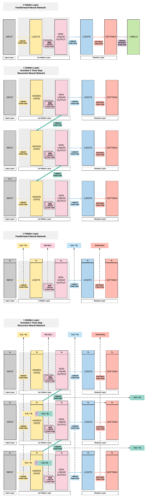

# Recurrent Neural Network with PyTorch

!!! tip "Run Jupyter Notebook"
    You can run the code for this section in this [jupyter notebook link](https://github.com/ritchieng/deep-learning-wizard/blob/master/docs/deep_learning/practical_pytorch/pytorch_recurrent_neuralnetwork.ipynb).
    
## About Recurrent Neural Network

### Feedforward Neural Networks Transition to 1 Layer Recurrent Neural Networks (RNN)
- RNN is essentially an FNN but with a hidden layer (non-linear output) that passes on information to the next FNN
- Compared to an FNN, we've one additional set of weight and bias that allows information to flow from one FNN to another FNN sequentially that allows time-dependency.
- The diagram below shows the only difference between an FNN and a RNN.


### 2 Layer RNN Breakdown


## Building a Recurrent Neural Network with PyTorch

### Model A: 1 Hidden Layer (ReLU)
- Unroll 28 time steps
    - Each step input size: 28 x 1
    - Total per unroll: 28 x 28
        - Feedforward Neural Network input size: 28 x 28 
- 1 Hidden layer
- ReLU Activation Function


#### Steps
- Step 1: Load Dataset
- Step 2: Make Dataset Iterable
- Step 3: Create Model Class
- Step 4: Instantiate Model Class
- Step 5: Instantiate Loss Class
- Step 6: Instantiate Optimizer Class
- Step 7: Train Model

#### Step 1: Loading MNIST Train Dataset
**Images from 1 to 9**


!!! note "Looking into the MNIST Dataset"
    ```python
    import torch
    import torch.nn as nn
    import torchvision.transforms as transforms
    import torchvision.datasets as dsets
    ```
    
    
    ```python
    train_dataset = dsets.MNIST(root='./data', 
                                train=True, 
                                transform=transforms.ToTensor(),
                                download=True)
    
    test_dataset = dsets.MNIST(root='./data', 
                               train=False, 
                               transform=transforms.ToTensor())
    ```
    
    We would have 60k training images of size 28 x 28 pixels.
    
    ```python
    print(train_dataset.train_data.size())
    ```

    ```python
    print(train_dataset.train_labels.size())
    ```
    
    Here we would have 10k testing images of the same size, 28 x 28 pixels.
    
    ```python
    print(test_dataset.test_data.size())
    ```
    
    ```python
    print(test_dataset.test_labels.size())
    ```

```python
torch.Size([60000, 28, 28])

torch.Size([60000])

torch.Size([10000, 28, 28])

torch.Size([10000])
```

#### Step 2: Make Dataset Iterable

!!! note "Creating iterable objects to loop through subsequently"
    ```python
    batch_size = 100
    n_iters = 3000
    num_epochs = n_iters / (len(train_dataset) / batch_size)
    num_epochs = int(num_epochs)
    
    train_loader = torch.utils.data.DataLoader(dataset=train_dataset, 
                                               batch_size=batch_size, 
                                               shuffle=True)
    
    test_loader = torch.utils.data.DataLoader(dataset=test_dataset, 
                                              batch_size=batch_size, 
                                              shuffle=False)
    ```

#### Step 3: Create Model Class


!!! note "1 Layer RNN"
    
    
    ```python
    class RNNModel(nn.Module):
        def __init__(self, input_dim, hidden_dim, layer_dim, output_dim):
            super(RNNModel, self).__init__()
            # Hidden dimensions
            self.hidden_dim = hidden_dim
            
            # Number of hidden layers
            self.layer_dim = layer_dim
            
            # Building your RNN
            # batch_first=True causes input/output tensors to be of shape
            # (batch_dim, seq_dim, input_dim)
            # batch_dim = number of samples per batch
            self.rnn = nn.RNN(input_dim, hidden_dim, layer_dim, batch_first=True, nonlinearity='relu')
            
            # Readout layer
            self.fc = nn.Linear(hidden_dim, output_dim)
        
        def forward(self, x):
            # Initialize hidden state with zeros
            # (layer_dim, batch_size, hidden_dim)
            h0 = torch.zeros(self.layer_dim, x.size(0), self.hidden_dim).requires_grad_()
            
            # We need to detach the hidden state to prevent exploding/vanishing gradients
            # This is part of truncated backpropagation through time (BPTT)
            out, hn = self.rnn(x, h0.detach())
            
            # Index hidden state of last time step
            # out.size() --> 100, 28, 10
            # out[:, -1, :] --> 100, 10 --> just want last time step hidden states! 
            out = self.fc(out[:, -1, :]) 
            # out.size() --> 100, 10
            return out
    ```

#### Step 4: Instantiate Model Class
- 28 time steps
    - Each time step: input dimension = 28
- 1 hidden layer
- MNIST 1-9 digits $\rightarrow$ output dimension = 10
    
    
!!! note "Instantiate model class and assign to an object"
    ```python
    input_dim = 28
    hidden_dim = 100
    layer_dim = 1
    output_dim = 10
    ```
    
    
    ```python
    model = RNNModel(input_dim, hidden_dim, layer_dim, output_dim)
    ```

#### Step 5: Instantiate Loss Class
- Recurrent Neural Network: **Cross Entropy Loss**
    - _Convolutional Neural Network_: **Cross Entropy Loss**
    - _Feedforward Neural Network_: **Cross Entropy Loss**
    - _Logistic Regression_: **Cross Entropy Loss**
    - _Linear Regression_: **MSE**
        
!!! note "Cross Entropy Loss for Classification Task"
    
    ```python
    criterion = nn.CrossEntropyLoss()
    ```

!!! warning "Cross Entropy vs MSE"
    Take note that there are cases where RNN, CNN and FNN use MSE as a loss function.
    
    We use cross entropy for classification tasks (predicting 0-9 digits in MNIST for example).
    
    And we use MSE for regression tasks (predicting temperatures in every December in San Francisco for example).
    
#### Step 6: Instantiate Optimizer Class
- Simplified equation
    - $\theta = \theta - \eta \cdot \nabla_\theta$
        - $\theta$: parameters (our tensors with gradient accumulation abilities)
        - $\eta$: learning rate (how fast we want to learn)
        - $\nabla_\theta$: gradients of loss with respect to the model's parameters
- Even simplier equation
    - `parameters = parameters - learning_rate * parameters_gradients`
    - **At every iteration, we update our model's parameters**


```python
learning_rate = 0.01

optimizer = torch.optim.SGD(model.parameters(), lr=learning_rate)  
```

###### Parameters In-Depth
- Input to Hidden Layer Affine Function
    - A1, B1
- Hidden Layer to Output Affine Function
    - A2, B2
- Hidden Layer to Hidden Layer Affine Function
    - A3, B3
    


!!! note "Total groups of parameters"
    We should have 6 groups as shown above.
    
    ```python
    len(list(model.parameters()))
    ```

```python
6
```


!!! note "Input to Hidden Weight"
    Remember we defined our hidden layer to have a size of 100. Because our input is a size of 28 at each time step, this gives rise to a weight matrix of 100 x 28.
    
    
    ```python
    # Input --> Hidden (A1)
    list(model.parameters())[0].size()
    ```

```python
torch.Size([100, 28])
```

!!! note "Input to Hidden Bias"
    ```python
    # Input --> Hidden BIAS (B1)
    list(model.parameters())[2].size()
    ```


```python
torch.Size([100])
```

!!! note "Hidden to Hidden"

    ```python
    # Hidden --> Hidden (A3)
    list(model.parameters())[1].size()
    ```
    
```python
torch.Size([100, 100])
```

   
!!! note "Hidden to Hidden Bias"
    ```python
    # Hidden --> Hidden BIAS(B3)
    list(model.parameters())[3].size()
    ```


```python
torch.Size([100])
```

!!! note "Hidden to Output"
    ```python
    # Hidden --> Output (A2)
    list(model.parameters())[4].size()
    ```

```python
torch.Size([10, 100])
```


!!! note "Hidden to Output Bias"
    
    ```python
    # Hidden --> Output BIAS (B2)
    list(model.parameters())[5].size()
    ```

```python
torch.Size([10])
```


#### Step 7: Train Model
- Process 
    1. **Convert inputs/labels to tensors with gradient accumulation abilities**
        - RNN Input: (1, 28)
        - CNN Input: (1, 28, 28) 
        - FNN Input: (1, 28*28)
    2. Clear gradient buffets
    3. Get output given inputs 
    4. Get loss
    5. Get gradients w.r.t. parameters
    6. Update parameters using gradients
        - `parameters = parameters - learning_rate * parameters_gradients`
    7. REPEAT


!!! note "Same 7 step process for training models"
    ```python
    # Number of steps to unroll
    seq_dim = 28  
    
    iter = 0
    for epoch in range(num_epochs):
        for i, (images, labels) in enumerate(train_loader):
            model.train()
            # Load images as tensors with gradient accumulation abilities
            images = images.view(-1, seq_dim, input_dim).requires_grad_()
            
            # Clear gradients w.r.t. parameters
            optimizer.zero_grad()
            
            # Forward pass to get output/logits
            # outputs.size() --> 100, 10
            outputs = model(images)
            
            # Calculate Loss: softmax --> cross entropy loss
            loss = criterion(outputs, labels)
            
            # Getting gradients w.r.t. parameters
            loss.backward()
            
            # Updating parameters
            optimizer.step()
            
            iter += 1
            
            if iter % 500 == 0:
                model.eval()
                # Calculate Accuracy         
                correct = 0
                total = 0
                # Iterate through test dataset
                for images, labels in test_loader:
                    # Load images to a Torch tensors with gradient accumulation abilities
                    images = images.view(-1, seq_dim, input_dim)
                    
                    # Forward pass only to get logits/output
                    outputs = model(images)
                    
                    # Get predictions from the maximum value
                    _, predicted = torch.max(outputs.data, 1)
                    
                    # Total number of labels
                    total += labels.size(0)
                    
                    # Total correct predictions
                    correct += (predicted == labels).sum()
                
                accuracy = 100 * correct / total
                
                # Print Loss
                print('Iteration: {}. Loss: {}. Accuracy: {}'.format(iter, loss.item(), accuracy))
    ```

```python
Iteration: 500. Loss: 2.301494836807251. Accuracy: 12
Iteration: 1000. Loss: 2.2986037731170654. Accuracy: 14
Iteration: 1500. Loss: 2.278566598892212. Accuracy: 18
Iteration: 2000. Loss: 2.169614315032959. Accuracy: 21
Iteration: 2500. Loss: 1.1662731170654297. Accuracy: 51
Iteration: 3000. Loss: 0.9290509223937988. Accuracy: 71
```
   
### Model B: 2 Hidden Layer (ReLU)
- Unroll 28 time steps
    - Each step input size: 28 x 1
    - Total per unroll: 28 x 28
        - Feedforward Neural Network inpt size: 28 x 28 
- **2 Hidden layer**
- ReLU Activation Function


#### Steps
- Step 1: Load Dataset
- Step 2: Make Dataset Iterable
- Step 3: Create Model Class
- **Step 4: Instantiate Model Class**
- Step 5: Instantiate Loss Class
- Step 6: Instantiate Optimizer Class
- Step 7: Train Model


!!! note "2 Hidden Layer + ReLU"
    ```python
    import torch
    import torch.nn as nn
    import torchvision.transforms as transforms
    import torchvision.datasets as dsets
    
    '''
    STEP 1: LOADING DATASET
    '''
    train_dataset = dsets.MNIST(root='./data', 
                                train=True, 
                                transform=transforms.ToTensor(),
                                download=True)
    
    test_dataset = dsets.MNIST(root='./data', 
                               train=False, 
                               transform=transforms.ToTensor())
    
    '''
    STEP 2: MAKING DATASET ITERABLE
    '''
    
    batch_size = 100
    n_iters = 3000
    num_epochs = n_iters / (len(train_dataset) / batch_size)
    num_epochs = int(num_epochs)
    
    train_loader = torch.utils.data.DataLoader(dataset=train_dataset, 
                                               batch_size=batch_size, 
                                               shuffle=True)
    
    test_loader = torch.utils.data.DataLoader(dataset=test_dataset, 
                                              batch_size=batch_size, 
                                              shuffle=False)
    
    '''
    STEP 3: CREATE MODEL CLASS
    '''
    
    class RNNModel(nn.Module):
        def __init__(self, input_dim, hidden_dim, layer_dim, output_dim):
            super(RNNModel, self).__init__()
            # Hidden dimensions
            self.hidden_dim = hidden_dim
            
            # Number of hidden layers
            self.layer_dim = layer_dim
            
            # Building your RNN
            # batch_first=True causes input/output tensors to be of shape
            # (batch_dim, seq_dim, feature_dim)
            self.rnn = nn.RNN(input_dim, hidden_dim, layer_dim, batch_first=True, nonlinearity='relu')
            
            # Readout layer
            self.fc = nn.Linear(hidden_dim, output_dim)
        
        def forward(self, x):
            # Initialize hidden state with zeros
            h0 = torch.zeros(self.layer_dim, x.size(0), self.hidden_dim).requires_grad_()
            
            # We need to detach the hidden state to prevent exploding/vanishing gradients
            # This is part of truncated backpropagation through time (BPTT)
            out, hn = self.rnn(x, h0.detach())
            
            # Index hidden state of last time step
            # out.size() --> 100, 28, 100
            # out[:, -1, :] --> 100, 100 --> just want last time step hidden states! 
            out = self.fc(out[:, -1, :]) 
            # out.size() --> 100, 10
            return out
    
    '''
    STEP 4: INSTANTIATE MODEL CLASS
    '''
    input_dim = 28
    hidden_dim = 100
    layer_dim = 2  # ONLY CHANGE IS HERE FROM ONE LAYER TO TWO LAYER
    output_dim = 10
    
    model = RNNModel(input_dim, hidden_dim, layer_dim, output_dim)
    
    # JUST PRINTING MODEL & PARAMETERS 
    print(model)
    print(len(list(model.parameters())))
    for i in range(len(list(model.parameters()))):
        print(list(model.parameters())[i].size())
    
    '''
    STEP 5: INSTANTIATE LOSS CLASS
    '''
    criterion = nn.CrossEntropyLoss()
    
    '''
    STEP 6: INSTANTIATE OPTIMIZER CLASS
    '''
    learning_rate = 0.01
    
    optimizer = torch.optim.SGD(model.parameters(), lr=learning_rate)  
    
    '''
    STEP 7: TRAIN THE MODEL
    '''
    
    # Number of steps to unroll
    seq_dim = 28  
    
    iter = 0
    for epoch in range(num_epochs):
        for i, (images, labels) in enumerate(train_loader):
            model.train()
            # Load images as tensors with gradient accumulation abilities
            images = images.view(-1, seq_dim, input_dim).requires_grad_()
            
            # Clear gradients w.r.t. parameters
            optimizer.zero_grad()
            
            # Forward pass to get output/logits
            # outputs.size() --> 100, 10
            outputs = model(images)
            
            # Calculate Loss: softmax --> cross entropy loss
            loss = criterion(outputs, labels)
            
            # Getting gradients w.r.t. parameters
            loss.backward()
            
            # Updating parameters
            optimizer.step()
            
            iter += 1
            
            if iter % 500 == 0:
                model.eval()
                # Calculate Accuracy         
                correct = 0
                total = 0
                # Iterate through test dataset
                for images, labels in test_loader:
                    # Resize images
                    images = images.view(-1, seq_dim, input_dim)
                    
                    # Forward pass only to get logits/output
                    outputs = model(images)
                    
                    # Get predictions from the maximum value
                    _, predicted = torch.max(outputs.data, 1)
                    
                    # Total number of labels
                    total += labels.size(0)
                    
                    # Total correct predictions
                    correct += (predicted == labels).sum()
                
                accuracy = 100 * correct / total
                
                # Print Loss
                print('Iteration: {}. Loss: {}. Accuracy: {}'.format(iter, loss.item(), accuracy))
    ```
    
```python
RNNModel(
  (rnn): RNN(28, 100, num_layers=2, batch_first=True)
  (fc): Linear(in_features=100, out_features=10, bias=True)
)

10

torch.Size([100, 28])
torch.Size([100, 100])
torch.Size([100])
torch.Size([100])
torch.Size([100, 100])
torch.Size([100, 100])
torch.Size([100])
torch.Size([100])
torch.Size([10, 100])
torch.Size([10])

Iteration: 500. Loss: 2.3019518852233887. Accuracy: 11
Iteration: 1000. Loss: 2.299217700958252. Accuracy: 11
Iteration: 1500. Loss: 2.279090166091919. Accuracy: 14
Iteration: 2000. Loss: 2.126953125. Accuracy: 25
Iteration: 2500. Loss: 1.356347680091858. Accuracy: 57
Iteration: 3000. Loss: 0.7377720475196838. Accuracy: 69
```

    


- **10 sets of parameters**
- First hidden Layer
    - $A_1 = [100, 28]$
    - $A_3 = [100, 100]$
    - $B_1 = [100]$
    - $B_3 = [100]$
- Second hidden layer
    - $A_2 = [100, 100]$
    - $A_5 = [100, 100]$
    - $B_2 = [100]$
    - $B_5 = [100]$
- Readout layer
    - $A_4 = [10, 100]$
    - $B_4 = [10]$


### Model C: 2 Hidden Layer
- Unroll 28 time steps
    - Each step input size: 28 x 1
    - Total per unroll: 28 x 28
        - Feedforward Neural Network inpt size: 28 x 28 
- 2 Hidden layer
- **Tanh** Activation Function


#### Steps
- Step 1: Load Dataset
- Step 2: Make Dataset Iterable
- Step 3: Create Model Class
- **Step 4: Instantiate Model Class**
- Step 5: Instantiate Loss Class
- Step 6: Instantiate Optimizer Class
- Step 7: Train Model


!!! "2 Hidden + ReLU"
    ```python
    import torch
    import torch.nn as nn
    import torchvision.transforms as transforms
    import torchvision.datasets as dsets
    
    '''
    STEP 1: LOADING DATASET
    '''
    train_dataset = dsets.MNIST(root='./data', 
                                train=True, 
                                transform=transforms.ToTensor(),
                                download=True)
    
    test_dataset = dsets.MNIST(root='./data', 
                               train=False, 
                               transform=transforms.ToTensor())
    
    '''
    STEP 2: MAKING DATASET ITERABLE
    '''
    
    batch_size = 100
    n_iters = 3000
    num_epochs = n_iters / (len(train_dataset) / batch_size)
    num_epochs = int(num_epochs)
    
    train_loader = torch.utils.data.DataLoader(dataset=train_dataset, 
                                               batch_size=batch_size, 
                                               shuffle=True)
    
    test_loader = torch.utils.data.DataLoader(dataset=test_dataset, 
                                              batch_size=batch_size, 
                                              shuffle=False)
    
    '''
    STEP 3: CREATE MODEL CLASS
    '''
    
    class RNNModel(nn.Module):
        def __init__(self, input_dim, hidden_dim, layer_dim, output_dim):
            super(RNNModel, self).__init__()
            # Hidden dimensions
            self.hidden_dim = hidden_dim
            
            # Number of hidden layers
            self.layer_dim = layer_dim
            
            # Building your RNN
            # batch_first=True causes input/output tensors to be of shape
            # (batch_dim, seq_dim, feature_dim)
            self.rnn = nn.RNN(input_dim, hidden_dim, layer_dim, batch_first=True, nonlinearity='tanh')
            
            # Readout layer
            self.fc = nn.Linear(hidden_dim, output_dim)
        
        def forward(self, x):
            # Initialize hidden state with zeros
            h0 = torch.zeros(self.layer_dim, x.size(0), self.hidden_dim).requires_grad_()
            
            # One time step
            # We need to detach the hidden state to prevent exploding/vanishing gradients
            # This is part of truncated backpropagation through time (BPTT)
            out, hn = self.rnn(x, h0.detach())
            
            # Index hidden state of last time step
            # out.size() --> 100, 28, 100
            # out[:, -1, :] --> 100, 100 --> just want last time step hidden states! 
            out = self.fc(out[:, -1, :]) 
            # out.size() --> 100, 10
            return out
    
    '''
    STEP 4: INSTANTIATE MODEL CLASS
    '''
    input_dim = 28
    hidden_dim = 100
    layer_dim = 2  # ONLY CHANGE IS HERE FROM ONE LAYER TO TWO LAYER
    output_dim = 10
    
    model = RNNModel(input_dim, hidden_dim, layer_dim, output_dim)
    
    # JUST PRINTING MODEL & PARAMETERS 
    print(model)
    print(len(list(model.parameters())))
    for i in range(len(list(model.parameters()))):
        print(list(model.parameters())[i].size())
    
    '''
    STEP 5: INSTANTIATE LOSS CLASS
    '''
    criterion = nn.CrossEntropyLoss()
    
    '''
    STEP 6: INSTANTIATE OPTIMIZER CLASS
    '''
    learning_rate = 0.1
    
    optimizer = torch.optim.SGD(model.parameters(), lr=learning_rate)  
    
    '''
    STEP 7: TRAIN THE MODEL
    '''
    
    # Number of steps to unroll
    seq_dim = 28  
    
    iter = 0
    for epoch in range(num_epochs):
        for i, (images, labels) in enumerate(train_loader):
            # Load images as tensors with gradient accumulation abilities
            images = images.view(-1, seq_dim, input_dim).requires_grad_()
            
            # Clear gradients w.r.t. parameters
            optimizer.zero_grad()
            
            # Forward pass to get output/logits
            # outputs.size() --> 100, 10
            outputs = model(images)
            
            # Calculate Loss: softmax --> cross entropy loss
            loss = criterion(outputs, labels)
            
            # Getting gradients w.r.t. parameters
            loss.backward()
            
            # Updating parameters
            optimizer.step()
            
            iter += 1
            
            if iter % 500 == 0:
                # Calculate Accuracy         
                correct = 0
                total = 0
                # Iterate through test dataset
                for images, labels in test_loader:
                    # Resize images
                    images = images.view(-1, seq_dim, input_dim)
                    
                    # Forward pass only to get logits/output
                    outputs = model(images)
                    
                    # Get predictions from the maximum value
                    _, predicted = torch.max(outputs.data, 1)
                    
                    # Total number of labels
                    total += labels.size(0)
                    
                    # Total correct predictions
                    correct += (predicted == labels).sum()
                
                accuracy = 100 * correct / total
                
                # Print Loss
                print('Iteration: {}. Loss: {}. Accuracy: {}'.format(iter, loss.item(), accuracy))
    ```

```python
RNNModel(
  (rnn): RNN(28, 100, num_layers=2, batch_first=True)
  (fc): Linear(in_features=100, out_features=10, bias=True)
)

10

torch.Size([100, 28])
torch.Size([100, 100])
torch.Size([100])
torch.Size([100])
torch.Size([100, 100])
torch.Size([100, 100])
torch.Size([100])
torch.Size([100])
torch.Size([10, 100])
torch.Size([10])
Iteration: 500. Loss: 0.5943437218666077. Accuracy: 77
Iteration: 1000. Loss: 0.22048641741275787. Accuracy: 91
Iteration: 1500. Loss: 0.18479223549365997. Accuracy: 94
Iteration: 2000. Loss: 0.2723771929740906. Accuracy: 91
Iteration: 2500. Loss: 0.18817797303199768. Accuracy: 92
Iteration: 3000. Loss: 0.1685929149389267. Accuracy: 92
```
   
## Summary of Results

| Model A | Model B   | Model C | 
|------|------|------|
|   ReLU | ReLU | Tanh |
| 1 Hidden Layer | 2 Hidden Layers | 2 Hidden Layers | 
| 100 Hidden Units | 100 Hidden Units |100 Hidden Units |
| 92.48% | 95.09% | 95.54% | 


## General Deep Learning Notes
- 2 ways to expand a recurrent neural network
    - More non-linear activation units (neurons)
    - More hidden layers
- Cons
    - Need a larger dataset
        - Curse of dimensionality
    - Does not necessarily mean higher accuracy

## 3. Building a Recurrent Neural Network with PyTorch (GPU)

### Model C: 2 Hidden Layer (Tanh)


GPU: 2 things must be on GPU
- `model`
- `tensors`

### Steps
- Step 1: Load Dataset
- Step 2: Make Dataset Iterable
- **Step 3: Create Model Class**
- **Step 4: Instantiate Model Class**
- Step 5: Instantiate Loss Class
- Step 6: Instantiate Optimizer Class
- **Step 7: Train Model**


!!! note "2 Layer RNN + Tanh"
    ```python
    import torch
    import torch.nn as nn
    import torchvision.transforms as transforms
    import torchvision.datasets as dsets
    
    '''
    STEP 1: LOADING DATASET
    '''
    train_dataset = dsets.MNIST(root='./data', 
                                train=True, 
                                transform=transforms.ToTensor(),
                                download=True)
    
    test_dataset = dsets.MNIST(root='./data', 
                               train=False, 
                               transform=transforms.ToTensor())
    
    '''
    STEP 2: MAKING DATASET ITERABLE
    '''
    
    batch_size = 100
    n_iters = 3000
    num_epochs = n_iters / (len(train_dataset) / batch_size)
    num_epochs = int(num_epochs)
    
    train_loader = torch.utils.data.DataLoader(dataset=train_dataset, 
                                               batch_size=batch_size, 
                                               shuffle=True)
    
    test_loader = torch.utils.data.DataLoader(dataset=test_dataset, 
                                              batch_size=batch_size, 
                                              shuffle=False)
    
    '''
    STEP 3: CREATE MODEL CLASS
    '''
    
    class RNNModel(nn.Module):
        def __init__(self, input_dim, hidden_dim, layer_dim, output_dim):
            super(RNNModel, self).__init__()
            # Hidden dimensions
            self.hidden_dim = hidden_dim
            
            # Number of hidden layers
            self.layer_dim = layer_dim
            
            # Building your RNN
            # batch_first=True causes input/output tensors to be of shape
            # (batch_dim, seq_dim, feature_dim)
            self.rnn = nn.RNN(input_dim, hidden_dim, layer_dim, batch_first=True, nonlinearity='tanh')
            
            # Readout layer
            self.fc = nn.Linear(hidden_dim, output_dim)
        
        def forward(self, x):
            # Initialize hidden state with zeros
            #######################
            #  USE GPU FOR MODEL  #
            #######################
            h0 = torch.zeros(self.layer_dim, x.size(0), self.hidden_dim).to(device)
                
            # One time step
            # We need to detach the hidden state to prevent exploding/vanishing gradients
            # This is part of truncated backpropagation through time (BPTT)
            out, hn = self.rnn(x, h0.detach())
            
            # Index hidden state of last time step
            # out.size() --> 100, 28, 100
            # out[:, -1, :] --> 100, 100 --> just want last time step hidden states! 
            out = self.fc(out[:, -1, :]) 
            # out.size() --> 100, 10
            return out
    
    '''
    STEP 4: INSTANTIATE MODEL CLASS
    '''
    input_dim = 28
    hidden_dim = 100
    layer_dim = 2  # ONLY CHANGE IS HERE FROM ONE LAYER TO TWO LAYER
    output_dim = 10
    
    model = RNNModel(input_dim, hidden_dim, layer_dim, output_dim)
    
    #######################
    #  USE GPU FOR MODEL  #
    #######################
    
    device = torch.device("cuda:0" if torch.cuda.is_available() else "cpu")
    model.to(device)
    
        
    '''
    STEP 5: INSTANTIATE LOSS CLASS
    '''
    criterion = nn.CrossEntropyLoss()
    
    '''
    STEP 6: INSTANTIATE OPTIMIZER CLASS
    '''
    learning_rate = 0.1
    
    optimizer = torch.optim.SGD(model.parameters(), lr=learning_rate)  
    
    '''
    STEP 7: TRAIN THE MODEL
    '''
    
    # Number of steps to unroll
    seq_dim = 28  
    
    iter = 0
    for epoch in range(num_epochs):
        for i, (images, labels) in enumerate(train_loader):
            # Load images as tensors with gradient accumulation abilities
            #######################
            #  USE GPU FOR MODEL  #
            #######################
            images = images.view(-1, seq_dim, input_dim).requires_grad_().to(device)
            labels = labels.to(device)
                
            # Clear gradients w.r.t. parameters
            optimizer.zero_grad()
            
            # Forward pass to get output/logits
            # outputs.size() --> 100, 10
            outputs = model(images)
            
            # Calculate Loss: softmax --> cross entropy loss
            loss = criterion(outputs, labels)
            
            # Getting gradients w.r.t. parameters
            loss.backward()
            
            # Updating parameters
            optimizer.step()
            
            iter += 1
            
            if iter % 500 == 0:
                # Calculate Accuracy         
                correct = 0
                total = 0
                # Iterate through test dataset
                for images, labels in test_loader:
                    #######################
                    #  USE GPU FOR MODEL  #
                    #######################
                    images = images.view(-1, seq_dim, input_dim).to(device)
                    
                    # Forward pass only to get logits/output
                    outputs = model(images)
                    
                    # Get predictions from the maximum value
                    _, predicted = torch.max(outputs.data, 1)
                    
                    # Total number of labels
                    total += labels.size(0)
                    
                    # Total correct predictions
                    #######################
                    #  USE GPU FOR MODEL  #
                    #######################
                    if torch.cuda.is_available():
                        correct += (predicted.cpu() == labels.cpu()).sum()
                    else:
                        correct += (predicted == labels).sum()
                
                accuracy = 100 * correct / total
                
                # Print Loss
                print('Iteration: {}. Loss: {}. Accuracy: {}'.format(iter, loss.item(), accuracy))
    ```

```python
Iteration: 500. Loss: 0.5983774662017822. Accuracy: 81
Iteration: 1000. Loss: 0.2960105836391449. Accuracy: 86
Iteration: 1500. Loss: 0.19428101181983948. Accuracy: 93
Iteration: 2000. Loss: 0.11918395012617111. Accuracy: 95
Iteration: 2500. Loss: 0.11246936023235321. Accuracy: 95
Iteration: 3000. Loss: 0.15849310159683228. Accuracy: 95
```


## Summary
We've learnt to...

!!! success
    * [x] **Feedforward Neural Networks** Transition to Recurrent Neural Networks
    * [x] **RNN Models** in PyTorch
        * [x] Model A: 1 Hidden Layer RNN (ReLU)
        * [x] Model B: 2 Hidden Layer RNN (ReLU)
        * [x] Model C: 2 Hidden Layer RNN (Tanh)
    * [x] Models Variation in **Code**
        * [x] Modifying only step 4
    * [x] Ways to Expand Model’s **Capacity**
        * [x] More non-linear activation units (**neurons**)
        * [x] More hidden **layers**
    * [x] **Cons** of Expanding Capacity
        * [x] Need more **data**
        * [x] Does not necessarily mean higher **accuracy**
    * [x] **GPU** Code
        * [x] 2 things on GPU
            * [x] **model**
            * [x] **tensors with gradient accumulation abilities**
        * [x] Modifying only **Step 3, 4 and 7**
    * [x] **7 Step** Model Building Recap
        * [x] Step 1: Load Dataset
        * [x] Step 2: Make Dataset Iterable
        * [x] **Step 3: Create Model Class**
        * [x] **Step 4: Instantiate Model Class**
        * [x] Step 5: Instantiate Loss Class
        * [x] Step 6: Instantiate Optimizer Class
        * [x] **Step 7: Train Model**
        * [x] **Step 7: Train Model**

## Citation
If you have found these useful in your research, presentations, school work, projects or workshops, feel free to cite using this DOI.

[](https://zenodo.org/badge/latestdoi/139945544)
