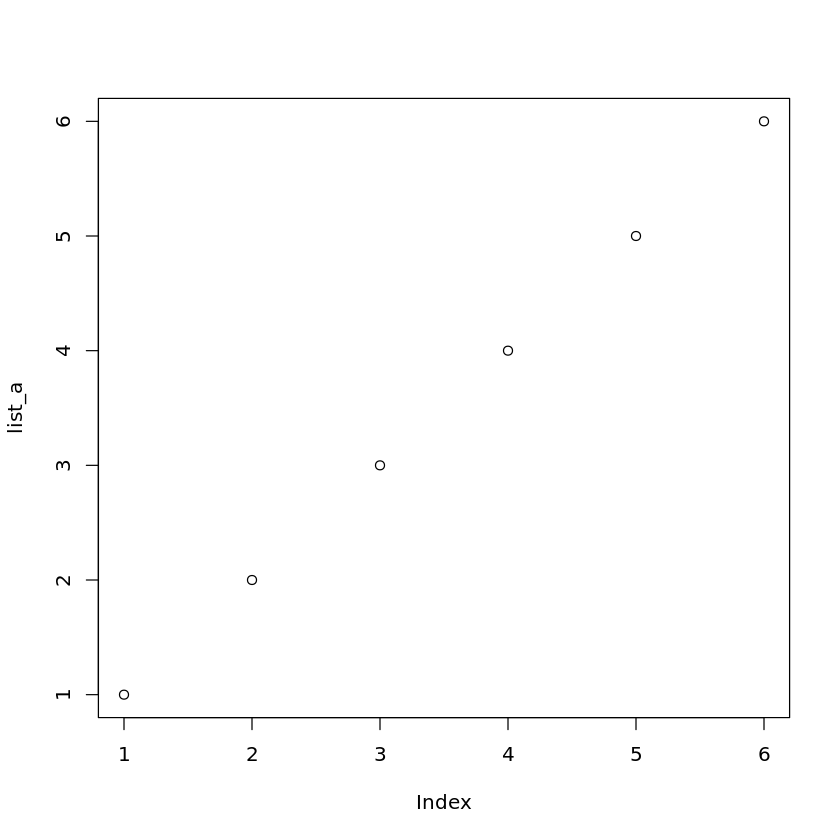

# R

## Quick Start Basics

### Variable Object


```R
var_a <- 2
print(var_a)
```

    [1] 2


```R
var_b = 3
print(var_b)
```

    [1] 3


### Check Object Type


```R
# In this case, it's a numeric type
class(var_a)
```


'numeric'


### List / Vector


```R
list_a <- c(0, 1, 2)
list_a
```


<style>
.list-inline {list-style: none; margin:0; padding: 0}
.list-inline>li {display: inline-block}
.list-inline>li:not(:last-child)::after {content: "\00b7"; padding: 0 .5ex}
</style>
<ol class=list-inline><li>0</li><li>1</li><li>2</li></ol>


```R
# It's inclusive start till end, unlike Python which leaves the last out
list_b <- c(0:6)
list_b
```


<style>
.list-inline {list-style: none; margin:0; padding: 0}
.list-inline>li {display: inline-block}
.list-inline>li:not(:last-child)::after {content: "\00b7"; padding: 0 .5ex}
</style>
<ol class=list-inline><li>0</li><li>1</li><li>2</li><li>3</li><li>4</li><li>5</li><li>6</li></ol>


```R
# Similar to a Python dictionary
list_c <- list(john_height=120, doe_height=150)
list_c
```


<dl>
	<dt>$john_height</dt>
		<dd>120</dd>
	<dt>$doe_height</dt>
		<dd>150</dd>
</dl>


```R
# Get keys only via names()
names(list_c)
```


<style>
.list-inline {list-style: none; margin:0; padding: 0}
.list-inline>li {display: inline-block}
.list-inline>li:not(:last-child)::after {content: "\00b7"; padding: 0 .5ex}
</style>
<ol class=list-inline><li>'john_height'</li><li>'doe_height'</li></ol>


```R
# Get values only via uname()
unname(list_c)
```


<ol>
	<li>120</li>
	<li>150</li>
</ol>


### Matrix


```R
# Create 2 vectors
vect_a <- c(1, 2)
vect_b <- c(3, 4)

vect_a
vect_b
```


<style>
.list-inline {list-style: none; margin:0; padding: 0}
.list-inline>li {display: inline-block}
.list-inline>li:not(:last-child)::after {content: "\00b7"; padding: 0 .5ex}
</style>
<ol class=list-inline><li>1</li><li>2</li></ol>


<style>
.list-inline {list-style: none; margin:0; padding: 0}
.list-inline>li {display: inline-block}
.list-inline>li:not(:last-child)::after {content: "\00b7"; padding: 0 .5ex}
</style>
<ol class=list-inline><li>3</li><li>4</li></ol>


```R
# Bind as row
mat_c <- rbind(vect_a, vect_b)
mat_c
```


<table class="dataframe">
<caption>A matrix: 2 × 2 of type dbl</caption>
<tbody>
	<tr><th scope=row>vect_a</th><td>1</td><td>2</td></tr>
	<tr><th scope=row>vect_b</th><td>3</td><td>4</td></tr>
</tbody>
</table>


```R
# Bind as column
mat_d <- cbind(vect_a, vect_b)
mat_d
```


<table class="dataframe">
<caption>A matrix: 2 × 2 of type dbl</caption>
<thead>
	<tr><th scope=col>vect_a</th><th scope=col>vect_b</th></tr>
</thead>
<tbody>
	<tr><td>1</td><td>3</td></tr>
	<tr><td>2</td><td>4</td></tr>
</tbody>
</table>


```R
# Create matrix
mat_e <- matrix(c(1, 2, 3, 
                 4, 5, 6), nrow=2, ncol=3)

mat_e
```


<table class="dataframe">
<caption>A matrix: 2 × 3 of type dbl</caption>
<tbody>
	<tr><td>1</td><td>3</td><td>5</td></tr>
	<tr><td>2</td><td>4</td><td>6</td></tr>
</tbody>
</table>


```R
# Create matrix with byrow option
mat_g <- matrix(c(1, 2, 3, 4, 5, 6), nrow=2, ncol=3, byrow=FALSE)

mat_g
```


<table class="dataframe">
<caption>A matrix: 2 × 3 of type dbl</caption>
<tbody>
	<tr><td>1</td><td>3</td><td>5</td></tr>
	<tr><td>2</td><td>4</td><td>6</td></tr>
</tbody>
</table>


```R
# Create same matrix with byrow option
mat_f <- matrix(c(1, 2, 3, 4, 5, 6), nrow=2, ncol=3, byrow=TRUE)

mat_f
```


<table class="dataframe">
<caption>A matrix: 2 × 3 of type dbl</caption>
<tbody>
	<tr><td>1</td><td>2</td><td>3</td></tr>
	<tr><td>4</td><td>5</td><td>6</td></tr>
</tbody>
</table>


```R
# Index matrix of first row and first column
mat_f[1,1]
# Index matrix of second row and first column
mat_f[2,1]
# Index matrix of second row and third column
mat_f[2,3]
# Select full first row
mat_f[1,]
# Select full first column
mat_f[,1]
```


1


4


6


<style>
.list-inline {list-style: none; margin:0; padding: 0}
.list-inline>li {display: inline-block}
.list-inline>li:not(:last-child)::after {content: "\00b7"; padding: 0 .5ex}
</style>
<ol class=list-inline><li>1</li><li>2</li><li>3</li></ol>


<style>
.list-inline {list-style: none; margin:0; padding: 0}
.list-inline>li {display: inline-block}
.list-inline>li:not(:last-child)::after {content: "\00b7"; padding: 0 .5ex}
</style>
<ol class=list-inline><li>1</li><li>4</li></ol>


```R
# Find transpose of matrix: rows to cols
t(mat_f)
```


<table class="dataframe">
<caption>A matrix: 3 × 2 of type dbl</caption>
<tbody>
	<tr><td>1</td><td>4</td></tr>
	<tr><td>2</td><td>5</td></tr>
	<tr><td>3</td><td>6</td></tr>
</tbody>
</table>


```R
# Add matrix
mat_1 <- matrix(c(1, 2, 3, 4, 5, 6), nrow=2, ncol=3)
mat_2 <- matrix(c(1, 2, 3, 4, 5, 6), nrow=2, ncol=3)
mat_new <- mat_1 + mat_2
mat_1
mat_2
mat_new
```


<table class="dataframe">
<caption>A matrix: 2 × 3 of type dbl</caption>
<tbody>
	<tr><td>1</td><td>3</td><td>5</td></tr>
	<tr><td>2</td><td>4</td><td>6</td></tr>
</tbody>
</table>


<table class="dataframe">
<caption>A matrix: 2 × 3 of type dbl</caption>
<tbody>
	<tr><td>1</td><td>3</td><td>5</td></tr>
	<tr><td>2</td><td>4</td><td>6</td></tr>
</tbody>
</table>


<table class="dataframe">
<caption>A matrix: 2 × 3 of type dbl</caption>
<tbody>
	<tr><td>2</td><td>6</td><td>10</td></tr>
	<tr><td>4</td><td>8</td><td>12</td></tr>
</tbody>
</table>


```R
# Subtract matrix
mat_1 <- matrix(c(1, 2, 3, 4, 5, 6), nrow=2, ncol=3)
mat_2 <- matrix(c(1, 2, 3, 4, 5, 6), nrow=2, ncol=3)
mat_new <- mat_1 - mat_2
mat_1
mat_2
mat_new
```


<table class="dataframe">
<caption>A matrix: 2 × 3 of type dbl</caption>
<tbody>
	<tr><td>1</td><td>3</td><td>5</td></tr>
	<tr><td>2</td><td>4</td><td>6</td></tr>
</tbody>
</table>


<table class="dataframe">
<caption>A matrix: 2 × 3 of type dbl</caption>
<tbody>
	<tr><td>1</td><td>3</td><td>5</td></tr>
	<tr><td>2</td><td>4</td><td>6</td></tr>
</tbody>
</table>


<table class="dataframe">
<caption>A matrix: 2 × 3 of type dbl</caption>
<tbody>
	<tr><td>0</td><td>0</td><td>0</td></tr>
	<tr><td>0</td><td>0</td><td>0</td></tr>
</tbody>
</table>


```R
# Element-wise multiplication / Hadamard product
mat_1 <- matrix(c(1, 2, 3, 4, 5, 6), nrow=2, ncol=3)
mat_2 <- matrix(c(1, 2, 3, 4, 5, 6), nrow=2, ncol=3)
mat_new <- mat_1 * mat_2
mat_1
mat_2
mat_new
```


<table class="dataframe">
<caption>A matrix: 2 × 3 of type dbl</caption>
<tbody>
	<tr><td>1</td><td>3</td><td>5</td></tr>
	<tr><td>2</td><td>4</td><td>6</td></tr>
</tbody>
</table>


<table class="dataframe">
<caption>A matrix: 2 × 3 of type dbl</caption>
<tbody>
	<tr><td>1</td><td>3</td><td>5</td></tr>
	<tr><td>2</td><td>4</td><td>6</td></tr>
</tbody>
</table>


<table class="dataframe">
<caption>A matrix: 2 × 3 of type dbl</caption>
<tbody>
	<tr><td>1</td><td> 9</td><td>25</td></tr>
	<tr><td>4</td><td>16</td><td>36</td></tr>
</tbody>
</table>


```R
# Matrix multiplication 
mat_1 <- matrix(c(1, 2, 3, 4, 5, 6), nrow=2, ncol=3)
mat_2 <- matrix(c(1, 2, 3, 4, 5, 6), nrow=3, ncol=2)
mat_new <- mat_1 %*% mat_2
mat_1
mat_2
mat_new
```


<table class="dataframe">
<caption>A matrix: 2 × 3 of type dbl</caption>
<tbody>
	<tr><td>1</td><td>3</td><td>5</td></tr>
	<tr><td>2</td><td>4</td><td>6</td></tr>
</tbody>
</table>


<table class="dataframe">
<caption>A matrix: 3 × 2 of type dbl</caption>
<tbody>
	<tr><td>1</td><td>4</td></tr>
	<tr><td>2</td><td>5</td></tr>
	<tr><td>3</td><td>6</td></tr>
</tbody>
</table>


<table class="dataframe">
<caption>A matrix: 2 × 2 of type dbl</caption>
<tbody>
	<tr><td>22</td><td>49</td></tr>
	<tr><td>28</td><td>64</td></tr>
</tbody>
</table>


```R
# Element-wise division
mat_1 <- matrix(c(1, 2, 3, 4, 5, 6), nrow=2, ncol=3)
mat_2 <- matrix(c(1, 2, 3, 4, 5, 6), nrow=2, ncol=3)
mat_new <- mat_1 / mat_2
mat_1
mat_2
mat_new
```


<table class="dataframe">
<caption>A matrix: 2 × 3 of type dbl</caption>
<tbody>
	<tr><td>1</td><td>3</td><td>5</td></tr>
	<tr><td>2</td><td>4</td><td>6</td></tr>
</tbody>
</table>


<table class="dataframe">
<caption>A matrix: 2 × 3 of type dbl</caption>
<tbody>
	<tr><td>1</td><td>3</td><td>5</td></tr>
	<tr><td>2</td><td>4</td><td>6</td></tr>
</tbody>
</table>


<table class="dataframe">
<caption>A matrix: 2 × 3 of type dbl</caption>
<tbody>
	<tr><td>1</td><td>1</td><td>1</td></tr>
	<tr><td>1</td><td>1</td><td>1</td></tr>
</tbody>
</table>


```R
# Scalar multiplication with matrix
mat_1 <- matrix(c(1, 2, 3, 4, 5, 6), nrow=2, ncol=3)
mat_new <- 10 * mat_1
mat_1
mat_new
```


<table class="dataframe">
<caption>A matrix: 2 × 3 of type dbl</caption>
<tbody>
	<tr><td>1</td><td>3</td><td>5</td></tr>
	<tr><td>2</td><td>4</td><td>6</td></tr>
</tbody>
</table>


<table class="dataframe">
<caption>A matrix: 2 × 3 of type dbl</caption>
<tbody>
	<tr><td>10</td><td>30</td><td>50</td></tr>
	<tr><td>20</td><td>40</td><td>60</td></tr>
</tbody>
</table>


```R
# Broadcast vector of 1x3 to matrix of 2x3
vec_1 <- c(1, 2, 3)
mat_1 <- matrix(c(1, 2, 3, 4, 5, 6), nrow=2, ncol=3)
vec_1 + mat_1
```


<table class="dataframe">
<caption>A matrix: 2 × 3 of type dbl</caption>
<tbody>
	<tr><td>2</td><td>6</td><td>7</td></tr>
	<tr><td>4</td><td>5</td><td>9</td></tr>
</tbody>
</table>


```R
# Check for determinant of matrix
mat_A <- matrix(c(1, 2, 3, 4), nrow=2, ncol=2)
mat_A
# Here det != 0, hence inverse exist
det_of_mat_A = det(mat_A)
cat(det_of_mat_A, 'is non-zero hence the inverse exist')
```


<table class="dataframe">
<caption>A matrix: 2 × 2 of type dbl</caption>
<tbody>
	<tr><td>1</td><td>3</td></tr>
	<tr><td>2</td><td>4</td></tr>
</tbody>
</table>


    -2 is non-zero hence the inverse exist


```R
# Invert of Matrix: mat'
mat_A_inv = solve(mat_A)
mat_A_inv
```


<table class="dataframe">
<caption>A matrix: 2 × 2 of type dbl</caption>
<tbody>
	<tr><td>-2</td><td> 1.5</td></tr>
	<tr><td> 1</td><td>-0.5</td></tr>
</tbody>
</table>


```R
# I = A'A = AA'
mat_A_identity = mat_A_inv %*% mat_A
mat_A_identity
mat_A_inv %*% mat_A
mat_A %*% mat_A_inv
```


<table class="dataframe">
<caption>A matrix: 2 × 2 of type dbl</caption>
<tbody>
	<tr><td>1</td><td>0</td></tr>
	<tr><td>0</td><td>1</td></tr>
</tbody>
</table>


<table class="dataframe">
<caption>A matrix: 2 × 2 of type dbl</caption>
<tbody>
	<tr><td>1</td><td>0</td></tr>
	<tr><td>0</td><td>1</td></tr>
</tbody>
</table>


<table class="dataframe">
<caption>A matrix: 2 × 2 of type dbl</caption>
<tbody>
	<tr><td>1</td><td>0</td></tr>
	<tr><td>0</td><td>1</td></tr>
</tbody>
</table>


```R
# IA = AI = A
mat_A
mat_A_identity %*% mat_A
mat_A %*% mat_A_identity
```


<table class="dataframe">
<caption>A matrix: 2 × 2 of type dbl</caption>
<tbody>
	<tr><td>1</td><td>3</td></tr>
	<tr><td>2</td><td>4</td></tr>
</tbody>
</table>


<table class="dataframe">
<caption>A matrix: 2 × 2 of type dbl</caption>
<tbody>
	<tr><td>1</td><td>3</td></tr>
	<tr><td>2</td><td>4</td></tr>
</tbody>
</table>


<table class="dataframe">
<caption>A matrix: 2 × 2 of type dbl</caption>
<tbody>
	<tr><td>1</td><td>3</td></tr>
	<tr><td>2</td><td>4</td></tr>
</tbody>
</table>


### DataFrames


```R
price_var <- c(100, 105, 120)
date_var <- as.Date(c('2021-01-11','2021-01-12','2021-01-13'))
df <- data.frame(price_var, date_var)
df
```


<table class="dataframe">
<caption>A data.frame: 3 × 2</caption>
<thead>
	<tr><th scope=col>price_var</th><th scope=col>date_var</th></tr>
	<tr><th scope=col>&lt;dbl&gt;</th><th scope=col>&lt;date&gt;</th></tr>
</thead>
<tbody>
	<tr><td>100</td><td>2021-01-11</td></tr>
	<tr><td>105</td><td>2021-01-12</td></tr>
	<tr><td>120</td><td>2021-01-13</td></tr>
</tbody>
</table>


### For Loop


```R
for (i in c(0:3)) {
    print(i)
}
```

    [1] 0
    [1] 1
    [1] 2
    [1] 3


### While Loop


```R
# Be careful, you might end up in an infinite loop
# if say i = -1
i <- 0
while (i < 3) {
    stdout_str = paste('Yet to reach 3, i is: ', i)
    print(stdout_str)
    i <- i + 1
}

print('Reached 3!')
```

    [1] "Yet to reach 3, i is:  0"
    [1] "Yet to reach 3, i is:  1"
    [1] "Yet to reach 3, i is:  2"
    [1] "Reached 3!"


### Math


```R
# Multiplication
2 * 2
```


4


```R
# Division
2 / 2
```


1


```R
# Addition
2 + 2
```


4


```R
# Subtraction
2 - 2
```


0


```R
# Exponentiation
exp(10)
```


22026.4657948067


```R
# Inbuilt value pi
2*pi
```


6.28318530717959


```R
# Natural log: ln
log(2)
```


0.693147180559945


```R
# Log with base 2
var_a = log(5, base=2)
var_a
```


2.32192809488736


```R
# Power to go back to 2
2**var_a
```


5


```R
# Power
2**2
```


4


```R
# Square root
sqrt(4)

# Alternative square root via power yiled same results
4**0.5
```


2


2


```R
# We can square root a complex number
sqrt(-25+0i)

# But we cannot square root a real number
cat(sprintf('---------------'))
cat(sprintf('This will fail!'))
cat(sprintf('---------------'))

sqrt(-25)
```


0+5i


    ---------------This will fail!---------------

    Warning message in sqrt(-25):
    “NaNs produced”


NaN


```R
# Print as fractions rather than decimal
library(MASS)
fractions(1 - 0.25)
```


3/4


### Statistics


```R
# Create list
list_a <- c(1, 2, 3, 4, 5, 6)

# Get standard deviation
cat('standard deviation:', sd(list_a))

# Get variance
cat('\nvariance:', var(list_a))

# Get mean
cat('\nmedian:', mean(list_a))

# Get median
cat('\nmean:', median(list_a))

# Get summary statistics
summary(list_a)
```

    standard deviation: 1.870829
    variance: 3.5
    median: 3.5
    mean: 3.5


       Min. 1st Qu.  Median    Mean 3rd Qu.    Max. 
       1.00    2.25    3.50    3.50    4.75    6.00 


```R
# t-test
var_test = t.test(list_a)
var_test
```


    
    	One Sample t-test
    
    data:  list_a
    t = 4.5826, df = 5, p-value = 0.005934
    alternative hypothesis: true mean is not equal to 0
    95 percent confidence interval:
     1.536686 5.463314
    sample estimates:
    mean of x 
          3.5 


```R
# This shows what you can call if we assign it to an object
names(t.test(list_a))
```


<style>
.list-inline {list-style: none; margin:0; padding: 0}
.list-inline>li {display: inline-block}
.list-inline>li:not(:last-child)::after {content: "\00b7"; padding: 0 .5ex}
</style>
<ol class=list-inline><li>'statistic'</li><li>'parameter'</li><li>'p.value'</li><li>'conf.int'</li><li>'estimate'</li><li>'null.value'</li><li>'stderr'</li><li>'alternative'</li><li>'method'</li><li>'data.name'</li></ol>


```R
# Get confidence interval
var_test$conf.int
```


<style>
.list-inline {list-style: none; margin:0; padding: 0}
.list-inline>li {display: inline-block}
.list-inline>li:not(:last-child)::after {content: "\00b7"; padding: 0 .5ex}
</style>
<ol class=list-inline><li>1.53668569301968</li><li>5.46331430698032</li></ol>


```R
# Mid-point of confidence interval is the mean
mean(var_test$conf.int)
```


3.5


```R
# Get p-value
var_test$p.value
```


0.00593354451759226


```R
# Plot histogram, hist() doesn't work all the time
barplot(table(list_a))
```


    

    


```R
# Plot dot plot
plot(list_a)
```


    

    


```R
# Plot dot plot
# type: p for point, l for line, b for both
# col: cyan, blue, green, red
plot(list_a, xlab='variable x', ylab='variable y', main='X-Y Plot', type='b', col='blue')
```


    

    


```R

```


```R

```


```R

```
